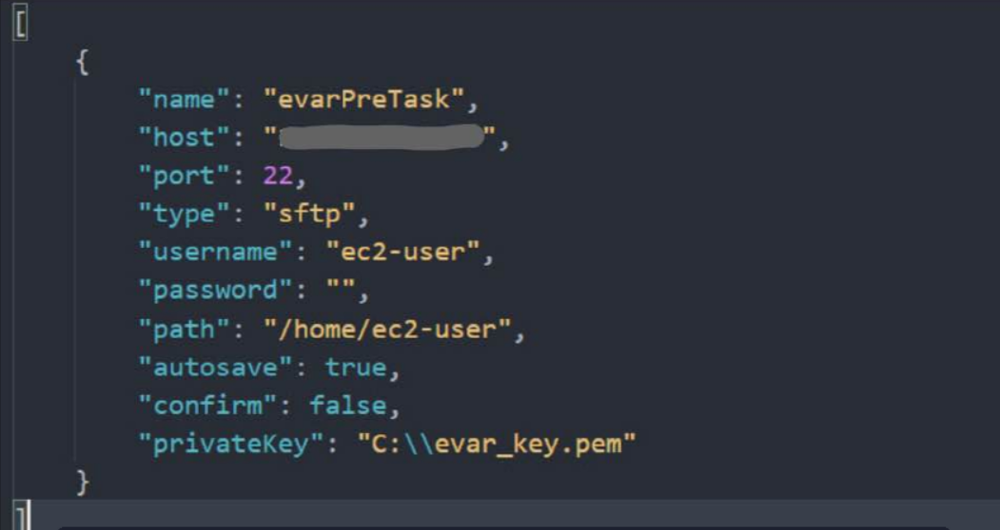

AWS EC2를 사용해서 구현해야 할 일이 생겨서 간만에 사용하다 잘 안되서 기록해둔다.

1. AWS EC2 인스턴스 생성

2. vscode extensions에서 ftp-simple을 설치해준다.

3. F1을 눌러 ftp-simple : Config - FTP connection setting 실행.  
 다음 사진과 같이 설정해준다.

1. F1 눌러 Remote directory open to workspace 실행하면 된다.
