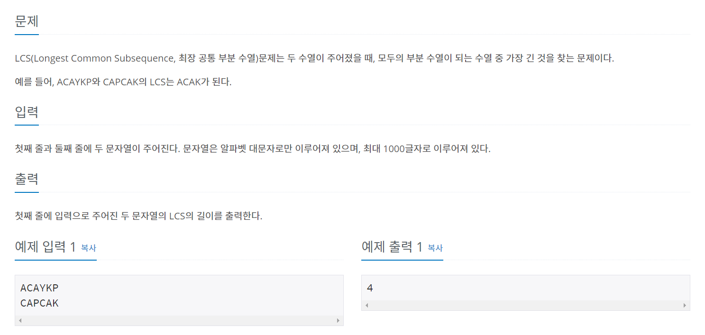

풀이를 보고 바로 이해하지 못하고 헷갈린 부분이 있어서 정리한다.



# LCS란?
공통적으로 가지고 있는 부분 문자열 중, 가장 긴 문자열(최장 공통 부분 수열)

## 규칙찾기

점화식을 찾아내기 전에 문제에 나온 예제 입력값을 통해 규칙을 찾아보면

```
index   C A P C A K
A       0 1 1 1 1 1
C       1 1 1 2 2 2
A       1 2 2 2 3 3
Y       1 2 2 2 3 3
K       1 2 2 2 3 4
P       1 2 3 3 3 4
```

## 접근

문제의 경우는 2가지로 나눌 수 있다.

 1) 두 문자열에 같은 문자가 추가되는 경우
    - ex) ACAYKP**A** , CAPCAK**A**
 2) 두 문자열에 다른 문자가 추가되는 경우
    - ex) ACAYKP**B** , CAPCAK**C**

## 점화식
두 가지 경우를 각각 점화식으로 나타내 보면
```
 1) dp[i][j] = dp[i-1][j-1] + 1
 2) dp[i][j] = Max(arr[i][j-1], arr[i-1][j])
```

점화식을 찾아냈으면 코드작성은 쉽다.

## 코드
```java
import java.io.BufferedReader;
import java.io.IOException;
import java.io.InputStreamReader;

public class num9251 {
	public static void main(String[] args) throws IOException {
		BufferedReader br = new BufferedReader(new InputStreamReader(System.in));
		String[] str1 = br.readLine().split("");
		String[] str2 = br.readLine().split("");
		
		int N = str1.length;
		int M = str2.length;
		int[][] arr = new int[N+1][M+1];
		
		for(int i=1;i<=N;i++) {
			for(int j=1;j<=M;j++) {
				if(str1[i-1].equals(str2[j-1])) {
					arr[i][j] = arr[i-1][j-1] +1;
				}else {
					arr[i][j] = Math.max(arr[i][j-1],arr[i-1][j]);
				}
			}
		}
		System.out.println(arr[N][M]);
	}
}
```