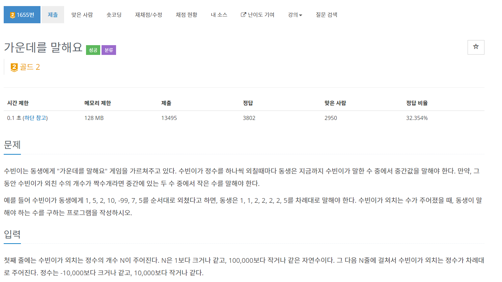
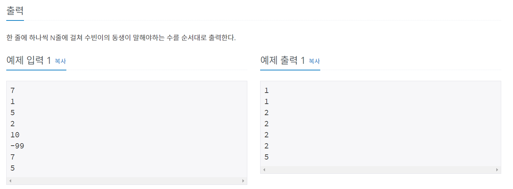
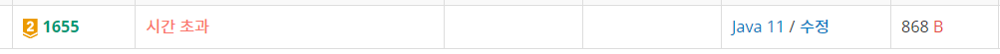
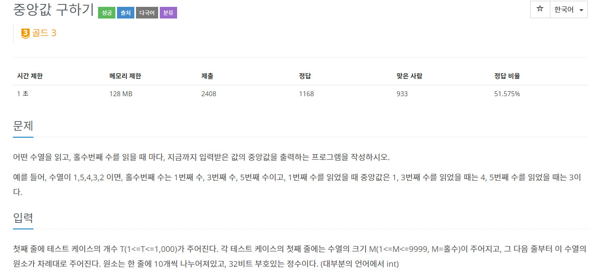
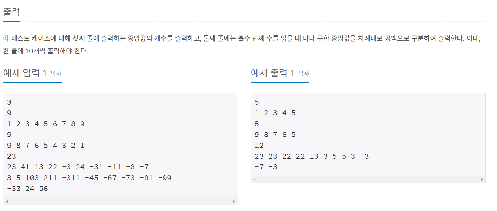

백준 단계별 문제 - 우선순위 큐 마지막 문제다.  

풀다가 조금 헷갈린 부분이 있어 정리하고자 포스팅한다.  

# 문제



일단 문제에 처음 접근할 땐, 우선순위 큐를 사용해 저장하고 중간 값을 계속 뽑아와 StringBuilder에 넣어주는 방식으로 구현했다.  

```java
package package21;

import java.io.BufferedReader;
import java.io.IOException;
import java.io.InputStreamReader;
import java.util.PriorityQueue;
import java.util.Stack;

public class num1655 {

	public static void main(String[] args) throws NumberFormatException, IOException {
		BufferedReader br = new BufferedReader(new InputStreamReader(System.in));
		PriorityQueue<Integer> q = new PriorityQueue<>();
		StringBuilder sb = new StringBuilder();
		
		int T = Integer.parseInt(br.readLine());
		
		for(int i=0; i<T; i++) {
			int value = Integer.parseInt(br.readLine());
			q.offer(value);
			int len = q.size()/2 + q.size()%2;
			Stack<Integer> s = new Stack<>();
			for(int j=0;j<len;j++) {
				s.push(q.remove());
			}
			if(!s.isEmpty())
				sb.append(s.peek()+"\n");
			while(!s.isEmpty()) {
				q.offer(s.pop());
			}
			
		}
		System.out.println(sb);
	}

}
```


역시 시간초과.....

## 풀이 1
stack대신 우선순위큐를 하나 더 써서 구현해보려고 생각하였고, 이 부분에서 삽질을 조금 하였다.  

포인트는 4가지다.
1. Max Heap(최대 값이 가장 앞에 위치)과 Min Heap(최소 값이 가장 앞에 위치) 사용   
2. 중간 값을 저장(초기 값 = 맨 처음에 입력받은 값)  
   중간 값 보다 작은 값은 Max Heap / 큰 값은 Min Heap
3. 큰값을 저장하는 min heap이 길이가 2이상 길면 중앙 값 바꿈  
    -> 작은 값을 저장하는 max heap에 중간 값 저장  
    -> 큰 값을 저장하는 min heap에서 가장 작은 값을 중간값으로 바꿈  
4. 작은 값을 저장하는 max heap이 길이가 1이상 길면 중앙 값 바꿈  
   (길이가 짝수이면 작은수가 중간 값이니 길이= 1 )  
   -> 큰 값을 저장하는 min heap에 중간 값 저장  
   -> 작은 값을 저장하는 max heap에서 가장 큰 값을 중간값으로 바꿈  

```java
package package21;

import java.io.BufferedReader;
import java.io.IOException;
import java.io.InputStreamReader;
import java.util.Comparator;
import java.util.PriorityQueue;
import java.util.Queue;

public class num1655v2 {

	public static void main(String[] args) throws NumberFormatException, IOException {
		BufferedReader br = new BufferedReader(new InputStreamReader(System.in));
		StringBuilder sb = new StringBuilder();
		Queue<Integer> min = new PriorityQueue<>();
		Queue<Integer> max = new PriorityQueue<>(new Comparator<Integer>() {
			@Override
			public int compare(Integer o1, Integer o2) {
				return o2.compareTo(o1);
			}
			
		});
		
		int T = Integer.parseInt(br.readLine());
		
		int index=0;
		
		for(int i = 0; i<T; i++) {
			int num = Integer.parseInt(br.readLine());
			if(i==0) {
				index = num;
				sb.append(num+"\n");
				continue;
			}
			if(num<=index) {
				// 작은 값이면 max heap에 저장
				max.offer(num);
				if(max.size()-min.size()>=1) {
					min.offer(index);
					index = max.poll();
				}
			}else {
				// 큰 값이면  min heap에 저장
				min.offer(num);
				if(min.size() - max.size() >=2) {
					max.offer(index);
					index = min.poll();
				}
			}
			sb.append(index+"\n");
		}
		System.out.println(sb);
	}

}
```

후... 큰 값을 min heap 저장, 작은 값을 max heap 저장, 중간값은 index로 빼놓는게 포인트인데 코드 짜다보니 헷갈려서 헤맸다.


추가) 다른 사람들은 코드를 어떻게 짰는지 구글링 해봤는데 조금 재밌게 푼 코드가 있어서 추가로 풀어봤다.

## 풀이2
1. 중간 값은 항상 max heap의 가장 앞의 값으로 유지
2. 크기가 같으면 max heap에 값 추가
   (입력한 값이 min heap의 최소값보다 크면 값 swap)
3. 크기가 다르면 min heap에 값 추가
   (입력한 값이 max heap의 최대값보다 작으면 값 swap)

이 코드는 입력값 : 521578 을 넣어서 직접 노트에 풀어보는게 이해하는데 도움됐다.
```java
package package21;

import java.io.BufferedReader;
import java.io.IOException;
import java.io.InputStreamReader;
import java.util.Comparator;
import java.util.PriorityQueue;
import java.util.Queue;

public class num1655v3 {

	public static void main(String[] args) throws NumberFormatException, IOException {
		BufferedReader br = new BufferedReader(new InputStreamReader(System.in));
		StringBuilder sb = new StringBuilder();
		Queue<Integer> min = new PriorityQueue<>();
		Queue<Integer> max = new PriorityQueue<>(new Comparator<Integer>() {
			@Override
			public int compare(Integer o1, Integer o2) {
				return o2.compareTo(o1);
			}
			
		});
		
		int T = Integer.parseInt(br.readLine());
		
		int index=0;
		
		for(int i = 0; i<T; i++) {
			int num = Integer.parseInt(br.readLine());
			if(max.size() == min.size()) {
				max.offer(num);
				if(!min.isEmpty() && max.peek() > min.peek()) {
					min.offer(max.poll());
					max.offer(min.poll());
				}
			}else {
				min.offer(num);
				if(max.peek() > min.peek()) {
					min.offer(max.poll());
					max.offer(min.poll());
				}
			}
			sb.append(max.peek()+"\n");
		}
		System.out.println(sb);
	}
}

```

우선순위 큐는 이렇게 마무리!!

# Update) 2021-01-14
백준 2981번이 비슷한 유형이라 풀고 추가로 update 한다.
# 백준 2981




```java
package priorityQueue;

import java.io.BufferedReader;
import java.io.IOException;
import java.io.InputStreamReader;
import java.util.Comparator;
import java.util.PriorityQueue;
import java.util.Queue;

public class num2696 {

	public static void main(String[] args) throws NumberFormatException, IOException {
		BufferedReader br = new BufferedReader(new InputStreamReader(System.in));
		StringBuilder sb = new StringBuilder();
		Queue<Integer> minHeap = new PriorityQueue<>();
		Queue<Integer> maxHeap = new PriorityQueue<>(new Comparator<Integer>() {
			@Override
			public int compare(Integer o1, Integer o2) {
				return o2.compareTo(o1);
			}
		});
		
		int T = Integer.parseInt(br.readLine());
		
		for(int i=0; i<T; i++) {
			int count = Integer.parseInt(br.readLine());
			String[] inputData = br.readLine().split(" ");
			sb.append(count/2+count%2 + "\n");
			int index = 0;
			int jindex = 0;
			for(int j=0; j<count; j++) {
				if(j%10==0 && j>9) {
					inputData = br.readLine().split(" ");
					if(j%20==0) {
						sb.append("\n");
					}
					jindex=0;
				}
				int num = Integer.parseInt(inputData[jindex]);
				if(jindex==0 && j==0) {
					jindex++;
					index = num;
					sb.append(num + " ");
					continue;
				}
				if(num <= index) {
					maxHeap.offer(num);
					if(maxHeap.size() - minHeap.size()>=1) {
						minHeap.offer(index);
						index = maxHeap.poll();
					}
				}else {
					minHeap.offer(num);
					if(minHeap.size() - maxHeap.size()>=2) {
						maxHeap.offer(index);
						index = minHeap.poll();
					}
				}
				if(jindex%2==0) {
					sb.append(index + " ");
				}
				jindex++;
			}
			
			sb.append("\n");
			minHeap.clear();
			maxHeap.clear();
		}
		System.out.println(sb);
	}

}

```

이 문제는 한 줄에 10개씩 들어온다는게 포인트다. 10개씩 장난쳐줘야 한다.

정말 끝