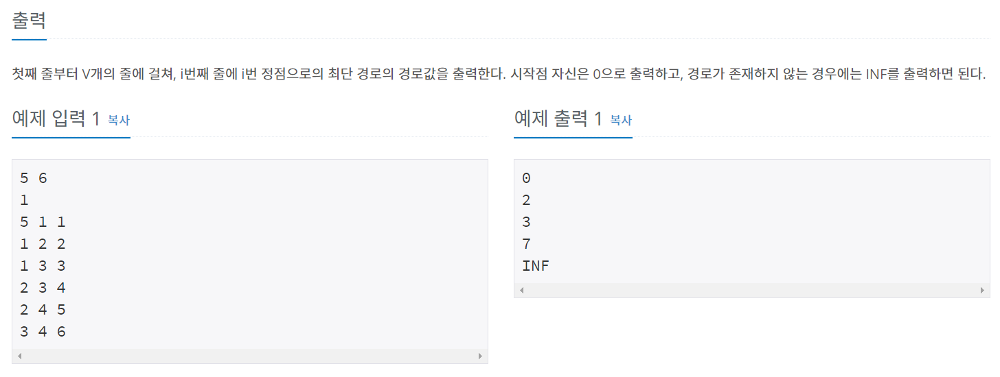
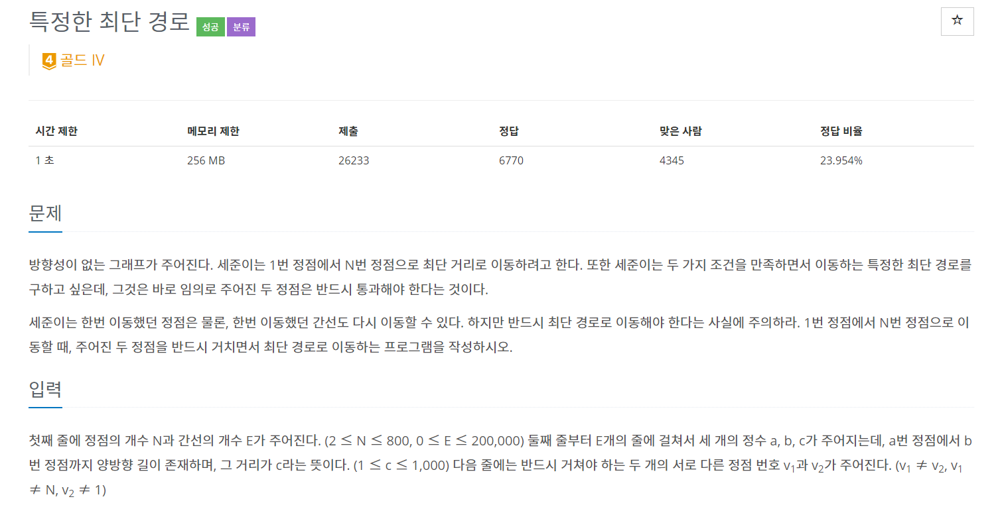
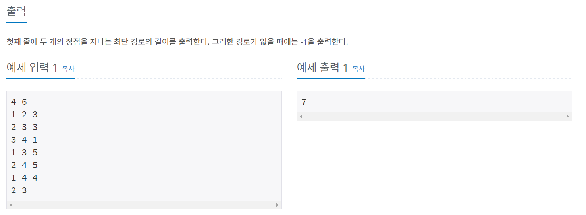
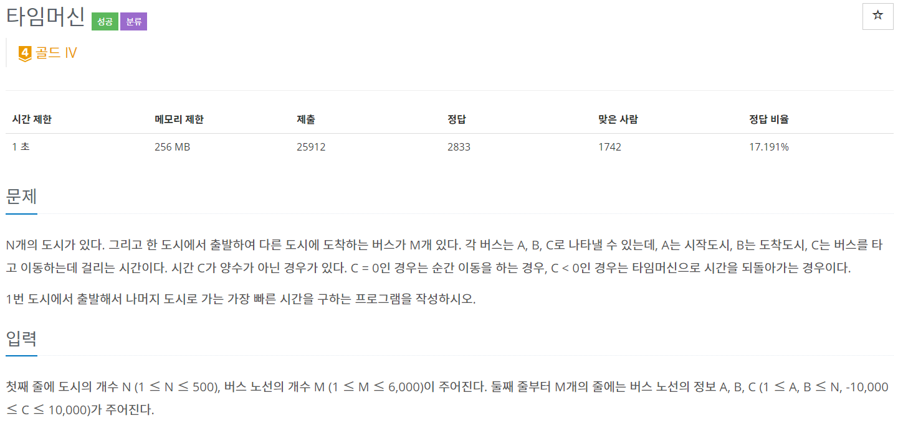
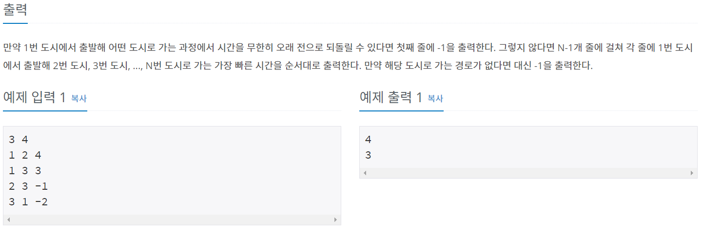
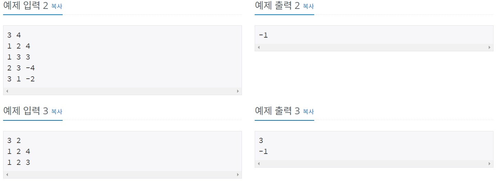

정리 안해두면 까먹을거 같아서 기억력을 조금이라도 향상시키기 위해 정리해둔다.

자, 최단거리 알고리즘을 이해하기 위해 그래프를 간략히 살펴보면

---

# 그래프란? 

---

그래프는 **정점(Vertex)** 와 **간선(Edge)** 을 모아놓은 자료구조다.

그래프라는 친구는 보통 간선에 가중치를 가진다.

## 구현 방법
---
1. 인접 행렬
2. 인접 리스트

# 다익스트라 알고리즘
---

최단 거리 알고리즘은 기본적으로 **그리디 알고리즘** 으로 분류된다.  
 -> **매번 가장 비용이 적은 노드** 를 선택하는 과정을 반복하기 때문이다.

## 전제조건
---

1. 시작 노드 - 시작 노드 사이 거리는 0이다.
2. 모든 간선은 양의 가중치를 가진다.

## 특징
---

1. 구현 방법은 2가지

## 1. 직관적인 방법 - O(V^2)
---
1. 각 노드에 대한 최단 거리를 담는 1차원 리스트 선언
2. 방문하지 않은 노드 중에서 거리가 가장 짧은 노드 선택  
(거리가 같으면 일반적으로 번호가 작은 노드)
3. 거리가 더 짧으면 값 갱신

### 최단거리 - 백준 1753
---



```java
package package24;

import java.io.BufferedReader;
import java.io.IOException;
import java.io.InputStreamReader;
import java.util.ArrayList;
import java.util.List;

public class num1753 {
	static int INF = Integer.MAX_VALUE;
	
	public static void main(String[] args) throws IOException {
		BufferedReader br = new BufferedReader(new InputStreamReader(System.in));
		
		String[] inputVE = br.readLine().split(" ");
		int V = stoi(inputVE[0]);
		int E = stoi(inputVE[1]);
		int K = stoi(br.readLine())-1;
		
		List<Edge>[] graph = new ArrayList[V];
        for (int i = 0; i < V; i++) 
        	graph[i] = new ArrayList<>();
		int[] distance = new int[V];
		boolean[] visited = new boolean[V];
		
		for(int i=0; i<V; i++) {
			distance[i] = INF; 
		}
		
		for(int i=0; i<E; i++) {
			String[] uvw = br.readLine().split(" ");
			int u = stoi(uvw[0])-1;
			int v = stoi(uvw[1])-1;
			int w = stoi(uvw[2]);
			graph[u].add(new Edge(v,w));
		}
		dijkstra(graph, visited, distance, V, E, K);
		
		for(int value : distance) {
			if(INF == value)
				System.out.println("INF");
			else
				System.out.println(value);
		}
	}
	
	public static void dijkstra(List<Edge>[] graph, boolean[] visited, int[] distance, int V, int E, int K) {
		distance[K] = 0;
		for(int i=0; i<V; i++) {
			int minIndex = getSmallestNodeNotVisited(visited, distance, V);
            for (Edge next : graph[minIndex]) {
                if(!visited[next.v] && distance[next.v] > distance[minIndex] + next.weight) {
                	distance[next.v] = distance[minIndex] + next.weight;
                }
            }

			visited[minIndex] = true;

		}
		
	}
	
	public static int getSmallestNodeNotVisited(boolean[] visited, int[] distance, int V) {
		int min = INF;
		int minIndex = 0;
		for(int i=0; i<V; i++) {
			if(visited[i] == false && distance[i]<min) {
				min = distance[i];
				minIndex = i;
			}
		}
		return minIndex;
	}
	
	public static int stoi(String string) {
		return Integer.parseInt(string);
	}
}

class Edge {
    int v, weight;

    public Edge(int v, int weight) {
        this.v = v;
        this.weight = weight;
    }
    
}

```
---

소스를 간략히 설명하면  
노드 arrayList를 만들고 Edge는 클래스로 만들어서 넣어주는 방법으로 구현했다.  
(배열로만 구현하면 메모리 초과난다.)

매번 최단거리가 가장 짧은 노드를 찾기 위해 O(V) 만큼 탐색하기 때문에 비효율적이다.  
 -> Priority Queue 활용

---

## 2. Priority Queue 활용 - O(ElogV)

---

최단 거리 -> **최소 힙**을 사용한다.

```
1. 각 노드에 대한 최단 거리를 담는 1차원 리스트 선언
2. 우선순위 큐을 사용해 거리가 짧은 정점부터 Queue에 넣어 줌.(처음 시작 값 : 0)  
3. 큐가 값이 없을 때까지 반복  
    3-1) 큐에서 값을 하나 꺼냄 (Vertex 선택)  
	3-2) visited 값 true 설정  
4. 다음 Vertex의 최단거리가 현재Vertex 최단 거리 + 다음 Vertex 가중치보다 크면   
	(다음 Vertex가 사용되지 않았을 때)  
	4-1) 값 갱신  
	4-2) 우선순위 큐에 값 추가  
```

요약하면
```
1. 아직 방문하지 않은 정점 중 거리가 짧은 정점을 하나 선택해 방문
2. 해당 정점에 인접하고 아직 방문하지 않은 정점의 최단거리 갱신
```

Tip!!  
**JAVA PriorityQueue 는 기본적으로 minHeap이다.**


```java
// 최소 힙
PriorityQueue<Integer> minHeap = new PriorityQueue<Integer>();

// 최대 힙
PriorityQueue<Integer> maxHeap = new PriorityQueue<Integer>(Comparator.reverseOrder());

// 최대 힙 version2
PriorityQueue<Integer> maxHeap = PriorityQueue<>(new Comparator<Integer>(){
	@Override
	public int compare(Integer i1, Integer i2) {
		return i2-i1;
	}
});
```

### 최단거리 - 백준 1504

---




---

문제를 보면 정점 2개를 방문해야 한다는 조건이 있다. 정점을 각각 V1, V2라고 한다면 
 1. 1 -> V1 -> V2 -> N
 2. 1 -> V2 -> V1 -> N

두가지 경우에 대해 구간별로 최소값을 구한 후, 더하면 된다.

---

```java
package package24;

import java.io.*;
import java.util.*;

public class num1504 {
	static int N,E,v1,v2,result;
	static ArrayList<ArrayList<Edge>> Vertex;
	static int[] distance;
	static boolean[] visited;
	static int INF = 200000000;
	
	public static void main(String[] args) throws IOException {
		BufferedReader br = new BufferedReader(new InputStreamReader(System.in));
		
		String[] NE = br.readLine().split(" ");
		N = stoi(NE[0]);
		E = stoi(NE[1]);
		distance = new int[N+1];
		visited = new boolean[N+1];
		Vertex = new ArrayList<>();
		
		for(int i=0; i<=N; i++) {
			Vertex.add(new ArrayList<>());
		}
		
		for(int i=0; i<E; i++) {
			String[] abc = br.readLine().split(" ");
			int a = stoi(abc[0]);
			int b = stoi(abc[1]);
			int c = stoi(abc[2]);
			
			Vertex.get(a).add(new Edge(b,c));
			Vertex.get(b).add(new Edge(a,c));
		}
		String[] v1v2 = br.readLine().split(" ");
		v1 = stoi(v1v2[0]);
		v2 = stoi(v1v2[1]);
		
		result = solve();
		System.out.println(result);
	}

	public static int solve() {
		int case1=0, case2=0;
		
		case1 = dijkstra(1,v1) + dijkstra(v1,v2) + dijkstra(v2,N);
		case2 = dijkstra(1,v2) + dijkstra(v2,v1) + dijkstra(v1,N);

		return (case1 >= INF && case2 >= INF) ? -1 : Math.min(case1, case2);
	}
	
	public static int dijkstra(int start, int end) {
		Arrays.fill(distance, INF);
		Arrays.fill(visited, false);
		
		PriorityQueue<Edge> queue = new PriorityQueue<Edge>();
		queue.add(new Edge(start,0));
		distance[start] = 0;
		
		while(!queue.isEmpty()) {
			Edge now = queue.remove();
			int nowNode = now.e;
			if(!visited[nowNode]) {
				visited[nowNode] = true;
				
				for(Edge next : Vertex.get(nowNode)) {
					if(!visited[next.e] && distance[next.e] > distance[nowNode] + next.weight) {
						distance[next.e] = distance[nowNode] + next.weight;
						queue.add(new Edge(next.e, distance[next.e]));
					}
				}
			}
		}
		return distance[end];
	}
	
	public static int stoi(String string) {
		return Integer.parseInt(string);
	}
	
	static class Edge implements Comparable<Edge>{
		int e, weight;
		Edge(int e, int weight){
			this.e = e;
			this.weight = weight;
		}
		
		@Override
		public int compareTo(Edge o){
			return weight - o.weight;
		}
	}
}
```


# 벨만-포드 알고리즘
---

## 특징
---

1. 시간 복잡도 - O(VE)
2. 다익스트라 알고리즘보다 느리지만 음의 가중치를 가진 경로의 최단거리를 구할 수 있다.

## 전제 조건
---
1. **같은 정점을 2번 지날일은 없기 때문에** 간선의 최대 개수는 **V-1**이다.
2. 음수 사이클이 없는 최단 경로를 구해야 한다.

> 존재하는 모든 간선을 돌아보면서 간선이 통할 수도 있는 거리를 갱신하는 것

## 백준 11657
---




```java
package package24;

import java.io.BufferedReader;
import java.io.IOException;
import java.io.InputStreamReader;
import java.util.ArrayList;

public class num11657 {
	static int N, M;
	static ArrayList<ArrayList<Edge>> Vertex;
	static long[] dist;
	static int INF = Integer.MAX_VALUE;
	static boolean minusCycle=false;
	
	public static void main(String[] args) throws IOException {
		BufferedReader br = new BufferedReader(new InputStreamReader(System.in));
		StringBuilder sb = new StringBuilder();
		
		String[] inputNM = br.readLine().split(" ");
		N = stoi(inputNM[0]);
		M = stoi(inputNM[1]);
		
		dist = new long[N];
		Vertex = new ArrayList<ArrayList<Edge>>();
		for(int i=0; i<N; i++) {
			Vertex.add(new ArrayList<Edge>());
			dist[i] = INF;
		}
		
		for(int i=0; i<M; i++) {
			String[] ABC = br.readLine().split(" ");
			int A = stoi(ABC[0])-1;
			int B = stoi(ABC[1])-1;
			int C = stoi(ABC[2]);
			
			Vertex.get(A).add(new Edge(B,C));
		}
		bellman();
		
		if(minusCycle)
			sb.append("-1\n");
		else {
			for(int i=1; i<N; i++) {
				sb.append(dist[i] != INF ? dist[i] : -1);
				sb.append("\n");
			}
		}
		System.out.println(sb.toString());
		
	}
	public static void bellman() {
		dist[0] = 0;
		
	    for(int i=0; i<N; i++){ 
	        for(int j=0; j<N; j++){
	            for(Edge edge: Vertex.get(j)){
	                int next = edge.e, w = edge.w;
	                if(dist[j] != INF && dist[next] > dist[j] + w){
	                    dist[next] = dist[j] + w;
	                    if(i == N-1) minusCycle = true;
	                }
	            }
	        }
	    }
	}
	
	static class Edge {
		int e, w;
		Edge(int e, int w) {
			this.e = e;
			this.w = w;
		}
	}
	
	public static int stoi(String string) {
		return Integer.parseInt(string);
	}
}
```

---

코드를 간단히 설명해보면

존재하는 모든 간선을 돌아보면서 이 간선을 통할 수도 있는 최단경로들의 거리를 갱신한다.
같은 정점을 2번 방문하는 경우는 없다는 전제가 있으므로 V-1까지 확인한다
만약, 음의 사이클이 존재한다면 -> V-1 이후 최단거리가 갱신된다. 
위의 소스에선 V까지 루프의 마지막에 최단거리가 갱신되는지 확인한다.


이 문제는 조금 주의할 점이 있다. 

최소 가중치가 -10000이라 언더플로우가 생길 수 있기 때문에 **dist를 long[]으로 설정해야 한다.**  

---

# 플로이드 알고리즘 
---
## 특징
---

1. 다익스트라, 벨만 포드 알고리즘 : 하나의 시작점에 대한 최단 거리
2. 플로이드 워셜 알고리즘 : **모든 지점에서 다른 모든 지점까지의 최단 경로를 모두 구해야 하는 경우**  
3. 시간 복잡도 : O(V^3)  
	-> 노드의 개수 O(V) * **현재 노드를 거쳐가는 모든 경로O(V^2)** -> **O(V^3)**
4. **DP형태** -> 점화식에 맞게 2차원 리스트를 갱신하기 때문

**Tip!!**  
상황에 따라 자기 자신으로 이동 가능하면 dis[i][j] = 0 / 불가능하면 dis[i][j] = INF

- 가장 바깥쪽 for문은 경유할 정점
- 가운데 for문은 출발 정점
- 가장 안쪽 for문은 도착 정점

---

## 백준 11404

```java
package package24;

import java.io.*;

public class num11404 {
	static int N, M, INF = 100000000;
	static int[][] dis;
	
	public static void main(String[] args) throws IOException {
		BufferedReader br = new BufferedReader(new InputStreamReader(System.in));
		BufferedWriter bw = new BufferedWriter(new OutputStreamWriter(System.out));
		StringBuilder sb = new StringBuilder();
		
		N = stoi(br.readLine());
		M = stoi(br.readLine());
		
		dis = new int[N][N];
		
		for(int i=0; i<N; i++) {
			for(int j=0; j<N; j++) {
				dis[i][j] = i == j ? 0 : INF;
			}
		}
		
		for(int i=0; i<M; i++) {
			String[] abc = br.readLine().split(" ");
			int a = stoi(abc[0])-1;
			int b = stoi(abc[1])-1;
			int c = stoi(abc[2]);
			
			dis[a][b] = Math.min(dis[a][b], c);
		}
		
		for(int k=0; k<N; k++) {
			for(int i=0; i<N; i++) {
				for(int j=0; j<N; j++) {
					dis[i][j] = Math.min(dis[i][j], dis[i][k] +dis[k][j]);
				}
			}
		}
		
        for (int i = 0; i < N; i++) {
            for (int j = 0; j < N; j++) {
            	dis[i][j] = dis[i][j] == INF ? 0 : dis[i][j];
                sb.append(dis[i][j] + " ");
            }
            sb.append("\n");
        }
 
        bw.write(sb.toString());
        bw.flush();
        bw.close();
        br.close();
	}
	public static int stoi(String string) {
		return Integer.parseInt(string);
	}

}
```


# 정리
---

이렇게 최단거리 알고리즘 3가지를 알아보았다.  

사용하는 경우를 정리해보면  
```
1. 다익스트라 알고리즘[우선순위 큐] -> 한 지점에서 다른 지점까지 최단거리 구하는 문제  
2. 벨만 포드 알고리즘 -> 음의 가중치를 가진 최단거리 구하는 문제  
3. 플로이드 와샬 알고리즘 -> 모든 경로의 최단거리 구하는 문제
``` 
로 정리할 수 있다.


생각보다 어려워서 정리하는데 시간이 오래걸렸다.  
다음 글은 최단경로의 경로출력에 대해 정리해 볼 예정이다.

추가로 [라이님 블로그](https://blog.naver.com/kks227/220796029558) 요기 있는 추가문제 하나씩 풀어봐야겠다.


# Reference
---
[라이님 블로그](https://blog.naver.com/kks227/220796029558)  
[갓킹독님 블로그](https://blog.encrypted.gg/917?category=773649)  
[Crocus님 블로그](https://www.crocus.co.kr/546?category=209527)  
[백준 질문하기 - 출력초과 문제 해결이 되었는데 이유를 모르겠습니다](https://www.acmicpc.net/board/view/55270)  
이것이 코딩테스트다 - 나동빈


