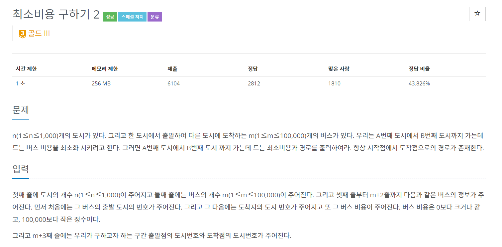
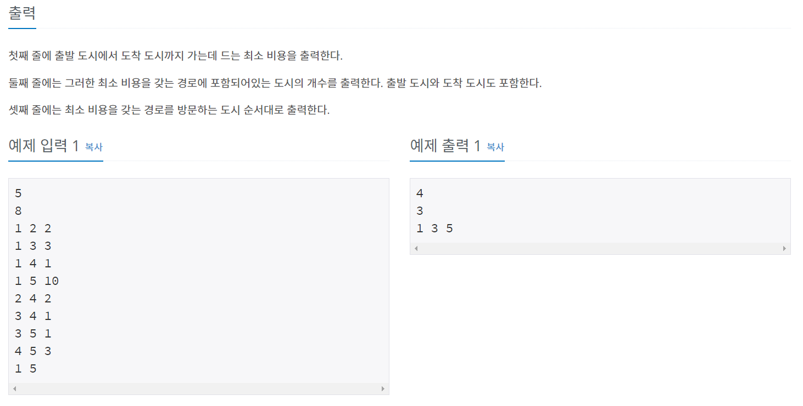
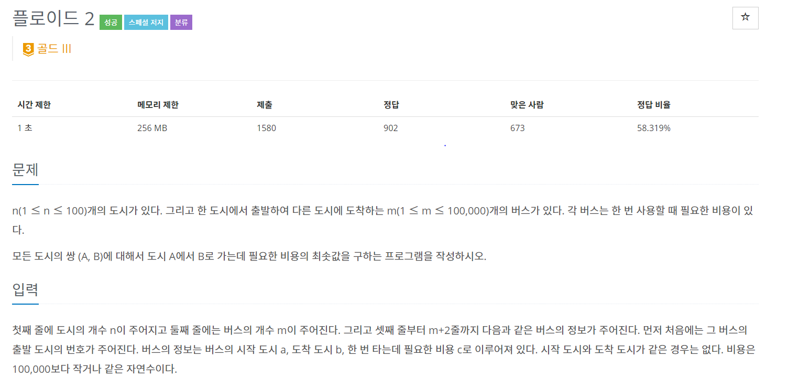
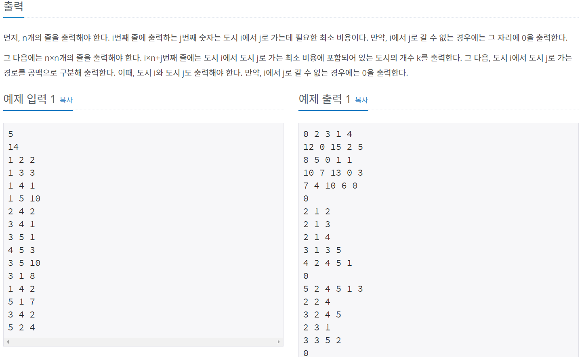
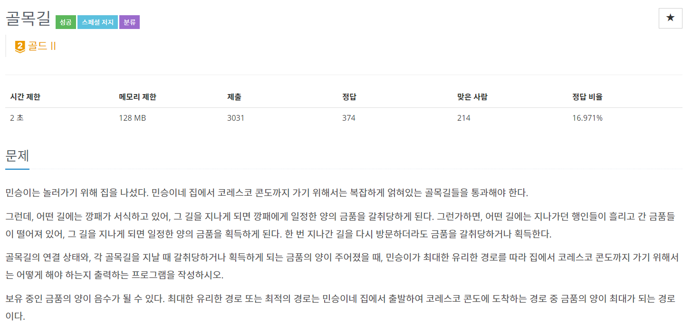

백준 11779, 11780, 1738번 문제를 통해 최단경로의 경로출력을 정리해보려고 한다.

---

# 백준 11779 - 다익스트라




---

소스를 간략히 설명하면

다익스트라 알고리즘에 값이 조건에 맞아 갱신될 때 배열의 값에 이전 노드를 저장한다.

첫 노드부터 순서대로 출력하기 위해 stack을 사용했다.

---

```java
package pakcage26;

import java.io.BufferedReader;
import java.io.IOException;
import java.io.InputStreamReader;
import java.util.ArrayList;
import java.util.PriorityQueue;
import java.util.Stack;

public class num11779 {
	static int N, M, count=2,INF = Integer.MAX_VALUE;
	static ArrayList<ArrayList<Edge>> Vertex;
	static int[] dist, pre;
	static boolean[] visited;
	
	public static void main(String[] args) throws IOException {
		BufferedReader br = new BufferedReader(new InputStreamReader(System.in));

		N = stoi(br.readLine());
		M = stoi(br.readLine());
		Vertex = new ArrayList<ArrayList<Edge>>();
		dist = new int[N];
		pre = new int[N];
		visited = new boolean[N];
		
		for(int i=0; i<N; i++) {
			Vertex.add(new ArrayList<Edge>());
			dist[i] = INF;
		}
		
		for(int i=0; i<M; i++) {
			String[] uvw = br.readLine().split(" ");
			int u = stoi(uvw[0])-1;
			int v = stoi(uvw[1])-1;
			int w = stoi(uvw[2]);
			Vertex.get(u).add(new Edge(v,w));
		}
		String[] point = br.readLine().split(" ");
		int start = stoi(point[0])-1;
		int end = stoi(point[1])-1;
		dijkstra(start, end);
		
		long answer =dist[end];

		Stack<Integer> st = new Stack<Integer>();
		st.add(end);
		
		while (pre[end] != start) {
			st.add(pre[end]);
			end = pre[end];
			count++;
		}
		
		st.add(start);
		
		System.out.println(answer);
		System.out.println(count);
		while (!st.isEmpty()) {
			System.out.print(st.pop()+1 + " ");
		}
		
	}
	
	public static void dijkstra(int start, int end) {
		dist[start] = 0;
		PriorityQueue<Edge> q = new PriorityQueue<Edge>();
		q.add(new Edge(start, 0));
		
		while(!q.isEmpty()) {
			Edge now = q.remove();
			if(!visited[now.e]) {
				visited[now.e] = true;
				for(Edge next : Vertex.get(now.e)) {
					if(!visited[next.e] && dist[next.e] >= dist[now.e] + next.w) {
						dist[next.e] = dist[now.e] + next.w;
						q.add(new Edge(next.e, dist[next.e]));
						pre[next.e] = now.e;
					}
				}
			}
		}
		
	}
	
	public static int stoi(String string) {
		return Integer.parseInt(string);
	}
	
	static class Edge implements Comparable<Edge>{
		int e, w;
		Edge(int e, int w){
			this.e = e;
			this.w = w;
		}
		@Override
		public int compareTo(Edge o){
			return w - o.w;
		}
	}
}
```

# 백준 11780 - 플로이드
---



---
next배열은 a(정점) -> b(정점) 일 때, 출발 정점(a)의 값을 가지고 있다.

플로이드 알고리즘은 i -> k -> j 의 거리가 짧을 경우 최단거리(dist배열)을 갱신해준다.  

동일하게 최단거리가 짧은 경우 출발 노드(next배열)을 k로 바꿔서 갱신해준다.

---
```java
package pakcage26;

import java.io.BufferedReader;
import java.io.IOException;
import java.io.InputStreamReader;
import java.util.Stack;

public class num11780 {
	static int N, M, INF = 100000000;
	static int[][] dist, next;
	static boolean[][] visited;
	static Stack<Integer> stack;
	
	public static void main(String[] args) throws IOException {
		BufferedReader br = new BufferedReader(new InputStreamReader(System.in));
		StringBuilder sb = new StringBuilder();
		
		
		N = stoi(br.readLine());
		M = stoi(br.readLine());
		dist = new int[N][N];
		next = new int[N][N];
		
		for(int i=0; i<N; i++) {
			for(int j=0; j<N; j++) {
				dist[i][j] = i == j ? 0 : INF;
				next[i][j] = INF;
			}
		}
				
		for(int i=0; i<M; i++) {
			String[] abc = br.readLine().split(" ");
			int a = stoi(abc[0])-1;
			int b = stoi(abc[1])-1;
			int c = stoi(abc[2]);
			
			dist[a][b] = Math.min(dist[a][b], c);
			next[a][b] = a;
		}
		
		floyd();
		
		printPath();
	}
	
	public static void floyd() {
		for(int k = 0; k<N; k++) {
			for(int i = 0; i<N; i++) {
				for(int j=0; j<N; j++) {
					if(dist[i][j] > dist[i][k] + dist[k][j]) {
						dist[i][j] = dist[i][k] +dist[k][j];
						next[i][j] = next[k][j];
					}
				}
			}
		}
	}
	
	public static void printPath() {
		for(int[] a : dist) {
			for(int b: a) {
				System.out.print(b + " ");
			}
			System.out.println();
		}
		
        for(int i=0; i<N; i++) {
            for(int j=0; j<N; j++) {
                if(next[i][j]==INF)
                    System.out.println(0);

                else {
                	stack = new Stack<>();
                    int pre = j;
                    stack.push(j);
                    while(i != next[i][pre]) {
                        pre = next[i][pre];
                        stack.push(pre);
                    }
                    System.out.print((stack.size()+1)+" ");
                    System.out.print(i+1+" ");
                    while(!stack.empty())
                        System.out.print(stack.pop()+1+" ");
                    System.out.println();
                }
            }
        }
	}
	
	public static int stoi(String string) {
		return Integer.parseInt(string);
	}
	
}
```

# 벨만포드 - 백준 1738

---




---
일차원 배열을 선언해 이전 경로의 값을 가지고 있는다.

기존의 벨만 포드 알고리즘과는 달리 음의 싸이클이 있으면 끝이 아니라,  
음의 싸이클에 도착점으로 도달 가능해야 답이 -1이다.

```
4 4
1 4 3
2 3 1
3 2 1
4 2 1
```
위의 테스트 케이스를 통과해야 정답이다.

이거 때문에 삽질 좀 했다 ㅜㅜ

---

```java
package MinPath;

import java.io.BufferedReader;
import java.io.IOException;
import java.io.InputStreamReader;
import java.util.ArrayList;
import java.util.Stack;

public class num1738 {
	static int N, M, INF = 987654321, INF2=-987654321;
	static ArrayList<ArrayList<Edge>> Vertex;
	static int[] preVertex;
	static long[] dist;
	
	public static void main(String[] args) throws IOException {
		BufferedReader br = new BufferedReader(new InputStreamReader(System.in));
		
		String[] NM = br.readLine().split(" ");
		
		N = stoi(NM[0]);
		M = stoi(NM[1]);
		
		dist = new long[N];
		Vertex = new ArrayList<ArrayList<Edge>>();
		preVertex = new int[N];
		for(int i=0; i<N; i++) {
			Vertex.add(new ArrayList<Edge>());
			dist[i] = INF;
			preVertex[i] = -1;
		}
		
		for(int i=0; i<M; i++) {
			String[] uvw = br.readLine().split(" ");
			int u = stoi(uvw[0])-1;
			int v = stoi(uvw[1])-1;
			int w = stoi(uvw[2]);
			Vertex.get(u).add(new Edge(v, -w));
		}
		
		bellmanFord();
		
		printPath();
	}
	
	public static void bellmanFord() {
		dist[0] = 0;
		preVertex[0] = 0;
		for(int i=0; i<N; i++) {
			for(int j=0; j<N; j++) {
				for(Edge edge : Vertex.get(j)) {
					int next = edge.e, weight = edge.w;
					if(dist[j]!=INF && dist[next] > dist[j] + weight) {
						dist[next] = (dist[j] + weight);
						preVertex[next] = j;
						if(i == N-1) {
							dist[next] = INF2;
						}
					}
				}
			}
		}
	}
	
	public static void printPath() {
		Stack<Integer> stack = new Stack<Integer>();
		StringBuilder sb = new StringBuilder();
		if(dist[N-1] == INF || dist[N-1] == INF2)
			sb.append("-1");
		else{
			for (int i = N-1 ; i != 0; i = preVertex[i]) {
				if(dist[i] == INF2) {
					System.out.println(-1);
					return;
				}else{
					stack.push(i);
				}
				
			}
			stack.push(0);
	        for (int i = stack.size(); i > 0; --i)
	        {
	            sb.append(stack.pop()+1+" ");
	        }
		}
		System.out.println(sb);
	}
	
	static class Edge{
		int e, w;
		Edge(int e, int w){
			this.e = e;
			this.w = w;
		}
	}
	
	public static int stoi(String string) {
		return Integer.parseInt(string);
	}

}
```

# 정리

---

세가지 알고리즘 모두 최단거리를 추적하면서  
**경로를 저장할 공간을 만들어서 저장하는 방식**이다.

# Reference
---
[갓킹독님 블로그](https://blog.encrypted.gg/category/%EA%B0%95%EC%A2%8C/%EC%8B%A4%EC%A0%84%20%EC%95%8C%EA%B3%A0%EB%A6%AC%EC%A6%98?page=1)  
[라이님 블로그](https://m.blog.naver.com/PostList.nhn?blogId=kks227)  
