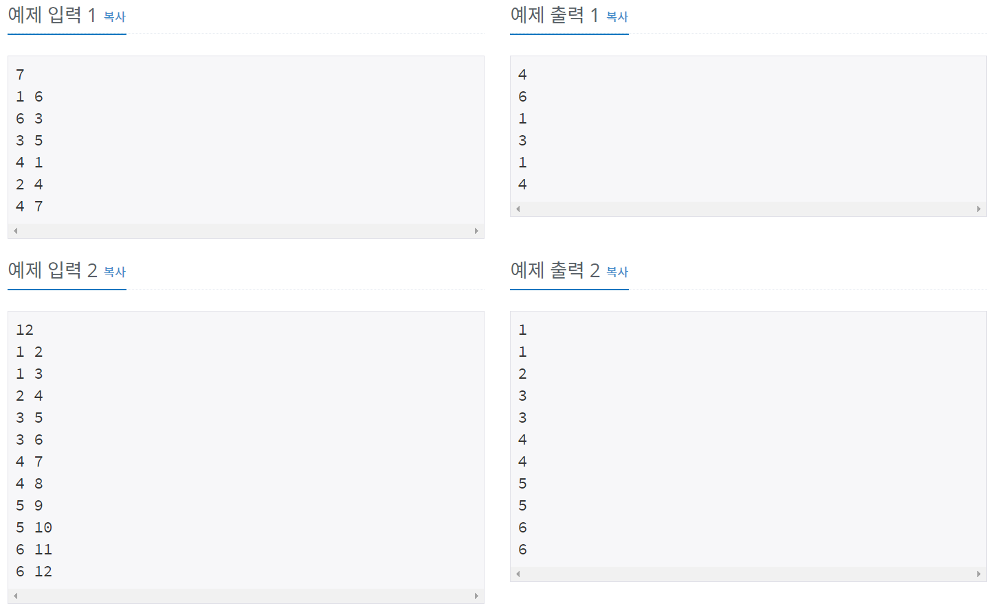
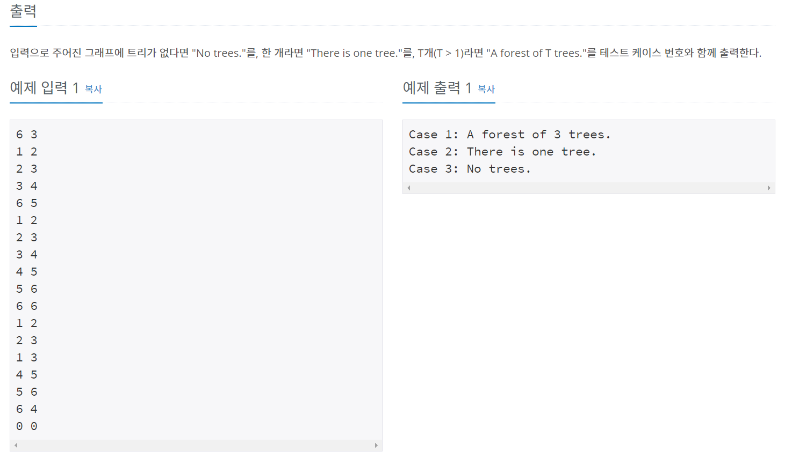
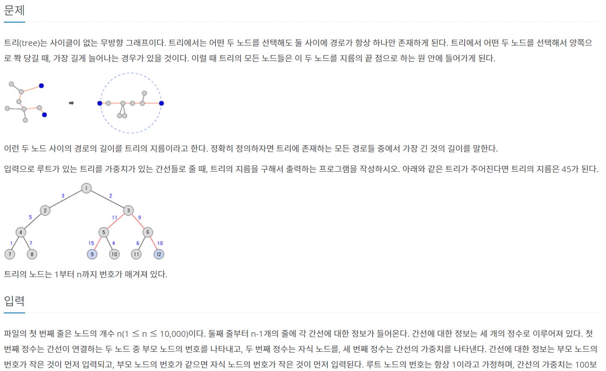
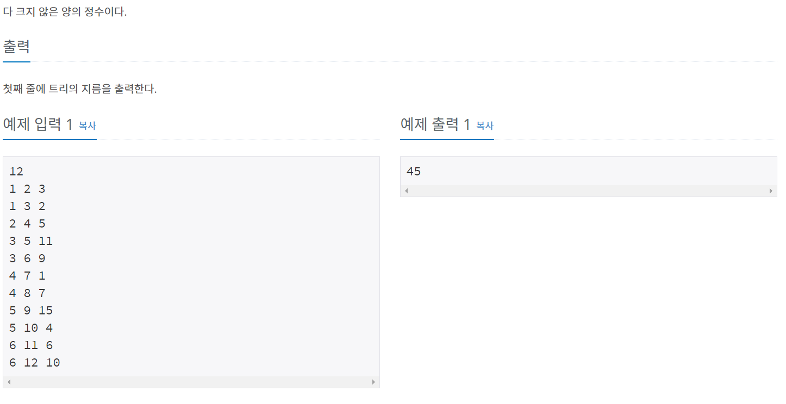
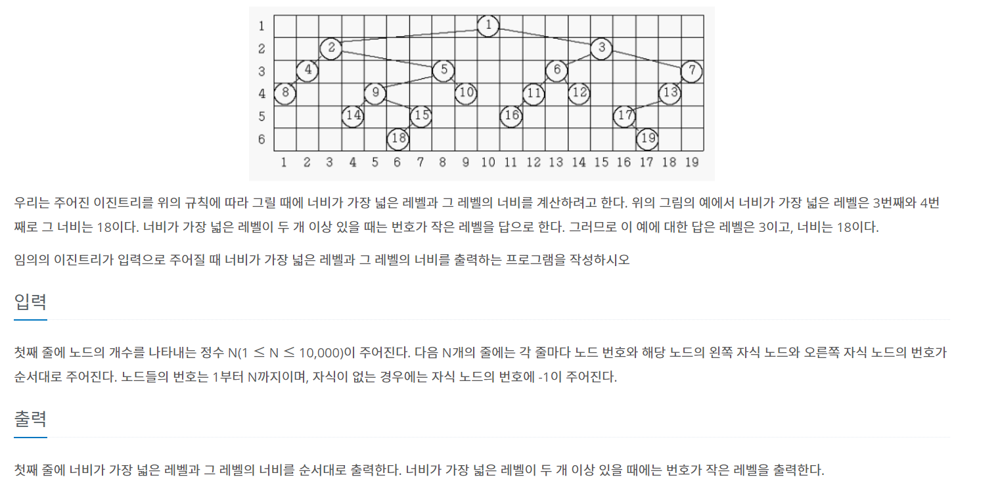
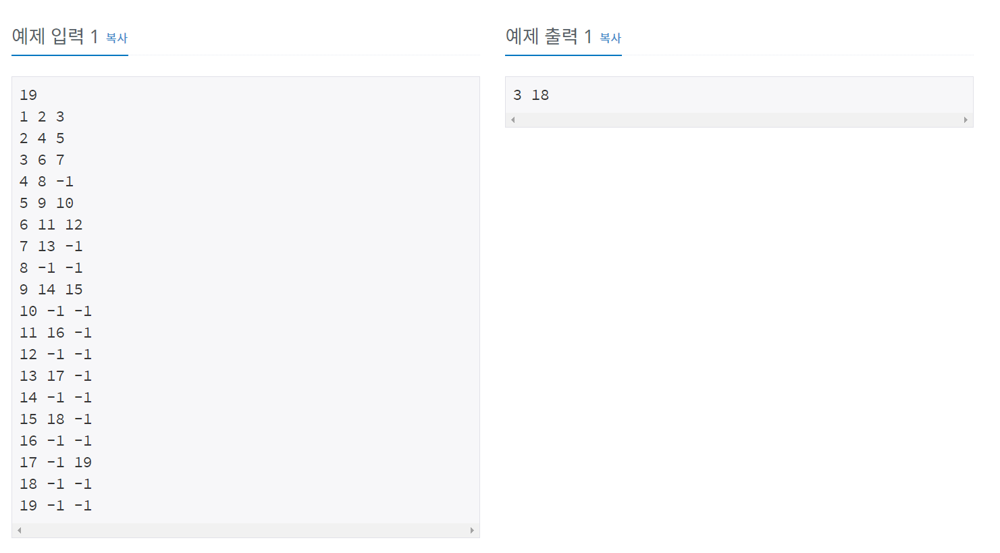
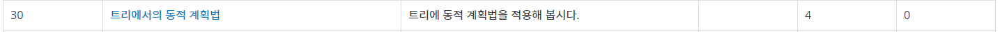

트리를 정리해보자 ㅎㅎ

## 특징
```
1. 연결 그래프
2. 방향을 무시하였을 때, 싸이클이 존재하지 않는다.
3. 트리의 간선개수는 정점 개수보다 1작다.
```

트리의 서브트리는 절대로 영역이 겹치지 않음 -> **분할정복**, **DP**로 장난을 잘 칠 줄 알아야 한다.

## 순회 방법

트리의 순회 방법은 3가지다.
```
1. 전위 순회 (root -> left -> right) 
2. 중위 순회 (left -> root -> right)
3. 후위 순회 (left -> right -> root)
```
보통 BFS, DFS로 구현한다.

## [백준 11725] - 트리의 부모찾기 




### 풀이
---

BFS, DFS를 사용해 탐색하는 방식으로 구현했다.

---
```java
package package27;

import java.io.BufferedReader;
import java.io.IOException;
import java.io.InputStreamReader;
import java.util.ArrayList;
import java.util.LinkedList;
import java.util.Queue;

public class num11725 {
	static int N;
	static ArrayList<ArrayList<Integer>> tree;
	static StringBuilder sb;
	static int[] result;
	static boolean[] visited;
	
	public static void main(String[] args) throws IOException {
		BufferedReader br = new BufferedReader(new InputStreamReader(System.in));
		tree = new ArrayList<ArrayList<Integer>>();
		sb = new StringBuilder();
		
		int N = stoi(br.readLine());
		result = new int[N+1];
		visited = new boolean[N+1];
		for(int i=0; i<=N; i++) {
			tree.add(new ArrayList<Integer>());
		}
		
		for(int i=0; i<N-1; i++) {
			String[] edge = br.readLine().split(" ");
			int node1 = stoi(edge[0]);
			int node2 = stoi(edge[1]);

			tree.get(node1).add(node2);
			tree.get(node2).add(node1);
		}
		
//		dfs(1);
		bfs();
		
		for(int i=2; i<=N; i++) {
			System.out.println(result[i]);
		}
	}
	
    private static void dfs(int num){
        if(visited[num]){
            return;
        }
        visited[num] =true;
        for (int node: tree.get(num)) {
            if(!visited[node]){
                result[node] = num;
                dfs(num);
            }

        }

    }
	
	public static void bfs() {
		Queue<Integer> queue = new LinkedList<Integer>();
		for(int value : tree.get(1)) {
			result[value] = 1;
			queue.add(value);
		}
		
		while(!queue.isEmpty()) {
			int node = queue.remove();
			
			for(int value : tree.get(node)) {
				if(result[value] == 0) {
					result[value] = node;
					queue.add(value);
				}
			}
		}
		
	}
	
	public static int stoi(String string) {
		return Integer.parseInt(string);
	}
}

```


## [백준 4803] - 트리




### 풀이

아.... 이거 풀다가 책상 부실뻔 했다. 너무 헤맸다... ㅜㅜ

일단 문제에 T는 트리의 개수다.

dfs로 입력받은 노드 모두 탐색하고, cycle이 존재하면 no tree로 출력하게 짰는데 계속 틀렸다고 나왔다.  ㅎㅎ 정답을 알려줘

열받아서 [마포 코딩박님 블로그](https://mapocodingpark.blogspot.com/2020/05/4803.html) dfs 부분을 참고해서 코드 작성했다.

일단 정답은 맞췄다고 나오는데 

```
입력값 
7 4
1 2
2 3
3 1
6 7
0 0
출력값 
Case 1: A forest of 3 trees.
```

이렇게 나오는데 이거 틀린거 아님? cycle 있으면 트리 없다고 나와야 하는거 아닌가 아시는 분 알려주세요ㅜㅜㅜㅜㅜ

아 짜증나 ㅋㅋㅋㅋㅋㅋㅋㅋㅋㅋㅋㅋㅋㅋ 화 좀 식히고 나중에 생각나면 다시 봐야겠다...

```java
package package27;

import java.io.BufferedReader;
import java.io.IOException;
import java.io.InputStreamReader;
import java.util.ArrayList;

public class num4803 {
	static int N, M, count, caseIndex = 0;
	static StringBuilder sb;
	static BufferedReader br; 
	static ArrayList<Integer>[] graph;
	static boolean[] visited;
	
	public static void main(String[] args) throws IOException {
		br = new BufferedReader(new InputStreamReader(System.in));
		sb = new StringBuilder();
		
		while(true) {
			String[] NM = br.readLine().split(" ");
			
			N = stoi(NM[0]);
			M = stoi(NM[1]);
			graph = new ArrayList[N+1];
			visited = new boolean[N+1];
			
			if(N==0 && M==0) {
				break;
			}
			
			resetData();
			
			inputTreeData();
			
			checkTree();
		}
		System.out.println(sb);
	}
	
	public static void inputTreeData() throws IOException {
		for(int i=0; i<M; i++) {
			String[] Edge = br.readLine().split(" ");
			int v1 = stoi(Edge[0]), v2 = stoi(Edge[1]);
			
			graph[v1].add(v2);
			graph[v2].add(v1);
		}
	}
	
	public static void checkTree() {

		for(int i=1; i<=N; i++) {
			if(!visited[i]) {
				if(dfs(i, 0))
					count++;
			}
		}
		
		if(count == 1) {
			sb.append("Case "+caseIndex+": There is one tree.\n");
		}else if(count==0){
			sb.append("Case "+caseIndex+": No trees.\n");
		}else {
			sb.append("Case "+caseIndex+": A forest of "+count+" trees.\n");
		}
	}
	
	public static boolean dfs(int num, int prev) {
		visited[num] = true;
		
		for(int node : graph[num]) {
			if (node == prev) continue;
			if (visited[node]) return false;
			if (dfs(node, num) == false) return false;
		}
		return true;
	}
	
	public static void resetData() {
		for(int i=0; i<=N; i++) {
			graph[i] = new ArrayList<Integer>();
			visited[i] = false;
		}
		count = 0;
		caseIndex++;
	}

	public static int stoi(String string) {
		return Integer.parseInt(string);
	}
}

```

## [백준 1967] - 트리의 지름

처음에 문제 접근하는 법을 잘못해서 좀 헤맸다.

트리의 지름을 구하는 방법은 다음과 같다.

```
1. 트리의 임의의 정점(x)에서 가장 먼 정점(y)을 찾는다.
2. 가장 먼 정점(y) 에서 가장 먼 정점(z)을 찾는다.
 => 지름은 y - z 까지의 거리다.
```

증명이 궁금하면 [전명우님 블로그 - 트리의 지름 구하기](https://blog.myungwoo.kr/112) 에 쉽게 설명한 글이 있다.  
 -> 한줄 요약 : 어떤 한 점에서 가장 먼 점이 지름에 무조건 포함된다 (포함 안되는 경우를 증명)




```java

package package27;

import java.io.BufferedReader;
import java.io.IOException;
import java.io.InputStreamReader;
import java.util.ArrayList;

public class num1967 {
	static int N, result = 0, start;
	static ArrayList<ArrayList<Edge>> Vertex;
	static boolean[] visited;
	
	public static void main(String[] args) throws IOException {
		BufferedReader br = new BufferedReader(new InputStreamReader(System.in));
		
		N = stoi(br.readLine());
		Vertex = new ArrayList<ArrayList<Edge>>();
		
		for(int i=0; i<=N; i++) {
			Vertex.add(new ArrayList<Edge>());
		}
		
		for(int i=1; i<N; i++) {
			String[] inputData = br.readLine().split(" ");
			int node1 = stoi(inputData[0]);
			int node2 = stoi(inputData[1]);
			int w = stoi(inputData[2]);
			
			Vertex.get(node1).add(new Edge(node2, w));
			Vertex.get(node2).add(new Edge(node1, w));
		}
		
		visited = new boolean[N+1];
		visited[1] = true;
		dfs(0, 1);
		
		visited = new boolean[N+1];
		visited[start] = true;
		dfs(0, start);
		
		System.out.println(result);
	}
	
	public static int dfs(int len, int now) {
		if (result < len) {
			result = len;
			start = now;
		}
		System.out.println(now);

        for (Edge node: Vertex.get(now)) {
            if(!visited[node.e]){
            	visited[node.e] = true;
            	dfs(len + node.w, node.e);
            }
        }
        return result;
	}
	
	public static int stoi(String string) {
		return Integer.parseInt(string);
	}
	
	static class Edge{
		int e, w;
		Edge(int e,int w){
			this.e = e;
			this.w = w;
		}
	}
}

```

[트리의 지름 - 백준1167](https://www.acmicpc.net/problem/1167)번 비슷한 문제다.  


## [백준 2250] - 트리의 높이와 너비

이문제 풀면서 많이 헤맸다ㅋㅋㅋㅋㅋㅋㅋ 

배열 만들어서 깊이마다 맨 오른쪽 값을 맨 왼쪽 값 빼면 될 것 같다는 생각을 했는데.....

양심고백을 조금 해보면 오늘 삽질을 너무 많이 해서 고민 많이 안해보고 정답 해결 방법부터 찾아봤다.

[쾌락코딩님 블로그 - 백준2250번 문제(트리의 높이와 너비) with Java](https://wooooooak.github.io/algorithm/2018/12/05/%EB%B0%B1%EC%A4%802250%EB%AC%B8%EC%A0%9C/)글을 참고했다.

문제의 포인트는 3가지다.

```
1. 문제에서 루트가 정해져 있지 않다
   -> 루트를 확인할 수 있는 뭔가 방법이 필요
2. 트리의 높이마다 가장 오른쪽 값, 가장 왼쪽값 저장
   -> 오른쪽 - 왼쪽 + 1
3. 중위 순회로 순회
   -> 그림보면 왼쪽 - 루트 - 오른쪽 순으로 index가 표시되있음
```





### 풀이

```java
package package27;

import java.io.BufferedReader;
import java.io.IOException;
import java.io.InputStreamReader;

public class num2250 {
	static int N, maxWidth, maxDepth, root, vCount = 1;
	static Node[] tree;
	
	static int[] depthLeft;
	static int[] depthRight;
	static BufferedReader br;
	
	public static void main(String[] args) throws IOException {
		br = new BufferedReader(new InputStreamReader(System.in));
		
		N = stoi(br.readLine());
		
		init();
		
		inputTreeData();
		
		searchRootIndex();
		
		inOrder(root, 1);
		
		printResult();
		
	}
	
	public static void init() {
		tree = new Node[N+1];
		depthLeft = new int[N+1];
		depthRight = new int[N+1];
		
		for(int i=0; i<=N; i++) {
			tree[i] = new Node(-1, -1, -1);
			depthLeft[i] = N+1;
		}
	}
	
	public static void inputTreeData() throws IOException {
		for(int i=0; i<N; i++) {
			String[] inputData = br.readLine().split(" ");
			
			int num = stoi(inputData[0]);
			int left = stoi(inputData[1]);
			int right = stoi(inputData[2]);
			
			tree[num].left = left;
            tree[num].right = right;
            if(left != -1)
                tree[left].parent = num;
            
            if(right != -1)
                tree[right].parent = num;
		}
	}
	
	public static void searchRootIndex() {
		for(int i=1; i <= N; i++) {
			if(tree[i].parent == -1) {
				root = i;
				break;
			}
		}
	}
	
	public static void inOrder(int parentIndex, int depth) {
        Node root = tree[parentIndex];
        if(maxDepth < depth) maxDepth = depth;
        if(root.left != -1) {
            inOrder(root.left, depth + 1);
        }
        
        depthLeft[depth] = Math.min(depthLeft[depth], vCount);
        depthRight[depth] = vCount++;
        
        if(root.right != -1) {
            inOrder(root.right, depth + 1);
        }
	}
	
	public static void printResult() {
        int index = 1;
        int maxWitdh = depthRight[1] - depthLeft[1] + 1;
        for(int i=2; i <= maxDepth; i++) {
            int tmp = depthRight[i] - depthLeft[i] +1;
            if(maxWitdh < tmp) {
            	index = i;
            	maxWitdh = tmp;
            }
        }
        
        System.out.println(index + " " + maxWitdh);
	}
	
	public static int stoi(String string) {
		return Integer.parseInt(string);
	}
	
	static class Node{
		int parent, value, left, right;
		Node(int value, int left, int right){
			this.parent = -1;
			this.value = value;
			this.left = left;
			this.right = right;
		}
	}
}

```

## 정리

사실 트리는 학교 알고리즘 시간에 다뤄봐서 정리하는데 오래걸리지 않을 줄 알았는데 생각보다 오래걸렸다 ㅜㅜㅜㅜ 문제도 많이 풀어봐야 할 듯.... 

정.말.알.고.리.즘.문.제.풀.이.는.너.무.재.밌.다.하.하.하.하.하.하.하.하.하.하.하.하.하

오늘 정리한 문제들은 dfs, bfs로 탐색하는 문제들이었다.


아래 사진같은3 유형의 문제들도 있던데.....

빠른 시일내로 4문제 풀어봐야겠다. (조금 무서워 보인다ㅋ)

# Reference
[라이님 블로그](https://m.blog.naver.com/kks227/220788265724)  
[전명우님 블로그](https://blog.myungwoo.kr/112)  
[쾌락코딩님 블로그 - 백준2250번 문제(트리의 높이와 너비) with Java](https://wooooooak.github.io/algorithm/2018/12/05/%EB%B0%B1%EC%A4%802250%EB%AC%B8%EC%A0%9C/)  
[마포 코딩박님 블로그](https://mapocodingpark.blogspot.com/2020/05/4803.html)  