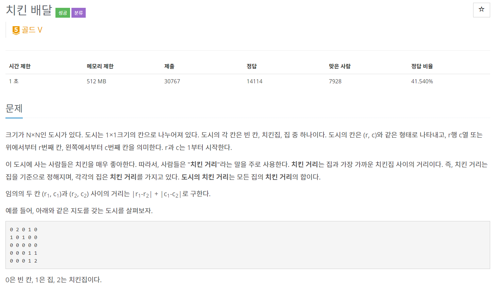
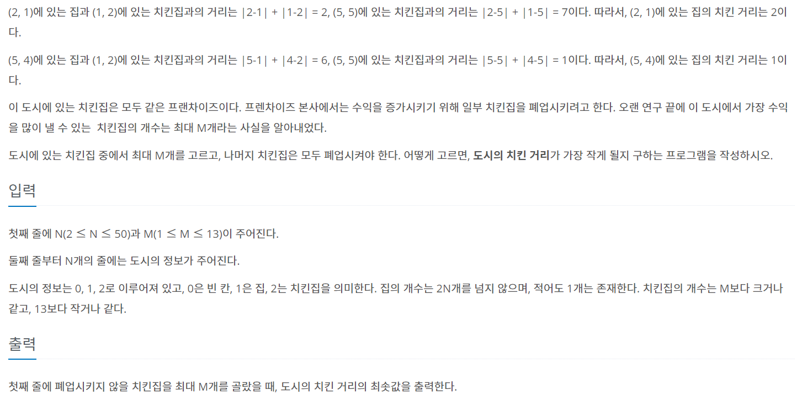
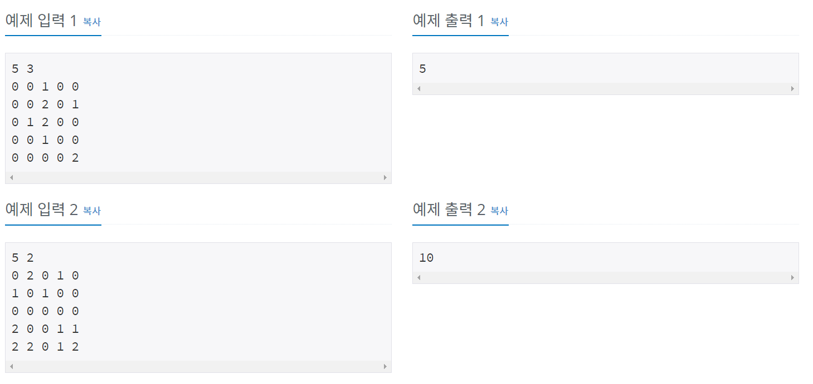
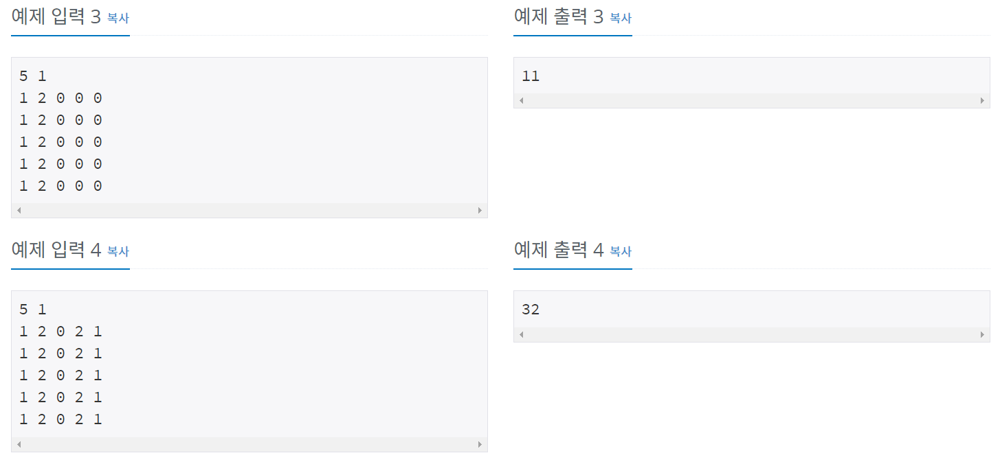

머리 식힐 겸 재밌어 보이는 문제 찾다가 풀어봤다.

## 문제






## 풀이

풀이는 다음과 같다.
```
1. 조합으로 치킨 집 구함
2. 치킨 집에서 집까지 거리를 찾는다.
3. 구한 거리의 합이 현재 가지고 있는 최솟값보다 작으면 교체
```

```java
import java.io.BufferedReader;
import java.io.IOException;
import java.io.InputStreamReader;
import java.util.ArrayList;
import java.util.Arrays;

public class Main {
	static int N, M, result = Integer.MAX_VALUE;
	static ArrayList<House> house;
	static ArrayList<Chicken> chicken;
	static int[] houseLen;
	public static void main(String[] args) throws IOException {
		BufferedReader br = new BufferedReader(new InputStreamReader(System.in));
		
		String[] NM = br.readLine().split(" ");
		N = stoi(NM[0]);
		M = stoi(NM[1]);
		boolean[] visited = new boolean[14];
		house = new ArrayList<House>();
		chicken = new ArrayList<Chicken>();
		
		for(int i=0; i<N; i++) {
			String[] inputData = br.readLine().split(" ");
			for(int j=0; j<N; j++) {
				int num = stoi(inputData[j]);
				if(num == 0) {
					continue;
				}else if(num == 1) {
					house.add(new House(i,j));
				}else {
					chicken.add(new Chicken(i,j));
				}
			}
		}
		houseLen = new int[house.size()];
		combination(visited, 0, chicken.size(), M);
		System.out.println(result);
		
	}
	public static void combination(boolean[] visited, int start, int n, int r) {
		if(r==0) {
			int len = 0;
			int index = 0;
			ArrayList<Chicken> ncr = new ArrayList<Chicken>();
			for(int i=0; i<visited.length; i++) {
				if(visited[i]==true) {
					ncr.add(chicken.get(i));
					index++;
				}
			}
			len = calcMinLen(ncr);
			result = result < len ? result : len;
			return;
		}

		for(int i=start; i<n; i++) {
			visited[i] = true;
			combination(visited, i+1, n, r-1);
			visited[i] = false;
		}
		
	}
	
	public static int calcMinLen(ArrayList<Chicken> c) {
		int minLen = 0;
		Arrays.fill(houseLen, Integer.MAX_VALUE);
		for(int i=0; i<c.size(); i++) {
			Chicken now = c.get(i);
			for(int k=0; k<house.size(); k++) {
				int houseNowLen = Math.abs(now.x - house.get(k).x) + Math.abs(now.y - house.get(k).y);
				houseLen[k] = houseLen[k] < houseNowLen ? houseLen[k] : houseNowLen;
			}
//			System.out.println(now.x + " " + now.y);
		}
		for(int i=0; i<houseLen.length; i++) {
			minLen += houseLen[i];
//			System.out.println(houseLen[i]);
		}
//		System.out.println(minLen);
		
		return minLen;
	}
	public static int stoi(String string) {
		return Integer.parseInt(string);
	}

	static class Chicken{
		int x, y;
		Chicken(int x, int y){
			this.x = x;
			this.y = y;
		}
	}
	static class House{
		int x, y;
		House(int x, int y){
			this.x = x;
			this.y = y;
		}
	}
}

```

주석 해놓은 부분 주석풀고 실행해보면 과정 살펴볼 수 있다.

상어들로 장난치는 문제들도 있는데 아침 공부 시작할 때 풀어보면 좋을 것 같다. 

끗