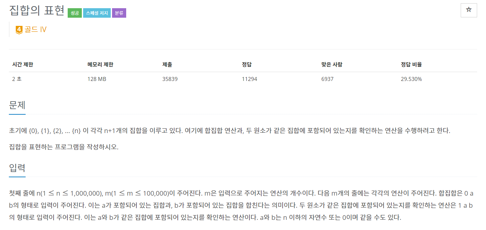
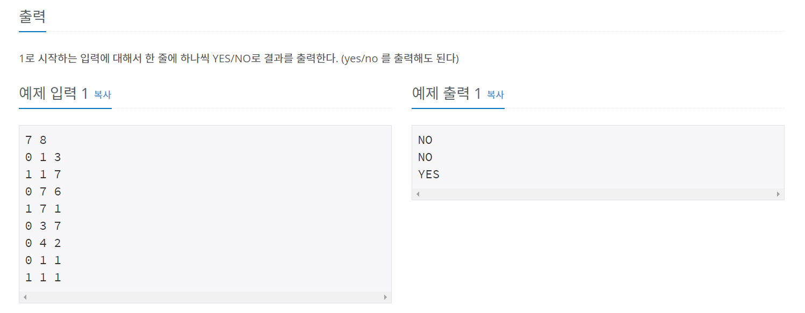
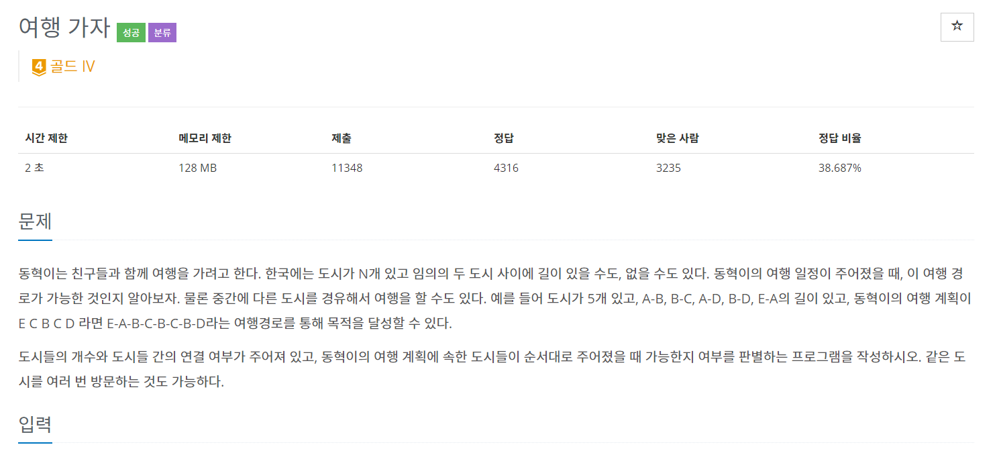
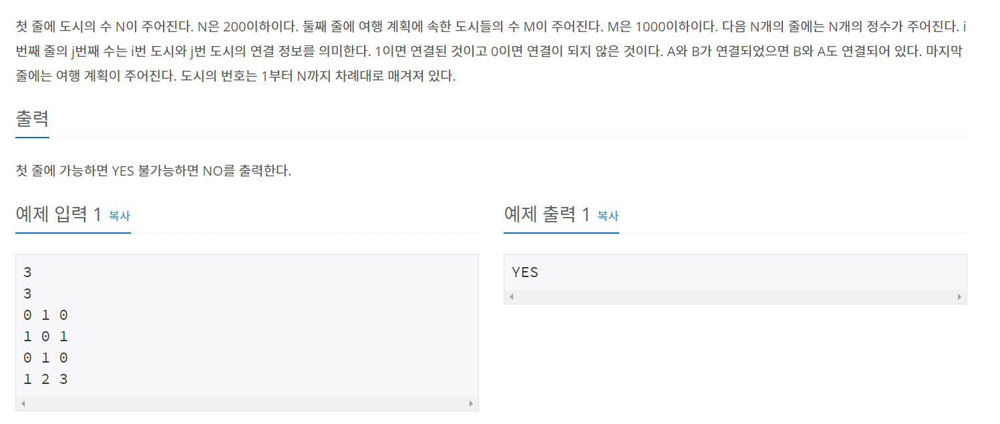
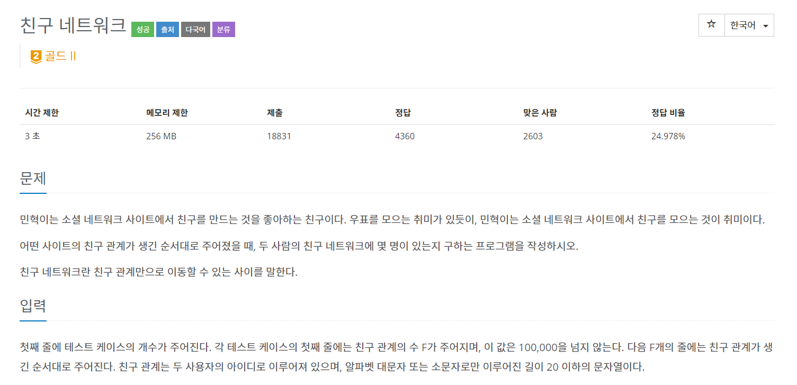
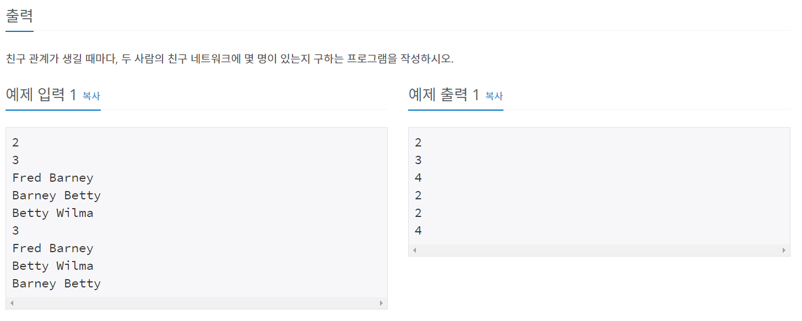
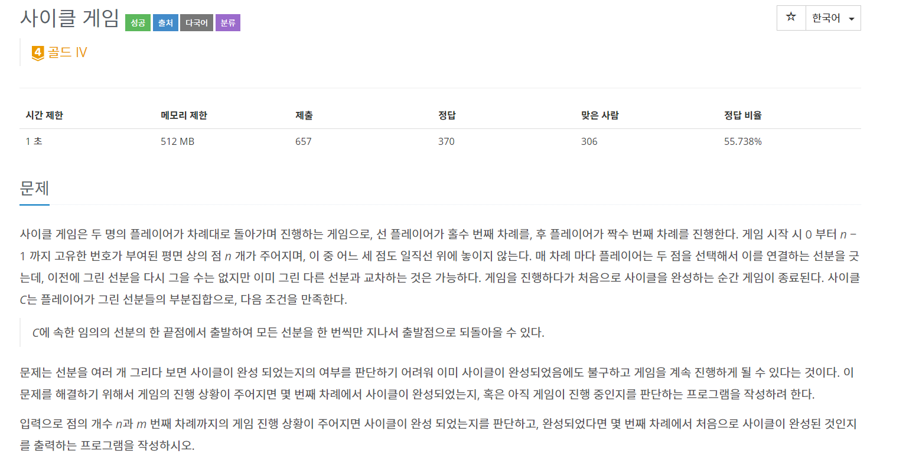
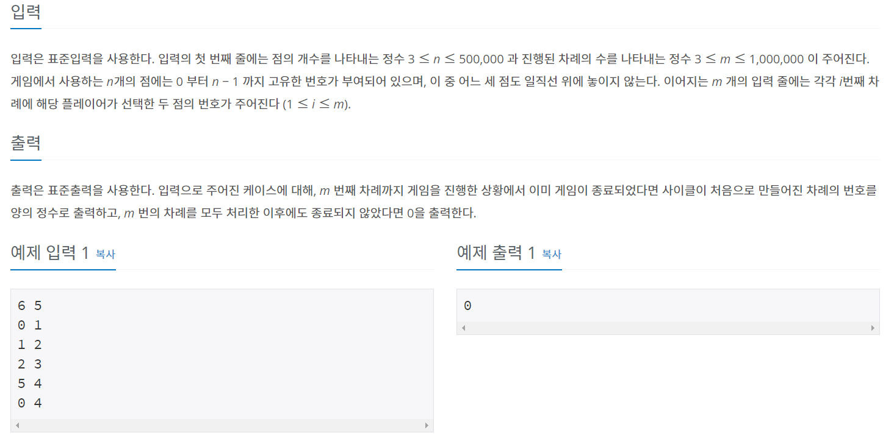
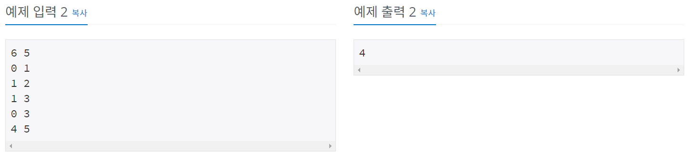

# 서로소 집합 자료구조란?
---

> 서로소 부분 집합들로 나누어진 원소들의 데이터를 처리하기 위한 자료구조

Union-Find Algorithm 은 그래프내 셀프루프 (self-loop : 자기자신을 가리키는 간선)을 포함하면  
안되고 **무방향그래프에서 사이클 찾는데 유용**

**Union, find 2개의 연산**이 있다.


## 전제 조건
---

> 같은 집합에 포함되어 있는 정점들끼리는 이미 간선으로 연결 된 것이고, 다른 집합의 정점과는 서로 연결되지 않았다는 것을 기반한다.

## 1. Union 연산
---
> 2개의 원소가 포함된 집함을 하나의 집합으로 합치는 연산

- Union연산은 간선으로 표현된다.
  (실제로는 트리 구조)

## 2. Find 연산
---

> 특정한 원소가 속한 집합이 어떤 집합인지 알려주는 연산

- 경로 압축 기법을 적용해 시간 복잡도를 개선한다. 
- 경로압축이란? 
  - 여기선 find함수를 재귀적으로 호출한 뒤에 부모 테이블 값을 갱신하는 기법을 말함

## 시간 복잡도
---

노드의 개수 : V , 최대 V-1개의 union 연산과 M개의 find연산이 가능할 때  
 -> O(V + M(1+log~2-M/V~V))  
 (O(1)이라고 생각하면 된다고 한다.)

## 구현
---
```
1. 초기값 자기 자신을 원소로 가지고 있게 설정
2. 간선을 확인하며 두 노드의 루트 노드를 확인.
   2-1. 루트 노드가 서로 다르면 두 노드에 대하여 union 연산을 수행
   2-2. 루트 노드가 같다면 사이클이 발생
3. 그래프에 포함되어 있는 모든 간선에 대하여 과정을 반복
```

## Tip!!
> 유니온파인드는 상황에 따라 **여러가지 정보 추가 가능**

# 백준 1717번
---





---

위에서 설명했던 그대로 Union함수와 Find함수를 구현했다.

---

```java
package package28;

import java.io.BufferedReader;
import java.io.IOException;
import java.io.InputStreamReader;

public class num1717 {
	static int N, M;
	static int[] parent;
	
	public static void main(String[] args) throws IOException {
		BufferedReader br = new BufferedReader(new InputStreamReader(System.in));
		StringBuilder sb = new StringBuilder();
		String[] NM = br.readLine().split(" ");
		
		N = stoi(NM[0]);
		M = stoi(NM[1]);
		parent = new int[N];
		
		for(int i=0; i<N; i++) {
			parent[i] = i;
		}
		
		for(int i=0; i<M; i++) {
			String[] inputData = br.readLine().split(" ");
			
			int action = stoi(inputData[0]);
			int a = stoi(inputData[1])-1;
			int b = stoi(inputData[2])-1;
			
			
			if(action == 0) {
				union(a,b);
			}else {
				sb.append(find_parent(a) == find_parent(b) ? "YES" : "NO");
				sb.append("\n");
			}
		}
		System.out.println(sb);
	}
	
	public static int find_parent(int num) {
		if(parent[num] != num)
			parent[num] = find_parent(parent[num]);
		return parent[num];
	}
	
	public static void union(int a, int b) {
		int aParent = find_parent(a);
		int bParent = find_parent(b);
		if(aParent<bParent)
			parent[b] = a;
		else
			parent[a] = b;
	}
	
	public static int stoi(String string) {
		return Integer.parseInt(string);
	}

}

```


# 백준 1976번
---





---

1717번 문제와 거의 동일하다.

마지막에 입력받은 값들이 하나의 부모노드를 가지고 있는지 알아보면 된다.

---

```java
package package28;

import java.io.BufferedReader;
import java.io.IOException;
import java.io.InputStreamReader;
import java.util.StringTokenizer;

public class num1976 {
	static int N, M;
	static int[] parent;
	
	public static void main(String[] args) throws IOException {
		BufferedReader br = new BufferedReader(new InputStreamReader(System.in));
		
		N = stoi(br.readLine());
		M = stoi(br.readLine());
		parent = new int[N+1];
		
		for(int i=1; i<=N; i++) {
			parent[i] = i;
		}
		
		for(int i=1; i<=N; i++) {
			String[] inputData = br.readLine().split(" ");
			for(int j=0; j<N; j++) {
				int num = stoi(inputData[j]);
				if(num == 1) {
					union(i, j+1);
				}
			}
		}
		
		String[] map = br.readLine().split(" ");
		boolean resultIndex = true;
		int index = parent[stoi(map[0])];
		
		for(int i=1; i<map.length; i++) {
			if(index != parent[stoi(map[i])])
				resultIndex = false;
		}
		System.out.println(resultIndex == true ? "YES" : "NO");
	}
	
	public static int find_parent(int num) {
		if(parent[num] == num)
			return num;
		return parent[num] = find_parent(parent[num]);
	}
	
	public static void union(int a, int b) {
		a = find_parent(a);
		b = find_parent(b);
		if (a != b) {
            if (a < b) {
                parent[b] = a;
            } else {
                parent[a] = b;
            }
		}
	}
	
	public static int stoi(String string) {
		return Integer.parseInt(string);
	}
}

```

# 백준 4195번
---





---

이문제는 위의 문제들과 다르게 입력값이 문자열로 들어온다.

HashMap을 사용해서 문자열마다 index를 할당해주는 방식으로 구현했다.

---

```java
package package28;

import java.io.BufferedReader;
import java.io.IOException;
import java.io.InputStreamReader;
import java.util.Arrays;
import java.util.HashMap;

public class num4195 {
	static int N, F, index;
	static HashMap<String, Integer> map;
	static int[] parent;
	
	public static void main(String[] args) throws IOException {
		BufferedReader br = new BufferedReader(new InputStreamReader(System.in));
		StringBuilder sb = new StringBuilder();
		N = stoi(br.readLine());
		
		for(int i=0; i<N; i++) {
			map = new HashMap<String, Integer>();
			index = 1;
			
			F = stoi(br.readLine());
			parent = new int[2*F+1];
			Arrays.fill(parent, -1);
			
			for(int j=0; j<F; j++) {
				String[] inputData = br.readLine().split(" ");
				int v1 = getMapValue(inputData[0]);
				int v2 = getMapValue(inputData[1]);
				int result = union(v1,v2);
				sb.append(result+"\n");
			}
		}
		System.out.println(sb.toString());
	}
	
	public static int find_parent(int num) {
		if(parent[num] < 0)
			return num;
		return parent[num] = find_parent(parent[num]);
	}
	
	public static int union(int a, int b) {
		a = find_parent(a);
		b = find_parent(b);
		if (a != b) {
            if (a < b) {
            	parent[a] += parent[b];
                parent[b] = a;
            } else {
            	parent[b] += parent[a];
                parent[a] = b;
            }
		}
		return parent[a] < 0 ? parent[a] : parent[b];
	}
	
	public static int getMapValue(String string) {
		if(!map.containsKey(string)) {
			map.put(string, index);
			index++;
		}
		return map.get(string);
	}
	
	public static int stoi(String string) {
		return Integer.parseInt(string);
	}
}

```

# 백준 20040번
---






---

이문제는 첫번째, 두번째 문제와 비슷한데  
사이클이 존재하면 사이클이 걸린 입력순서를 출력해주는 문제다.


---

```java
package package28;

import java.io.BufferedReader;
import java.io.IOException;
import java.io.InputStreamReader;
import java.util.Arrays;
import java.util.StringTokenizer;

public class num20040 {
	static int N, M;
	static int[] parent;
	
	public static void main(String[] args) throws IOException {
		BufferedReader br = new BufferedReader(new InputStreamReader(System.in));
		StringTokenizer st;
		
		int index = 0;
		st = new StringTokenizer(br.readLine());
		N = stoi(st.nextToken());
		M = stoi(st.nextToken());
		parent = new int[N+1];
		for(int i =0; i<=N; i++) {
			parent[i] = i;
		}
		for(int i=0; i<M; i++) {
			st = new StringTokenizer(br.readLine());
			int v1 = stoi(st.nextToken());
			int v2 = stoi(st.nextToken());
			if(!union(v1,v2)) {
				index = i+1;
				break;
			}
		}
		System.out.println(index);
	}
	
	public static boolean union(int a, int b) {
		a = find_parent(a);
		b = find_parent(b);
		if(a==b)
			return false;
		if(a!=b) {
			if(a < b) {
				parent[b] = a;
			}else {
				parent[a] = b;
			}
		}
		return true;
	}
	
	public static int find_parent(int num) {
		if(parent[num] == num)
			return num;
		return parent[num] = find_parent(parent[num]);
	}
	
	
	public static int stoi(String string) {
		return Integer.parseInt(string);
	}
}

```

블로그와 책을 읽고 유니온 파인드 개념을 정리해보았다.  

유니온 파인드는 **최소신장트리**에 이용된다고  한다.  
궁금하니 빠른 시일내로 공부해야겠다 ㅋㅋ    

# Referece
[라이님 블로그](https://m.blog.naver.com/kks227/220791837179)  
[잭팟53님 블로그](https://jackpot53.tistory.com/)  
이것이 취업을 위한 코딩 테스트다 - 나동빈  