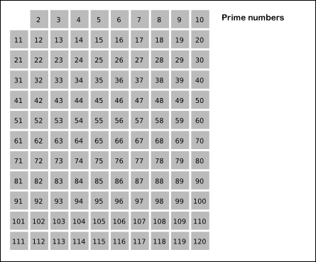
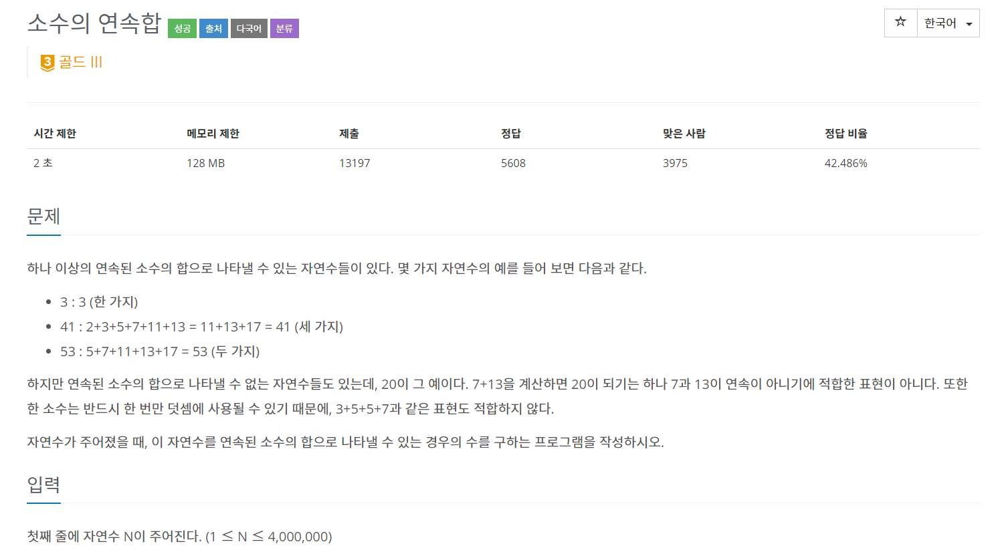
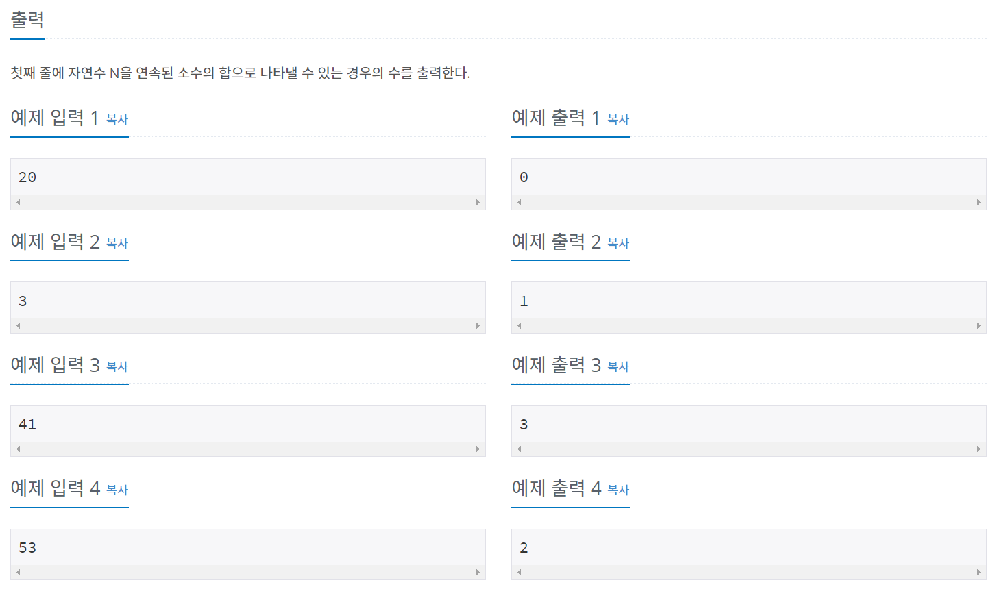

백준 단계별 문제 - 투포인터에 있는 1644번 문제를 풀다 소수 구하는 알고리즘이 생각이 안나서 정리 해둘 겸 포스팅한다.

# 에라토스테네스의 체란?
 
> 소수가 되는 수의 배수를 지우면 남는 건 소수가 된다

요런 알고리즘이다.



## 백준 1644 - 소수의 연속 합
---

```
1. 에라토스테네스의 체로 소수 구하는 방법을 활용해 소수를 구한다.
2. 투포인터 알고리즘을 활용해 연속 합 확인
```





---

```java
package package25;

import java.io.BufferedReader;
import java.io.IOException;
import java.io.InputStreamReader;
import java.util.ArrayList;

public class num1644 {
	static int N, sum = 0, s = 0, e = 0, count = 0;
	static boolean primeCheckArr[];
	static ArrayList<Integer> primeList;
	
	public static void main(String[] args) throws IOException {
		BufferedReader br = new BufferedReader(new InputStreamReader(System.in));
		
		N = stoi(br.readLine());
		primeCheckArr = new boolean[N+1];        
        primeList = new ArrayList<Integer>();
        
        getPrimeNumber();
        
        getCountResult();
        
        System.out.println(count);
		
	}
	
	public static void getCountResult() {
		while(true) {
			if(sum>=N) sum-=primeList.get(s++);
			else if(e == primeList.size()) break;
			else sum+=primeList.get(e++);
			if(sum == N) count++;	
		}
	}
	
	public static void getPrimeNumber() {
		primeCheckArr[0] = primeCheckArr[1] = true;  
		
        for(int i=2; i*i<=N; i++){
            if(!primeCheckArr[i]) {
            	for(int j=i*i; j<=N; j+=i)
            		primeCheckArr[j]=true;                
            }
        }
        
        for(int i=1; i<=N;i++){
        	if(!primeCheckArr[i]) primeList.add(i); 
        }
	}
	
	public static int stoi(String string) {
		return Integer.parseInt(string);
	}

}
```

---
추가로 소수를 구하는 부분의 for문을 살펴보면 

```java
for(int i=2; i*i<=N; i++){
    if(!primeCheckArr[i]) {
    	for(int j=i*i; j<=N; j+=i)
    		primeCheckArr[j]=true;                
    }
}
```

특정한 소수의 제곱근 까지만 구하면 된다
 -> 약수가 아닌경우는 수가 대칭을 이루기 때문

# Reference

[위키 백과](https://ko.wikipedia.org/wiki/%EC%97%90%EB%9D%BC%ED%86%A0%EC%8A%A4%ED%85%8C%EB%84%A4%EC%8A%A4%EC%9D%98_%EC%B2%B4)  