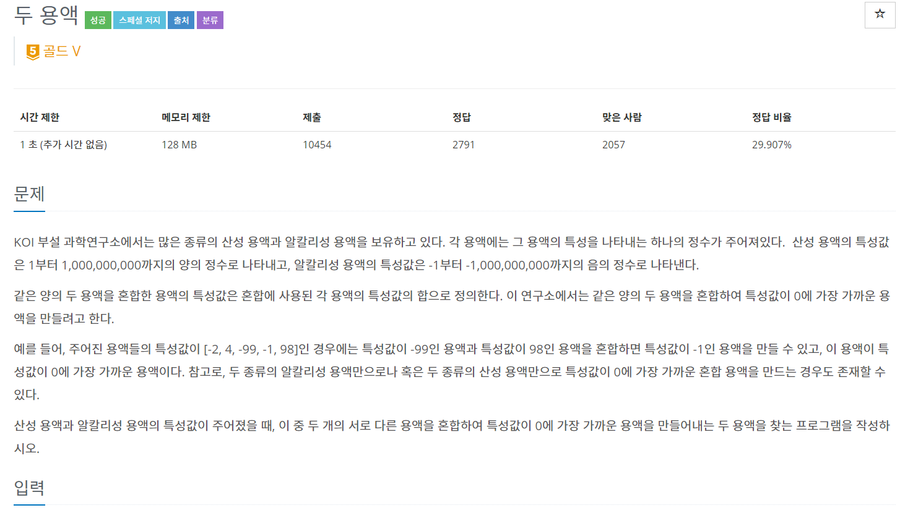
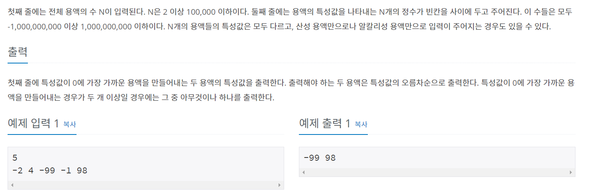
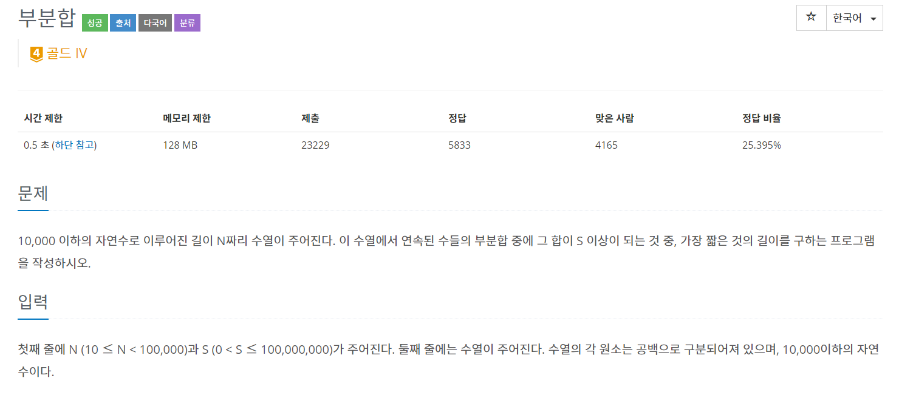
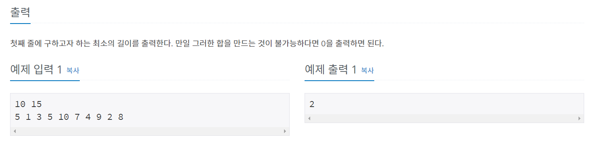
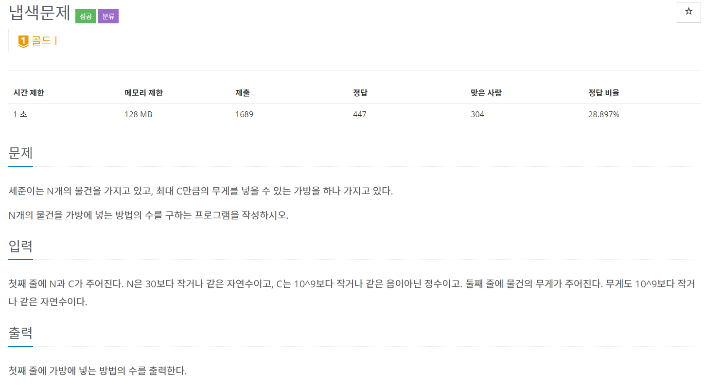
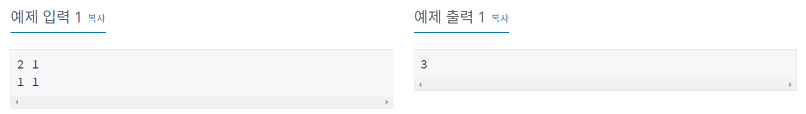

# 투 포인터 알고리즘
---

> 리스트에 순차적으로 접근해야 할 때 2개의 점의 위치를 기록하면서 처리하는 알고리즘을 의미한다.  

 -> **2개의 점을 무조건 증가시키는 방향으로 변화하면서 횟수 계산**

Tip!!  
 -> 연속된 값을 이용해 풀어나가는 문제에 한정적으로 사용해야 한다.
 (정렬을 통해 연속성을 줄 수 있다.)

## 백준 2470 - 두 용액
---




---
소스를 간략히 설명해보면

1. end점을 마지막, start점을 처음값을 가르키게 설정한다.

2. 입력받은 값을 정렬

3. sum값이 0보다 크면 end점의 index를 -1해주고, 0보다 작으면 start값을 +1해준다.
   (두 점이 가운데로 모이면서 진행된다.)

---

```java
package package25;

import java.io.BufferedReader;
import java.io.IOException;
import java.io.InputStreamReader;
import java.util.Arrays;

public class num2470 {
	static int N, s = 0, e, sum = 0, min = Integer.MAX_VALUE;
	static int[] arr, result;
	
	public static void main(String[] args) throws IOException {
		BufferedReader br = new BufferedReader(new InputStreamReader(System.in));
		
		N = stoi(br.readLine());
		e = N-1;
		arr = new int[N];
		result = new int[2];
		
		String[] inputData = br.readLine().split(" ");
		for(int i=0; i<N; i++) {
			arr[i] = stoi(inputData[i]);
		}
		Arrays.sort(arr);
		
		getResult();
		
		System.out.println(result[0] + " " + result[1]);
	}
	
	public static void getResult() {
		while(s < e) {
			sum = arr[s] + arr[e];
			if(min > Math.abs(sum)) {
				min = Math.abs(sum);
				result[0] = arr[s];
				result[1] = arr[e];
			}
			if(sum > 0) e--;
			else s++;
		}
	}
	
	public static int stoi(String string) {
		return Integer.parseInt(string);
	}
}

```

## 백준 1806 - 부분 합
---




---

연속 된 수들의 부분합이니 정렬 할 필요는 없다.

입력받은 S값 보다 작으면 end점을 늘려주고 S값 보다 크면 S점을 늘려준다.

---

```java
package package25;

import java.io.BufferedReader;
import java.io.IOException;
import java.io.InputStreamReader;

public class num1806 {
	static int INF = Integer.MAX_VALUE;
	static int N, S, result=INF, sum = 0, s = 0, e = 0;
	static int[] arr;
	
	public static void main(String[] args) throws IOException {
		BufferedReader br = new BufferedReader(new InputStreamReader(System.in));
		
		String[] NS = br.readLine().split(" ");
		N = stoi(NS[0]);
		S = stoi(NS[1]);
		arr = new int[N];
		
		String[] inputArr = br.readLine().split(" ");
		for(int i=0; i<N; i++) {
			arr[i] = stoi(inputArr[i]);
		}
		
		calcCount();
		
		result = result == INF ? 0 : result;
		System.out.println(result);
	}
	
	public static void calcCount() {
		while(true) {
			if(sum >= S) {
				sum-=arr[s++];
				result = Math.min(result, (e-s)+1);
			}else if(e == N) break;
			else sum+=arr[e++];
		}
	}
	
	public static int stoi(String string) {
		return Integer.parseInt(string);
	}
}

```

## 백준 1450 - 냅색 문제

이 문제가 어려웠다.

이 친구는 **Meet in the 알고리즘**을 사용한다.

### Meet in the 알고리즘이란?

> 구간을 반으로 나눈다.

범위를 2개로 나누면  
 -> O(2^n)의 시간복잡도가 O(2^(N/2)) 시간으로 줄어든다.

---




---

앞쪽과 뒤쪽으로 범위를 나눈다. 양쪽 구간에서 가능한 모든 합을 구해다 정렬하고 

한쪽 값들을 순회하면서 다른 구간를 탐색하면서 모든 합을 확인하고 C값보다 작거나 같은 값이 몇개인지 이분 탐색을 사용해 찾는다.

배열의 index값을 사용하기 때문에 count계산할 때 +1을 해주거나, 입력 받을 때 배열값을 장난쳐놔야 한다.

---

```java
package package25;

import java.io.BufferedReader;
import java.io.IOException;
import java.io.InputStreamReader;
import java.util.ArrayList;
import java.util.Collections;

public class num1450 {
	static int N, C, count =0, index;
	static int[] arr;
	static ArrayList<Integer> left, right;
	
	public static void main(String[] args) throws IOException {
		BufferedReader br = new BufferedReader(new InputStreamReader(System.in));
		
		String[] NC = br.readLine().split(" ");
		N = stoi(NC[0]);
		C = stoi(NC[1]);
		arr = new int[N];
		
		String[] arrData = br.readLine().split(" ");
		for(int i=0; i<N; i++) {
			arr[i] = stoi(arrData[i]);
		}
		
		left = new ArrayList<Integer>();
		right = new ArrayList<Integer>();
		
		calcPart(0,N/2,0,left);
		calcPart(N/2+1,N-1,0,right);
		
		Collections.sort(right);
		
		for (int i = 0; i < left.size(); i++) {
            index = 0;
            binarySearch(0, right.size() - 1, left.get(i));
            count += index +1;
		}
		
		System.out.println(count);
	}
	
    static void binarySearch(int start, int end, int val) {
        if (start > end) {
            return;
        }

        int mid = (start + end) / 2;

        if (right.get(mid) + val <= C) {
            index = mid;
            binarySearch(mid + 1, end, val);
        } else {
            binarySearch(start, mid - 1, val);
        }
    }

	public static void calcPart(int s, int e, int sum, ArrayList<Integer> list) {
		if (sum > C) return;
		if (s > e) {
			list.add(sum);
			return;
		}
		calcPart(s + 1, e, sum, list);
		calcPart(s + 1, e, sum + arr[s], list);
	}

	public static int stoi(String string) {
		return Integer.parseInt(string);
	}
}

```

1450번 문제 풀면서 배열 index때문에 삽질을 너무 오래했다 ㅜㅜ

meet in the middle 알고리즘은 정리 한번 하고 문제 좀 더 풀어봐야 겠다.


# Reference 
[라이님 블로그](https://m.blog.naver.com/kks227/220795165570)  
[meet in the middle 알고리즘 - 반으로 쪼갠다. - chogahui05님 블로그](https://blog.naver.com/chogahui05/221374387858)  
이것이 코딩테스트다 - 나동빈