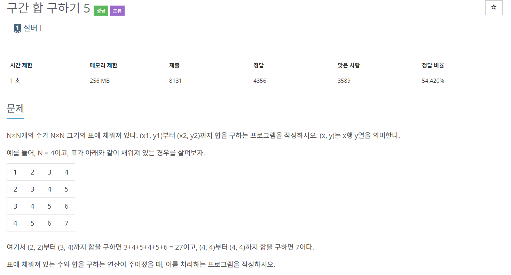
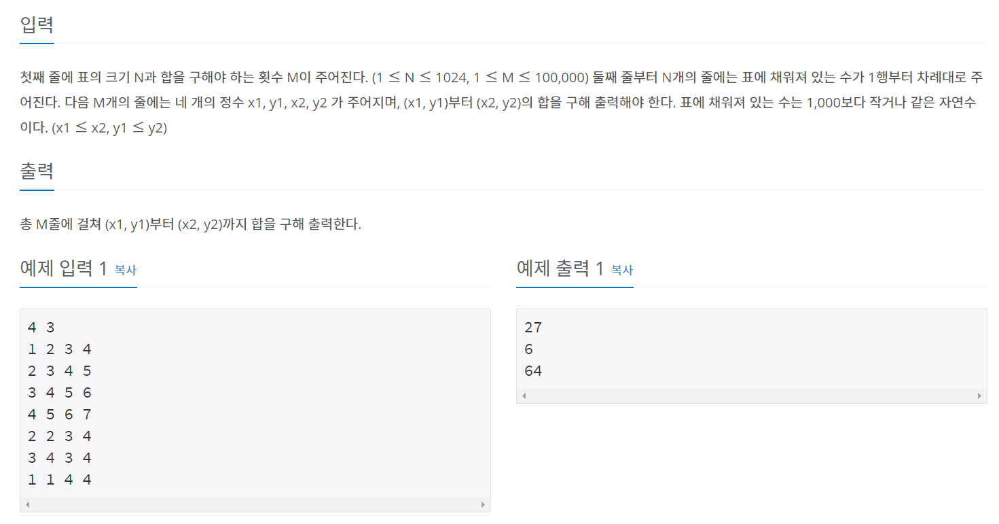
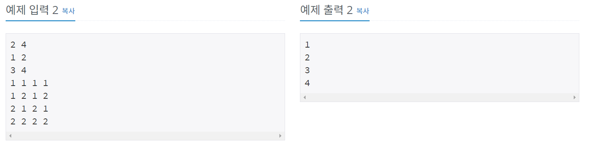
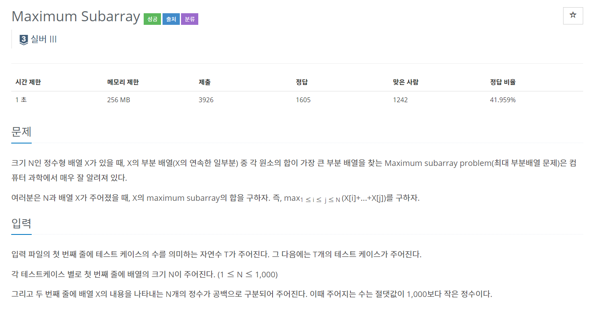
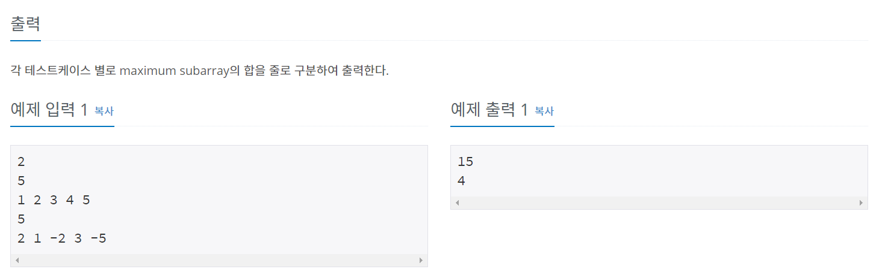
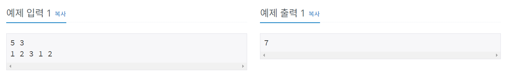

# 구간합 배열
> 전처리를 통해 모든 부분합을 O(1)으로 구할 수 있는 방법


```
1. 원래 배열 이외에 pSum배열을 추가로 하나 만들어 준다. 
2. pSum[x] 배열에는 앞에서 부터 x개 원소의 합을 저장한다.
  -> pSum[i+1] = pSum[i] + A[i]

```

## 백준 11659 - 구간 합 구하기4

---


---

### 풀이

pSum[i+1] - pSum[j]를 해주면 된다.

---

```java
package sumOfInterval;

import java.io.BufferedReader;
import java.io.IOException;
import java.io.InputStreamReader;

public class num11659 {
	static int N, M;
	static int[] arr, pSum;
	
	public static void main(String[] args) throws IOException {
		BufferedReader br = new BufferedReader(new InputStreamReader(System.in));
		StringBuilder sb = new StringBuilder();
		String[] NM = br.readLine().split(" ");
		
		N = stoi(NM[0]);
		M = stoi(NM[1]);
		
		arr = new int[N];
		pSum = new int[N+1];
		
		String[] arrData = br.readLine().split(" ");
		for(int i=0; i<N; i++) {
			arr[i] = stoi(arrData[i]);
			pSum[i+1] = arr[i] + pSum[i];
		}
		
		for(int i=0; i<M; i++) {
			String[] AB = br.readLine().split(" ");
			int a = stoi(AB[0])-1;
			int b = stoi(AB[1])-1;
			
			sb.append(pSum[b+1] - pSum[a] + "\n");
		}
		System.out.println(sb);
	}

	
	public static int stoi(String string) {
		return Integer.parseInt(string);
	}
}

```

## 백준 11660 - 구간 합 구하기5

---





---

### 풀이

이전 문제와 비슷한데 2차원 배열을 사용해 pSum을 저장한다.

빼줄 때 범위 설정에 주의한다.

---

```java
package sumOfInterval;

import java.io.BufferedReader;
import java.io.IOException;
import java.io.InputStreamReader;

public class num11660 {
	static int N, M, x1, x2, y1, y2;
	static int[][] map, pSum;
	
	public static void main(String[] args) throws IOException{
		BufferedReader br = new BufferedReader(new InputStreamReader(System.in));
		StringBuilder sb = new StringBuilder();
		
		String[] NM = br.readLine().split(" ");
		N = stoi(NM[0]);
		M = stoi(NM[1]);
		map = new int[N+1][N+1];
		pSum = new int[N+2][N+2];
		
		for(int i=0; i<N; i++) {
			String[] row = br.readLine().split(" ");
			for(int j=0; j<N; j++) {
				map[i][j] = stoi(row[j]);
				pSum[i+1][j+1] = pSum[i+1][j] + pSum[i][j+1] - pSum[i][j] + map[i][j];
			}
		}
		
		for(int i=1; i<=M; i++) {
			String[] point = br.readLine().split(" ");
			x1 = stoi(point[0]);
			y1 = stoi(point[1]);
			x2 = stoi(point[2]);
			y2 = stoi(point[3]);
			
			sb.append(pSum[x2][y2] - pSum[x1-1][y2] - pSum[x2][y1-1] + pSum[x1-1][y1-1] + "\n");
		}
		
		System.out.println(sb.toString());
		
	}
	
	public static int stoi(String string) {
		return Integer.parseInt(string);
	}
}

```

## 백준 10211 - Maximum Subarray

---




---

### 풀이
---
```
1
2
-7 5
```

별 생각 없이 풀다가 위 CASE에 걸리는 걸 알았다.

**전까지 합이 음수고, 새롭게 들어온 값이 양수라면 새롭게 들어온 값부터 더해준 값이 최대값이다.**

위 문장에 대한 처리를 해야한다.

---

```java
package sumOfInterval;

import java.io.BufferedReader;
import java.io.IOException;
import java.io.InputStreamReader;

public class num10211 {
	static int N, X, MAX;
	static int[] arr, pSum;
	
	public static void main(String[] args) throws IOException {
		BufferedReader br = new BufferedReader(new InputStreamReader(System.in));
		StringBuilder sb = new StringBuilder();
		
		N = stoi(br.readLine());
		
		for(int i=0; i<N; i++) {
			MAX = Integer.MIN_VALUE;
			X = stoi(br.readLine());
			String[] arrData = br.readLine().split(" ");
			arr = new int[X];
			pSum = new int[X+1];
			
			for(int j=0; j<X; j++) {
				arr[j] = stoi(arrData[j]);
				pSum[j+1] = Math.max(pSum[j], 0) + arr[j];
				MAX = MAX > pSum[j+1] ? MAX : pSum[j+1];
			}
			sb.append(MAX+"\n");
		}
		
		System.out.println(sb.toString());
	}
	
	public static int stoi(String string) {
		return Integer.parseInt(string);
	}
}

```

## 백준 10986 - 나머지 합

---




---

### 풀이

이 문제는 발상의 전환이 필요하다.

pSum[j] % M 와 pSum[i] % M 나머지가 같으면 나누어 떨어지는 구간이다.  
 -> M으로 나눴을 때 나머지를 저장하는 누적합 배열을 만든다.  
 -> 나머지의 개수를 저장하는 배열을 하나 더 만들어서 나머지에 대한 개수를 저장한다.  
 -> 나머지의 순서에 상관없이 2개씩 뽑는 개수를 모두 더한다.   

---

```java
package sumOfInterval;

import java.io.BufferedReader;
import java.io.IOException;
import java.io.InputStreamReader;

public class num10986 {
	static long N, M, ans;
	static long[] cnt, pSum;
	static final int MAX = 1000000 + 1;
	
	public static void main(String[] args) throws IOException {
		BufferedReader br = new BufferedReader(new InputStreamReader(System.in));
		
		String[] NM = br.readLine().split(" ");
		
		N = stol(NM[0]);
		M = stol(NM[1]);
		cnt = new long[(int)M];
		pSum = new long[(int)N+1];
		
		String[] arrData = br.readLine().split(" ");
		for(int i=1; i<=N; i++) {
			long num = stol(arrData[i-1]);
			pSum[i] = (pSum[i - 1] + num) % M;
			cnt[(int) pSum[i]]++;
			if(pSum[i] == 0) ans++;
		}
		
		for(int i = 0 ; i < M ; ++i) {
			ans += cnt[i] * (cnt[i] - 1) / 2;
		}
		System.out.println(ans);
	}
	public static long stol(String string) {
		return Long.parseLong(string);
	}

}

```

# Reference
[라이님 블로그](https://m.blog.naver.com/kks227/220787178657)  