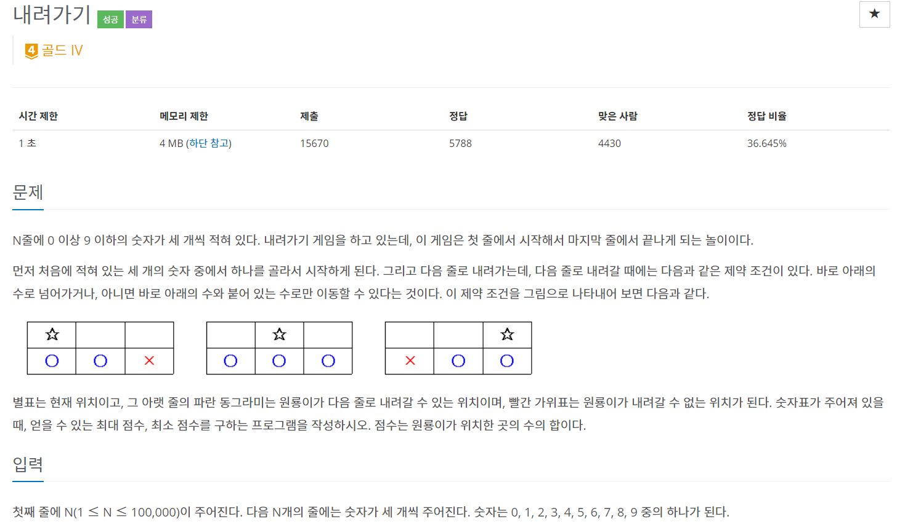
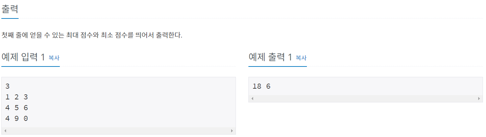
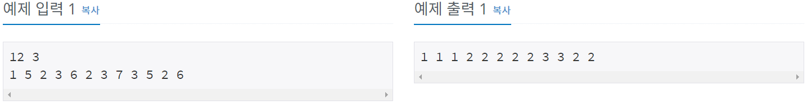
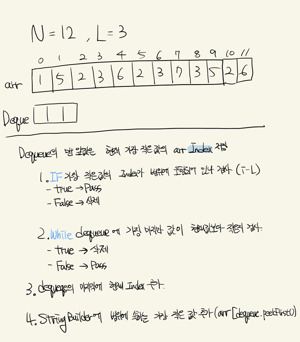
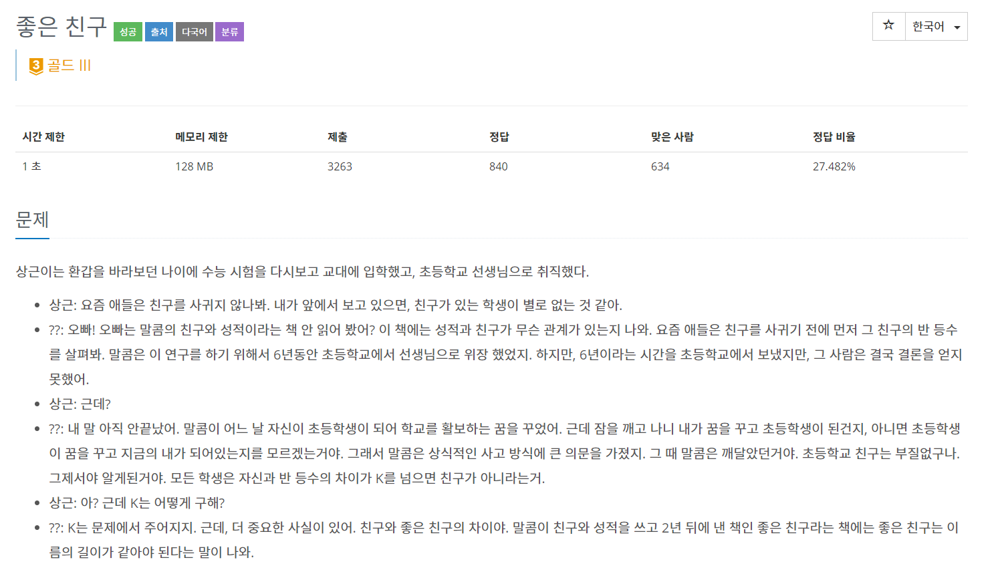
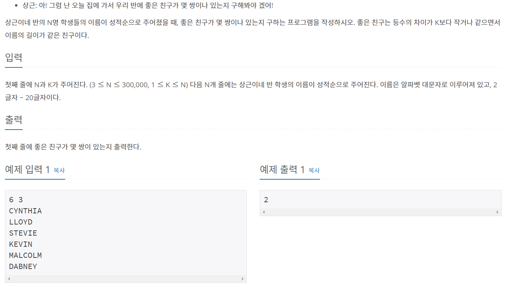

# 슬라이딩 윈도우

투포인터 알고리즘과 비슷하지만 슬라이딩 윈도우는 **어느 순간에도 그 구간의 넓이가 동일하다**  
 -> 사용하지 않는 값을 삭제하거나 갱신하는 기법이다.
## 백준 2096번 - 내려가기
---




---

### 풀이
---

이 문제는 슬라이딩 윈도우 + DP문제다. 

문제를 보면 메모리 제한이 있다.

계단의 최대값과 최솟값을 저장하는데 이전의 값들만 저장하고 있으면 된다.

---

```java
package slidingWindow;

import java.io.BufferedReader;
import java.io.IOException;
import java.io.InputStreamReader;
import java.util.Arrays;

public class num2096 {
	static int N, MAX, MIN;
	static int[] tempMaxDp, tempMinDp, maxDp, minDp;
	
	public static void main(String[] args) throws IOException {
		BufferedReader br = new BufferedReader(new InputStreamReader(System.in));
		
		N = stoi(br.readLine());
		tempMaxDp = new int[3]; tempMinDp = new int[3]; maxDp = new int[3]; minDp = new int[3];
		
		for(int i=0; i<N; i++) {
			String[] step = br.readLine().split(" ");
			for(int j=0; j<3; j++) {
				tempMinDp[j] = tempMaxDp[j] = stoi(step[j]);
				tempMaxDp[j] += Math.max(maxDp[1] , j == 1 ? Math.max(maxDp[0], maxDp[2]) : maxDp[j]);
				tempMinDp[j] += Math.min(minDp[1] , j == 1 ? Math.min(minDp[0], minDp[2]) : minDp[j]);
				MAX = j==0 ? tempMaxDp[j] : MAX > tempMaxDp[j] ? MAX : tempMaxDp[j];
				MIN = j==0 ? tempMinDp[j] : MIN < tempMinDp[j] ? MIN : tempMinDp[j];
			}
			arrayCopy(maxDp, tempMaxDp);
			arrayCopy(minDp, tempMinDp);
			
		}
		System.out.println(MAX + " " + MIN);
	}
	
	public static void arrayCopy(int[] to, int[] from) {
		for(int i=0; i<3; i++) {
			to[i] = from[i];
		}
	}
	
	public static int stoi(String string) {
		return Integer.parseInt(string);
	}

}

```


## 백준 11003번 - 최솟값 찾기
---




---

### 풀이
---

문제를 보면 범위가 심상치 않다.....ㅋㅋㅋ

문제가 좀 어려워서 노트로 작성하면서 정리했다.



---

```java
package slidingWindow;

import java.io.*;
import java.util.*;

public class num11003 {
    public static void main(String[] args) throws Exception {
        BufferedReader br = new BufferedReader(new InputStreamReader(System.in));
        BufferedWriter bw = new BufferedWriter(new OutputStreamWriter(System.out));
        Deque<Integer> deque = new LinkedList<>();
        StringTokenizer st = new StringTokenizer(br.readLine(), " ");
        
        int N = stoi(st.nextToken());
        int L = stoi(st.nextToken());
        
        int[] arr = new int[N];
        st = new StringTokenizer(br.readLine(), " ");
        
        
        StringBuilder sb = new StringBuilder();
        for (int i = 0; i < N; i++) {
        	arr[i] = stoi(st.nextToken());
            if (!deque.isEmpty() && deque.getFirst() <= i - L) {
            	deque.removeFirst();
            }
            while (!deque.isEmpty() && arr[deque.getLast()] > arr[i]) {
            	deque.removeLast();
            }
            deque.addLast(i);
            sb.append(arr[deque.peekFirst()] + " ");
        }
        bw.write(sb.toString());
		bw.flush();
		bw.close();
    }
    
    public static int stoi(String string) {
    	return Integer.parseInt(string);
    }
}
```

## 백준 3078번 - 좋은 친구
---




### 풀이
---

이전 문제를 풀었다면 어렵지 않게 풀 수 있다.

cnt범위 때문에 long으로 설정해야 한다.

cnt 때문에 책상 부술뻔.... 후.....하...후...하...

---

```java
package slidingWindow;

import java.io.BufferedReader;
import java.io.IOException;
import java.io.InputStreamReader;
import java.util.LinkedList;
import java.util.Queue;
import java.util.StringTokenizer;

public class num3078 {
	static int N, K;
	static long cnt=0;
	static Queue[] qarr;
	
	public static void main(String[] args) throws IOException {
		BufferedReader br = new BufferedReader(new InputStreamReader(System.in));
		
		StringTokenizer st = new StringTokenizer(br.readLine());
		N = stoi(st.nextToken());
		K = stoi(st.nextToken());
		
		qarr = new Queue[21];
		for(int i=0; i<=20; i++) {
			qarr[i] = new LinkedList<Integer>();
		}
		
		for(int i=0; i<N; i++) {
			int nowLen = br.readLine().length();
			
			if(qarr[nowLen].isEmpty()) {
				qarr[nowLen].offer(i);
			}else {
				while ((i - (int) qarr[nowLen].peek()) > K) {
					qarr[nowLen].poll();
					if (qarr[nowLen].isEmpty()) {
						break;
					}
				}
				cnt += qarr[nowLen].size();
				qarr[nowLen].offer(i);
			}
		}
		
		System.out.println(cnt);
	}
	
	static int stoi(String string) {
		return Integer.parseInt(string);
	}

}

```

# Reference
[라이님 블로그](https://m.blog.naver.com/kks227/220795165570)