# 신장 트리(Spnning Tree)
> 하나의 그래프가 있을 때 모든 노드를 포함하면서 사이클이 존재하지 않는 부분 그래프

# 최소 신장 트리(Minimum Spanning Tree)
> 트리의 간선마다 가중치가 있을 때, **간선의 가중치 합이 최소**인 트리

신장 트리의 최소비용을 구하는 크루스칼 알고리즘, 프림 알고리즘 2가지 알고리즘에 대해 정리한다.

## 크루스칼 알고리즘
---
> 간선 선택 기반의 알고리즘으로, 탐욕적인 방법을 이용, 간선을 하나씩 선택해서 MST를 찾는 알고리즘입니다.

### 특징
---
1. 그리디 알고리즘의 일종 -> 작은 간선부터 훑기 때문에  
2. 시간 복잡도 : **O(ElogE)**  
   -> 가중치 별로 정렬 : O(ElogE) + 정점이 같은 컴포넌트에 속해있는지 확인 : 약 O(1) = **O(ElogE)**  


### 구현 방법
---

```
1. 간선을 비용에 따라 오름차순으로 정리하고, 정점을 초기화한다
2. 간선을 하나씩 확인하며 간선이 싸이클을 발생시키지 않으면 간선을 포함시킨다.
3. 간선을 V-1개 뽑았을 때, 이루는 그래프가 MST이다.
```

## 백준 1197 - 최소 스패닝 트리

---

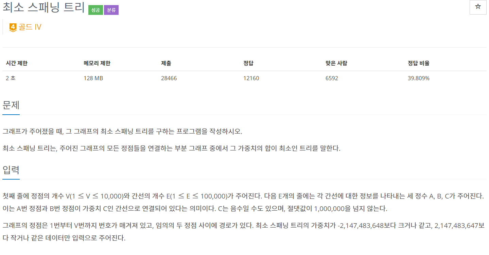
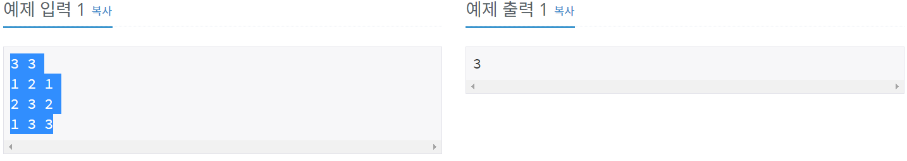

---

### 풀이
---

1. 간선 클래스를 만들어 우선순위 큐로 저장한다.
2. union find를 사용해 싸이클 검사와 거리를 더해준다.

---

```java
package package29;

import java.io.BufferedReader;
import java.io.IOException;
import java.io.InputStreamReader;
import java.util.PriorityQueue;
import java.util.StringTokenizer;

public class num1197 {
	static int V, E, result=0, cnt=0;
	static int[] parent;
	static PriorityQueue<Edge> pq = new PriorityQueue<Edge>();
	
	public static void main(String[] args) throws IOException {
		BufferedReader br = new BufferedReader(new InputStreamReader(System.in));
		
		String[] VE = br.readLine().split(" ");
		V = stoi(VE[0]);
		E = stoi(VE[1]);
		
		parent = new int[V+1];
		
		for(int i=0; i<V+1; i++) {
            parent[i] = i;
        }
		
	    for(int i=0; i<E; i++) {
	    	StringTokenizer st = new StringTokenizer(br.readLine());
	    	pq.add(new Edge(stoi(st.nextToken()),stoi(st.nextToken()),stoi(st.nextToken())));
	    }
		
	    for(int i=0; i<E; i++) {
	    	Edge temp = pq.poll();
	    	
	    	int a = temp.s;
	    	int b = temp.e;
	    	if(!union(a, b))
	    		continue;
	    	result+= temp.w;
	    	cnt++;
	    	if(cnt == V-1)
	    		break;
	    }
	    System.out.println(result);
	}
	
	static class Edge implements Comparable<Edge>{
		int s, e, w;
		Edge(int s, int e, int w){
			this.s = s;
			this.e = e;
			this.w = w;
		}
		@Override
		public int compareTo(Edge o) {
			return o.w >= this.w ? -1: 1;
		}
	}
	
	public static int find_parent(int num) {
		if(parent[num] != num)
			return parent[num] = find_parent(parent[num]);
		return parent[num];
	}

	public static boolean union(int a, int b) {
		a = find_parent(a);
		b = find_parent(b);
		
		if(a==b) {
			return false;
		}
		else if(a < b)
			parent[b] = a;
		else
			parent[a] = b;
		return true;
	}
	public static int stoi(String string) {
		return Integer.parseInt(string);
	}
	
}

```

## 백준 4386 - 별자리 만들기

---


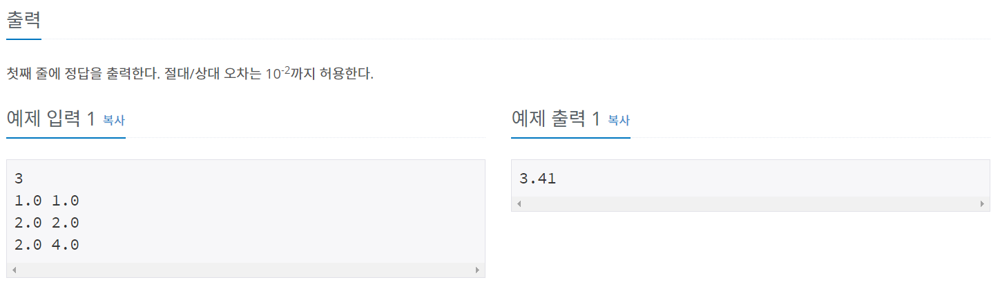

---

### 풀이
---

정점의 x좌표와 y좌표를 저장할 수 있는 클래스를 만들어 사용했다.

위의 문제는 가중치가 주어졌지만, 4386번문제는 가중치를 두 점사이 거리로 계산해서 넣어야 한다.

---

```java
package package29;

import java.io.BufferedReader;
import java.io.IOException;
import java.io.InputStreamReader;
import java.util.PriorityQueue;
import java.util.StringTokenizer;

public class num4386 {
	static int N, cnt=0;
	static double result = 0;
	static int[] parent;
	static PriorityQueue<Edge> pq = new PriorityQueue<Edge>();
	static Vertex[] v;
	
	public static void main(String[] args) throws IOException {
		BufferedReader br = new BufferedReader(new InputStreamReader(System.in));
		
		N = stoi(br.readLine());
		
		parent = new int[N+1];
		v = new Vertex[N+1];
		for(int i=1; i<=N+1; i++) {
            parent[i] = i;
        }
		
	    for(int i=1; i<=N; i++) {
	    	StringTokenizer st = new StringTokenizer(br.readLine()," ");
	    	v[i] = new Vertex(stod(st.nextToken()), stod(st.nextToken()));
	    }
	    
	    for(int i=1; i<=N; i++) {
	    	for(int j=i+1; j<=N; j++) {
	    		pq.add(new Edge(i, j, getDistance(v[i].x, v[j].x, v[i].y, v[j].y)));
	    	}
	    }
	    
	    for(int i=0; i<pq.size(); i++) {
	    	Edge temp = pq.poll();
	    	
	    	int a = temp.s;
	    	int b = temp.e;
	    	if(!union(a, b))
	    		continue;
	    	result+= temp.w;
	    	cnt++;
	    	if(cnt == N-1)
	    		break;
	    }
	    System.out.println(String.format("%.2f", result));
	}
	
	static class Vertex{
		double x, y;
		Vertex(double x, double y){
			this.x = x;
			this.y = y;
		}
	}
	
	static class Edge implements Comparable<Edge>{
		int s, e;
		double w;
		Edge(int s, int e, double w){
			this.s = s;
			this.e = e;
			this.w = w;
		}
		@Override
		public int compareTo(Edge o) {
			return o.w >= this.w ? -1: 1;
		}
	}
	
	public static int find_parent(int num) {
		if(parent[num] != num)
			return parent[num] = find_parent(parent[num]);
		return parent[num];
	}

	public static boolean union(int a, int b) {
		a = find_parent(a);
		b = find_parent(b);
		
		if(a==b) {
			return false;
		}
		else if(a < b)
			parent[b] = a;
		else
			parent[a] = b;
		return true;
	}
	
	public static double getDistance(double x1, double x2, double y1, double y2) {
		return Math.sqrt(Math.pow(Math.abs(x1 - x2), 2) + Math.pow(Math.abs(y1 - y2), 2));
	}
	
	public static int stoi(String string) {
		return Integer.parseInt(string);
	}
	
	public static double stod(String string) {
		return Double.parseDouble(string);
	}
	
}


```

## 백준 1647 - 도시 분할 계획

---

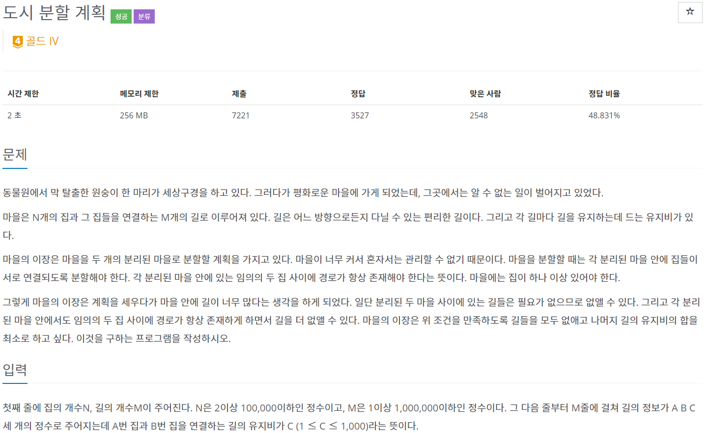
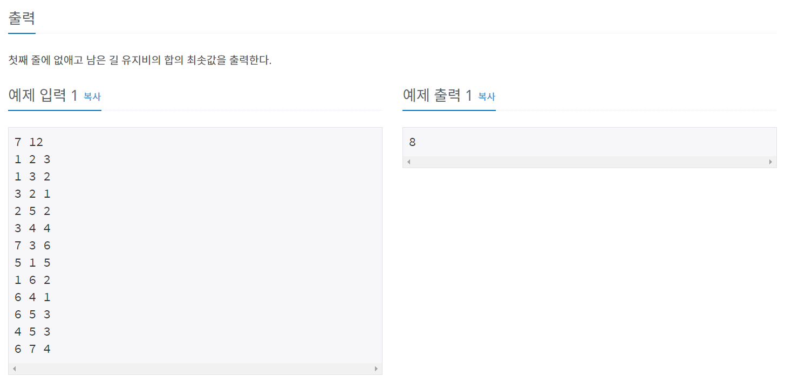

---

### 풀이
---

도시를 2개로 나눈다고 했으니 크루스칼 알고리즘이 끝나는 조건을 N-2로 작성해야 한다.

---

```java
package MST;

import java.io.BufferedReader;
import java.io.IOException;
import java.io.InputStreamReader;
import java.util.PriorityQueue;
import java.util.StringTokenizer;

public class num1647 {
	static int N, M, result=0, cnt=0;
	static int[] parent;
	static PriorityQueue<Edge> pq = new PriorityQueue<Edge>();
	
	public static void main(String[] args) throws IOException {
		BufferedReader br = new BufferedReader(new InputStreamReader(System.in));
		StringTokenizer st;
		
		st = new StringTokenizer(br.readLine());
		N = stoi(st.nextToken());
		M = stoi(st.nextToken());
	
		parent = new int[N+1];
		for(int i=1; i<=N; i++) {
            parent[i] = i;
        }
		
		for(int i=0; i<M; i++) {
			st = new StringTokenizer(br.readLine());
			int s = stoi(st.nextToken()), e = stoi(st.nextToken()), w = stoi(st.nextToken());
			pq.add(new Edge(s,e,w));
		}
		
		while(!pq.isEmpty()) {
			Edge temp = pq.poll();
			
			int a = temp.s;
			int b = temp.e;
			if(!union(a, b))
				continue;
			result += temp.w;
			cnt++;
			if(cnt == N-2)
				break;
		}
		System.out.println(result);
	}
	
	static class Edge implements Comparable<Edge> {
		int s, e, w;
		Edge(int s, int e, int w) {
			this.s = s;
			this.e = e;
			this.w = w;
		}
		

		@Override
		public int compareTo(Edge o) {
			return o.w >= this.w ? -1 : 1;
		}
	}
	
	public static int find_parent(int num) {
		if(parent[num] != num)
			return parent[num] = find_parent(parent[num]);
		return parent[num];
	}
	
	public static boolean union(int a, int b) {
		a = find_parent(a);
		b = find_parent(b);
		
		if(a==b)
			return false;
		if(a < b)
			parent[b] = a;
		else
			parent[a] = b;
		return true;
	}
	
	public static int stoi(String string) {
		return Integer.parseInt(string);
	}

}

```

## 백준 1774 - 우주신과의 교감

---


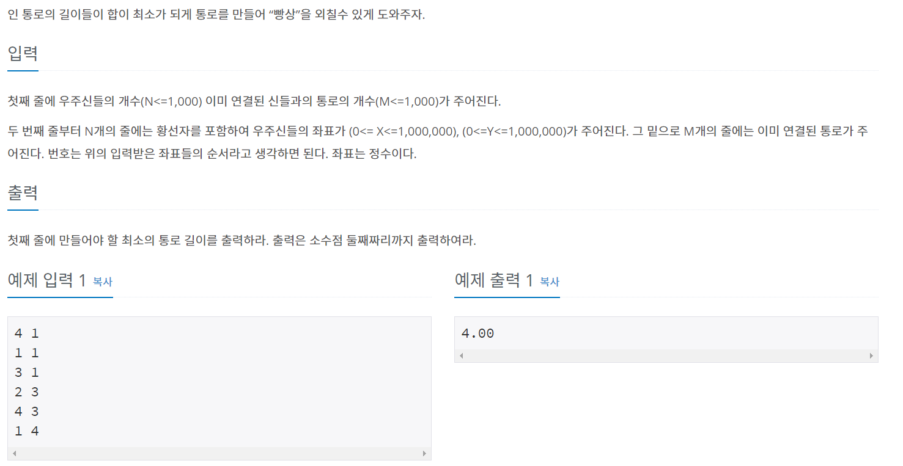

---

### 풀이
---

일반적인 최소 스패닝 트리 문제다. 1197번과 풀이가 동일하다.

---

```java
package package29;

import java.io.BufferedReader;
import java.io.IOException;
import java.io.InputStreamReader;
import java.util.PriorityQueue;

public class num1774 {
	static int N, M, cnt = 0;
	static PriorityQueue<Edge> pq = new PriorityQueue<Edge>();
	static int[] parent;
	static Node[] arr;
	static double minLen = 0;
	
	public static void main(String[] args) throws IOException {
		BufferedReader br = new BufferedReader(new InputStreamReader(System.in));
		
		String[] NM = br.readLine().split(" ");
		
		N = stoi(NM[0]);
		M = stoi(NM[1]);
		Node[] arr = new Node[N+1];
		parent = new int[N+1];
		
		for(int i=1; i<=N; i++) {
            parent[i] = i;
        }
		
		for(int i=1; i<=N; i++) {
			String[] XY = br.readLine().split(" ");
			arr[i] = new Node(stoi(XY[0]), stoi(XY[1]));
		}
		
		for(int i=0; i<M; i++) {
			String[] se = br.readLine().split(" ");
			int s = stoi(se[0]);
			int e = stoi(se[1]);
			union(s, e);
		}
		for (int i = 1; i <= N; i++) {
			for (int j = i + 1; j <= N; j++) {
				pq.add(new Edge(i, j, getDistance(arr[i].x, arr[j].x, arr[i].y, arr[j].y)));
			}
		}
		
	    for(int i=0; i<pq.size(); i++) {
	    	Edge temp = pq.poll();
	    	
	    	int a = temp.s;
	    	int b = temp.e;
	    	if(!union(a, b))
	    		continue;
	    	minLen+= temp.w;
	    }
	    System.out.println(String.format("%.2f", minLen));
		
	}
	static class Edge implements Comparable<Edge>{
		int s, e;
		double w;
		Edge(int s, int e, double w){
			this.s = s;
			this.e = e;
			this.w = w;
		}
		@Override
		public int compareTo(Edge o) {
			return o.w >= this.w ? -1: 1;
		}
	}
	
	public static double getDistance(double x1, double x2, double y1, double y2) {
		return Math.sqrt(Math.pow(Math.abs(x1 - x2), 2) + Math.pow(Math.abs(y1 - y2), 2));
	}
	
	public static int find_parent(int num) {
		if(parent[num] != num)
			return parent[num] = find_parent(parent[num]);
		return parent[num];
	}

	public static boolean union(int a, int b) {
		a = find_parent(a);
		b = find_parent(b);
		
		if(a==b) {
			return false;
		}
		else if(a < b)
			parent[b] = a;
		else
			parent[a] = b;
		return true;
	}
	
	public static int stoi(String string) {
		return Integer.parseInt(string);
	}
	
	static class Node{
		double x, y;
		Node(double x, double y){
			this.x = x;
			this.y = y;
		}
	}
}
```

## 백준 2887 - 행성 터널

---

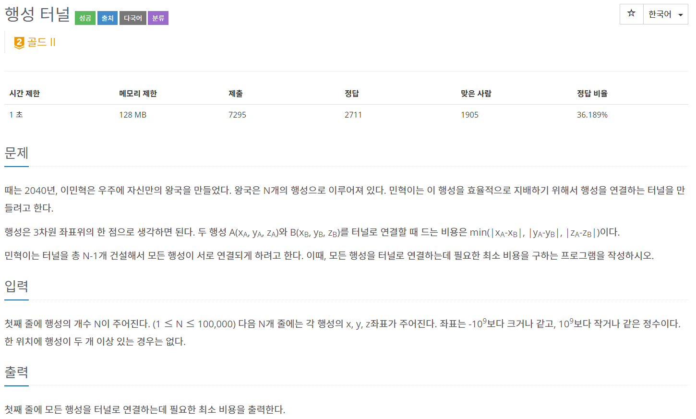
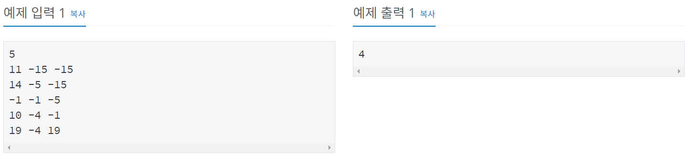

---

### 풀이
---

이 문제가 어려웠다.

N의 개수가 상당히 커서 모든 간선을 추가하면 시간 초과가 나온다.

간선 비용은 문제에 주어진대로 Min(x좌표 차이, y좌표 차이, z좌표 차이)이다.

행성을 연결할 때 드는 비용을 x, y, z을 각각 오름차순으로 정렬하고

인접한 좌표의 비용을 PriorityQueue에 넣는다.

그 뒤 크루스칼 알고리즘을 통해 답을 구한다.

---

```java
package package29;

import java.io.*;
import java.util.*;

public class num2887 {
	static int N;
	static Vertex[] vertexs;
	static PriorityQueue<Edge> pq = new PriorityQueue<Edge>(new Comparator<Edge>() {
		@Override
		public int compare(Edge o1,Edge o2) {
			return (o1.w-o2.w);
		}
	});			
	static int[] parent; 
	
	public static void main(String[] args) throws IOException { 
		BufferedReader br = new BufferedReader(new InputStreamReader(System.in)); 
		N = Integer.parseInt(br.readLine()); 
		vertexs = new Vertex[N]; 
		
		StringTokenizer st; 
		for (int i = 0; i < N ; i++) { 
			st = new StringTokenizer(br.readLine().trim(), " ");
			int X = stoi(st.nextToken()); 
			int Y = stoi(st.nextToken());
			int Z = stoi(st.nextToken()); 
			vertexs[i] = new Vertex(X, Y, Z, i);
		} 
		
		Arrays.sort(vertexs,new Comparator<Vertex>() {
			@Override
			public int compare(Vertex o1, Vertex o2) {
				return Integer.compare(o1.x, o2.x);
			}
		});
		for (int i = 1; i <N ; i++) {
			pq.add(new Edge(vertexs[i-1].id, vertexs[i].id, Math.abs(vertexs[i].x-vertexs[i-1].x)));
		}
			
		Arrays.sort(vertexs,new Comparator<Vertex>() {
			@Override
			public int compare(Vertex o1, Vertex o2) {
				return Integer.compare(o1.y, o2.y);
			}
		});
		for (int i = 1; i <N ; i++) {
			pq.add(new Edge(vertexs[i-1].id, vertexs[i].id, Math.abs(vertexs[i].y-vertexs[i-1].y)));
		} 
		
		Arrays.sort(vertexs,new Comparator<Vertex>() {
			@Override
			public int compare(Vertex o1, Vertex o2) {
				return Integer.compare(o1.z, o2.z);
			}
		});
		for (int i = 1; i <N ; i++) {
			pq.add(new Edge(vertexs[i-1].id, vertexs[i].id, Math.abs(vertexs[i].z-vertexs[i-1].z)));
		} 
		
		
		parent = new int[N+1];
		for (int i = 1; i <= N ; i++)
			parent[i] = i; 
		long result=0;
		
		while(!pq.isEmpty()) {
			Edge tmp = pq.poll();
			if(find_parent(tmp.s)!=find_parent(tmp.e)) {
				result +=tmp.w;
				union(tmp.s,tmp.e);
			}
		}
		System.out.println(result);
	}
	
	static class Vertex {
		int x, y, z, id;
		Vertex(int x, int y, int z, int id) {
			this.x = x;
			this.y = y;
			this.z = z;
			this.id = id;
		}
	}
	
	static class Edge {
		int s, e, w;
		Edge(int s, int e, int w) {
			this.s = s; 
			this.e = e; 
			this.w = w;
		} 
	} 
	
	public static int find_parent(int num) {
		if(parent[num] != num)
			return parent[num] = find_parent(parent[num]);
		return parent[num];
	}
	
	public static boolean union(int a, int b) {
		a = find_parent(a);
		b = find_parent(b);
		
		if(a==b) {
			return false;
		}
		else if(a < b)
			parent[b] = a;
		else
			parent[a] = b;
		return true;
	}
	public static int stoi(String string) {
		return Integer.parseInt(string);
	}
}


```

## 백준 17472 - 다리 만들기2

---

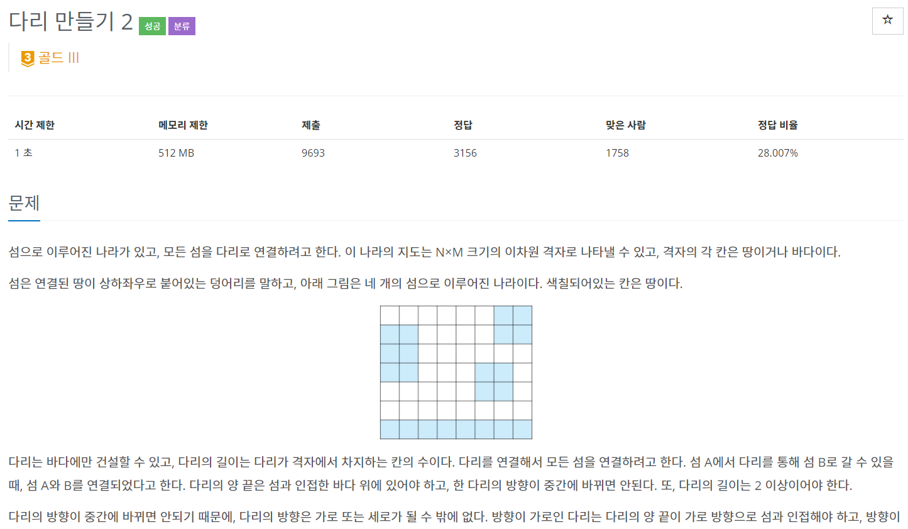
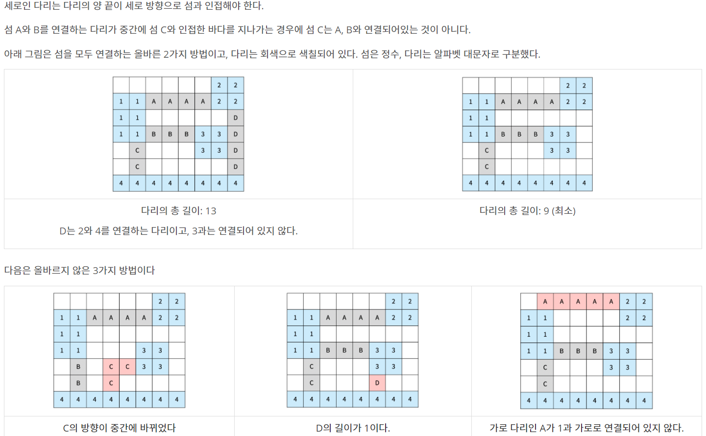
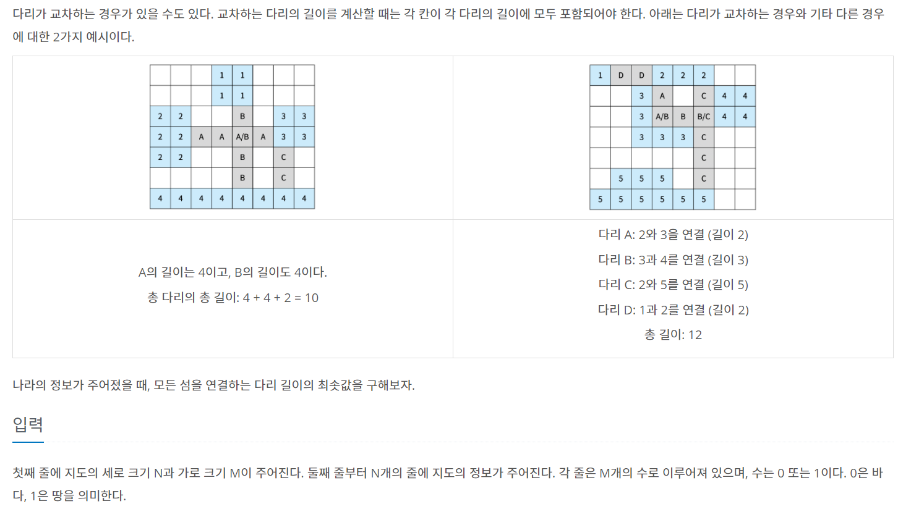
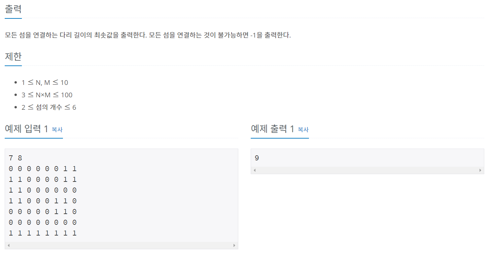
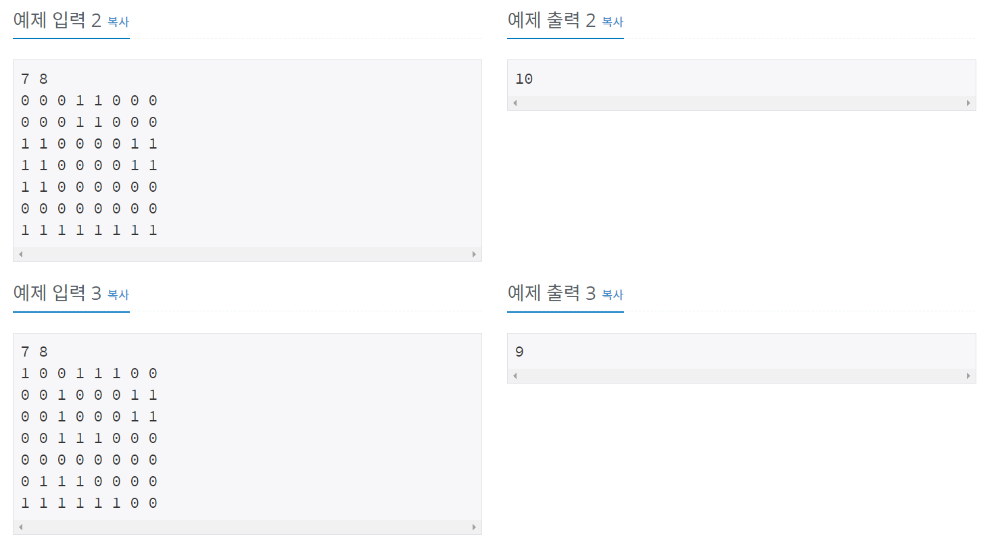
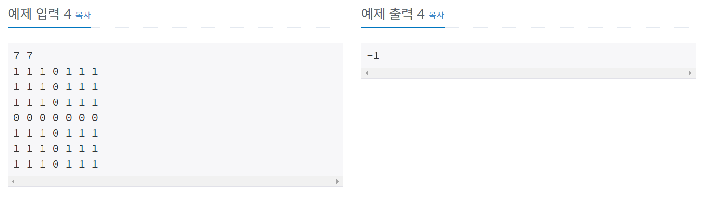

---

### 풀이
---

이전 문제들을 모두 풀어봤으면 어렵진 않은데 삽질을 많이했다.

내가 실수한 부분은 2가지였다.

```
1. dfs로 체크하는데 자기 자신을 바꾸지 않음
2. for(int i=0; i<pq.size(); i++) 이런식으로 사용
```

어떤 친절하신 분이 반례를 정리해놔서 참고했다.  

[반례모음 - promise12mee](https://www.acmicpc.net/board/view/63536)

---

```java
package package29;

import java.io.BufferedReader;
import java.io.IOException;
import java.io.InputStreamReader;
import java.util.PriorityQueue;


public class num17472 {
	static int N, M, landCount=0, result = 0, cnt=0;
	static int[] parent;
	static int[][] map;
	static int[] dx = new int[]{0,0,1,-1};
	static int[] dy = new int[]{1,-1,0,0};
	static PriorityQueue<Edge> pq = new PriorityQueue<Edge>();
	
	public static void main(String[] args) throws IOException {
		BufferedReader br = new BufferedReader(new InputStreamReader(System.in));
	
		String[] NM = br.readLine().split(" ");
		
		N = stoi(NM[0]);
		M = stoi(NM[1]);
		map = new int[N][M];
		
		for(int i=0; i<N; i++) {
			String[] mapData = br.readLine().split(" ");
			for(int j=0; j<M; j++) {
				map[i][j] = stoi(mapData[j]);
			}
		}
		
		checkLand();
		
		parent = new int[landCount+1];
		for(int i=0; i<=landCount; i++) {
			parent[i] = i;
		}
		
        for(int i=0; i<N; i++) {
            for(int j=0; j<M; j++) {
                if(map[i][j] != 0) {
                    makeBridge(i, j, map[i][j]);
                }
            }
        }
        
        int size = pq.size();
	    for(int i=0; i<size; i++) {
	    	Edge temp = pq.poll();
	    	int a = temp.s;
	    	int b = temp.e;
	    	if(!union(a, b))		
	    		continue;
	    	union(temp.s, temp.e);
	    	result+= temp.w;
	    	cnt++;
	    }
	    if(result == 0 || cnt != landCount-1) {
            System.out.println(-1);
        } else {
            System.out.println(result);
        }
	}
	
	static void makeBridge(int x, int y, int landNum) {
        int newX = x;
        int newY = y;
		int length = 0;
        
        for(int i=0; i<4; i++) {
            while(true) {
                newX = newX + dx[i];
                newY = newY + dy[i];
                
                if(isPossibleIndex(newX, newY)) {
                    if(map[newX][newY] == landNum) {
                        length = 0;
                        newX = x;
                        newY = y;
                        break;
                    } else if(map[newX][newY] == 0){
                        length++;
                    } else {
                        if(length > 1) {
                        	pq.add(new Edge(landNum, map[newX][newY], length));
                        }
                        length = 0;
                        newX = x;
                        newY = y;
                        break;
                    }
                } else {
                    length = 0;
                    newX = x;
                    newY = y;
                    break;
                }
            }
        }	
	}
	
	static class Edge implements Comparable<Edge>{
		int s, e, w;
		Edge(int s, int e, int w){
			this.s = s;
			this.e = e;
			this.w = w;
		}
		@Override
		public int compareTo(Edge o) {
			return o.w >= this.w ? -1 : 1;
		}
	}
	
	public static int find_parent(int num) {
		if(parent[num] != num)
			return parent[num] = find_parent(parent[num]);
		return parent[num];
	}
	
	public static boolean union(int a, int b) {
		a = find_parent(a);
		b = find_parent(b);
		
		if(a==b) {
			return false;
		}
		else if(a < b)
			parent[b] = a;
		else
			parent[a] = b;
		return true;
	}
	
	public static void checkLand() {
		boolean[][] visited = new boolean[N][M];
		
		for(int i=0; i<N; i++) {
			for(int j=0; j<M; j++) {
				if(map[i][j] != 0 && !visited[i][j]) {
					landCount++;
					dfs(i, j, visited);
				}
			}
		}
		
	}
	
	public static void dfs(int x, int y, boolean[][] visited) {
		map[x][y] = landCount;
		for(int i=0; i<4; i++) {
			int newX = x + dx[i];
			int newY = y + dy[i];
			if(isPossibleIndex(newX, newY) && !visited[newX][newY] && map[newX][newY] != 0) {
				visited[x + dx[i]][y + dy[i]] = true;
				map[newX][newY] = landCount;
				dfs(x + dx[i], y + dy[i], visited);
			}
		}
	}
	
	public static boolean isPossibleIndex(int x, int y) {
		return x >= 0 && y >= 0 && x < N && y < M ? true : false;
	}
	
	public static int stoi(String string) {
		return Integer.parseInt(string);
	}
}

```


## 프림 알고리즘
---
> 정점 선택 기반의 알고리즘으로, 하나의 정점에서 연결된 간선들 중에 최소 간선 비용을 가진 정점을 하나씩 선택하면서 MST를 찾는 알고리즘

### 구현 방법
---

```
1. 임의의 정점 하나를 선택해서 시작
2. 선택한 정점과 인접하는 정점들 중에 최소비용의 간선을 가지는 정점을 선택
3. 모든 정점이 선택될 때 까지 반복

```

---

## 주절주절

크루스칼 알고리즘과 프림 알고리즘에 대해 알아보았다. 대부분 최소 신장 트리문제는 크루스칼 알고리즘을 통해 대부분 해결 가능하기 때문에 백준 단계별 문제에 있는 MST문제는 모두 크루스칼 알고리즘을 사용해서 문제를 풀었다.

# Reference
이것이 취업을 위한 코딩테스트다 - 나동빈  
[라이님 블로그](https://m.blog.naver.com/kks227/220799105543)  
[갓킹독님 블로그](https://blog.encrypted.gg/915?category=773649)  
[주남2님 블로그](https://ju-nam2.tistory.com/112)  
[두 점 사이의 거리, 좌표평면위의 두 점 사이의 거리](https://mathbang.net/408)  
[Java - 반올림해서 소수점 n번째 자리까지 출력 - chacha님 블로그](https://codechacha.com/ko/java-round-a-number-to-decimal-point/)  