# 위상 정렬
> 싸이클이 없는 방향 그래프의 모든 노드를 **방향성에 거스르지 않도록 순서대로 나열**

**Tip!!**
1. 그래프에서 **방문 조건이 주어질 때 사용!!**
2. 시간 복잡도 **O(V+E)**이다.
   (모든 노드를 확인하면서, 해당 노드에서 출발하는 간선을 차례대로 제거하기 때문)

## 구현 방법

### 1. DFS 활용

```
1. DFS 실행
2. DFS가 끝날 때 스택에 삽입

```

### 2. BFS와 In-degree 활용

```
1. 모든 간선을 읽으며 InDegree 테이블을 채운다.
2. Indegree가 0인 정점을 모두 큐에 넣는다.
3. 큐의 Front에 있는 정점을 가져와 위상정렬 결과에 추가한다.
4. 해당 정점으로부터 연결된 모든 정점의 Indegree값을 1 감소 시킨다.
   이 때 Indegree가 0이면 그 정점을 큐에 추가
5. 큐게 빌 때까지 3,4번을 반복
```

**Tip!!**
 - **루프가 V번 돌기전에 큐가 비면** 위상정렬이 **불가능**
 - **큐의 크기가 2이상인 경우가 생기면** 위상정렬 **결과가 2개 이상**

## 백준 2623 - 음악 프로그램

---

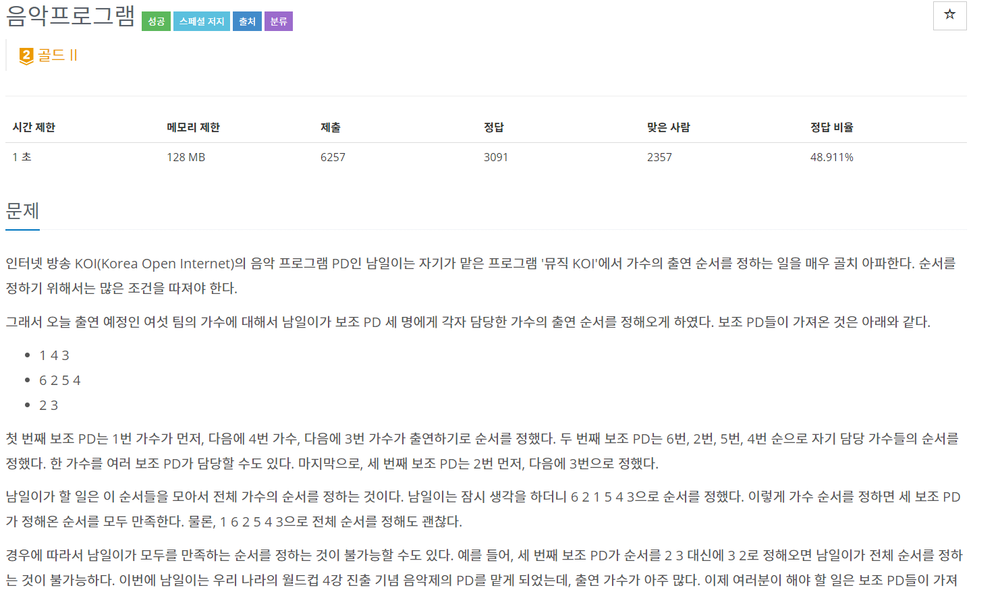  
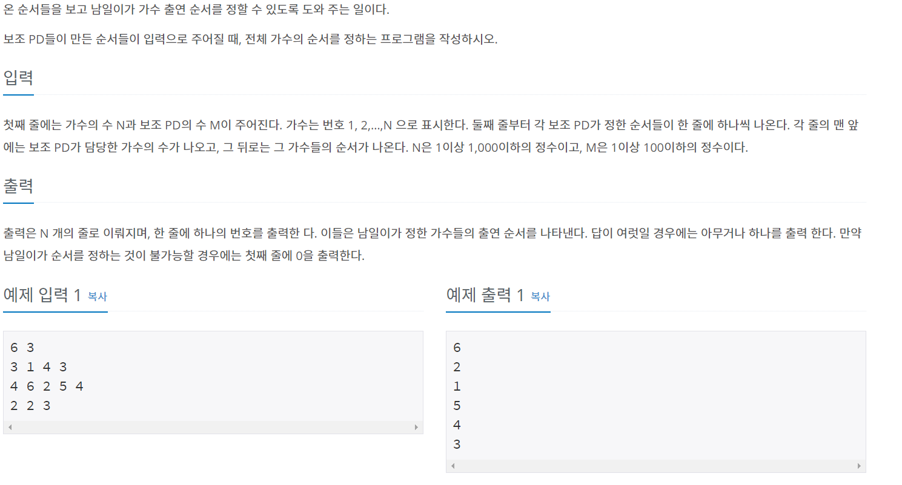  

---

### 풀이
---

간선을 입력받을 때 슬라이딩 윈도우 방식을 사용한다. 

BFS / Indegree를 활용해 위상정렬

---

```java
package TopologySort;

import java.io.*;
import java.util.*;

public class num2623 {
	static int N, M;
	static int[] indegree;
	static Queue<Integer> q = new LinkedList<Integer>();
	static ArrayList<Edge>[] edge;
	static int[] result;
	
	public static void main(String[] args) throws IOException {
		BufferedReader br = new BufferedReader(new InputStreamReader(System.in));
		StringTokenizer st;
		st = new StringTokenizer(br.readLine());
		
		N = stoi(st.nextToken());
		M = stoi(st.nextToken());
		
		indegree = new int[N+1];
		result = new int[N+1];
		edge = new ArrayList[N+1];
		
		for(int i=1; i<=N; i++) {
			edge[i] = new ArrayList<Edge>();
		}
		
		for(int i=0; i<M; i++) {
			st = new StringTokenizer(br.readLine());
			int testCase = stoi(st.nextToken());
			if(testCase==0) continue;
			
			int prev = stoi(st.nextToken());
			for(int j=1; j<testCase; j++) {
				int now = stoi(st.nextToken());
				indegree[now]++;
				edge[prev].add(new Edge(prev, now));
				prev = now;
			}
		}
		
		for(int i=1; i<=N; i++)
			if(indegree[i]==0) q.add(i);
		
		for(int i=0; i<N; i++) {
			if(q.isEmpty()) {
				System.out.println("0");
				return;
			}
			int now = q.poll();
			result[i] = now;
			for(Edge e : edge[now]) {
				indegree[e.e]--;
				if(indegree[e.e]==0)
					q.add(e.e);
			}
		}
		for(int num : result) {
			System.out.println(num);
		}
		
	}
	static class Edge{
		int s, e;
		Edge(int s, int e){
			this.s = s;
			this.e = e;
		}
	}
	
	public static int stoi(String string) {
		return Integer.parseInt(string);
	}

}

```

## 백준 1516 - 게임 개발

---

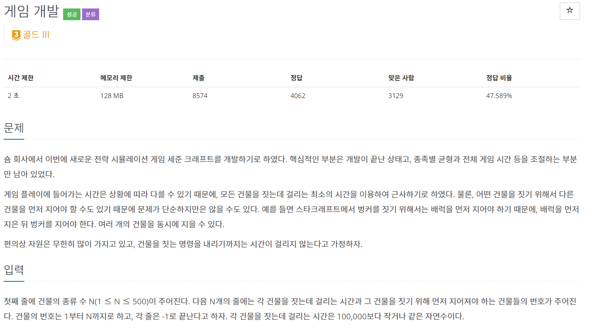  
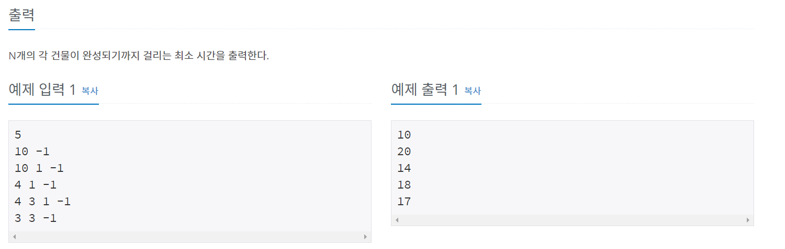  

---

### 풀이
---

이 전 문제와 비슷한데 출력을 비용으로 해준다.
 -> result배열에 간선의 값을 더해준다.

---

```java
package TopologySort;

import java.io.*;
import java.util.*;

public class num1516 {
	static int N, M;
	static int[] indegree, result, weight;
	static Queue<Integer> q = new LinkedList<Integer>();
	static ArrayList<Edge>[] edge;

	public static void main(String[] args) throws IOException {
		BufferedReader br = new BufferedReader(new InputStreamReader(System.in));
		
		StringTokenizer st = new StringTokenizer(br.readLine());
		
		N = stoi(st.nextToken());
		
		indegree = new int[N+1];
		result = new int[N+1];
		edge = new ArrayList[N+1];
		weight = new int[N+1];
		
		for(int i=1; i<=N; i++) {
			edge[i] = new ArrayList<Edge>();
		}
		
		for(int i=1; i<=N; i++) {
			st = new StringTokenizer(br.readLine());
			weight[i] = stoi(st.nextToken());
			while(true) {
				int prev = stoi(st.nextToken());
				if(prev == -1) break;
				indegree[i]++;
				edge[prev].add(new Edge(prev, i));
			}
			if(indegree[i] == 0){
	            result[i] = weight[i];
	            q.add(i);
	        }
		}
		
		for(int i=1; i<=N; i++) {
			if(q.isEmpty()) {
				return;
			}
			int now = q.poll();
			
			for(Edge next : edge[now]) {
				result[next.e] = Math.max(result[next.e], result[now]+weight[next.e]);
				indegree[next.e]--;
				if(indegree[next.e]==0)
					q.add(next.e);
			}
		}
		
		for(int i=1; i<=N; i++)
			System.out.println(result[i]);
		
	}
	static class Edge{
		int s, e;
		Edge(int s, int e){
			this.s = s;
			this.e = e;
		}
	}
	public static int stoi(String string) {
		return Integer.parseInt(string);
	}

}

```

## 백준 2252 - 줄 세우기

---

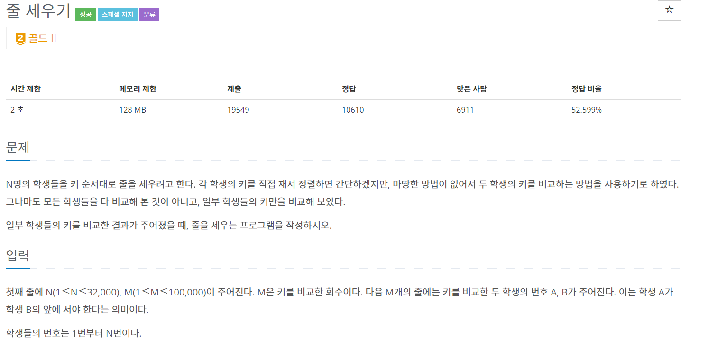  
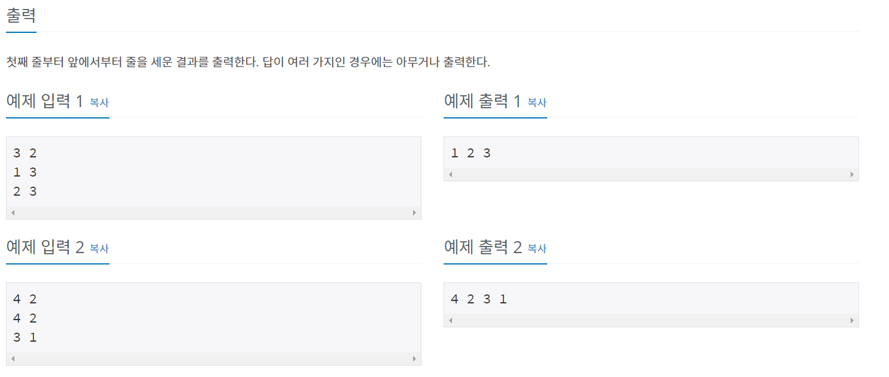  

---

### 풀이
---

2623번과 거의 동일하다

---

```java
package package34;

import java.io.BufferedReader;
import java.io.IOException;
import java.io.InputStreamReader;
import java.util.ArrayList;
import java.util.LinkedList;
import java.util.Queue;

public class num2252 {
	static int N, M;
	static int[] indegree,result;
	static ArrayList<Edge>[] edge;
	static Queue<Integer> q = new LinkedList<Integer>();
	
	public static void main(String[] args) throws IOException {
		BufferedReader br = new BufferedReader(new InputStreamReader(System.in));
		
		String[] NM = br.readLine().split(" ");
		
		N = stoi(NM[0]);
		M = stoi(NM[1]);
		indegree = new int[N+1];
		result = new int[N+1];
		edge = new ArrayList[N+1];
		
		for(int i=1; i<=N; i++) {
			edge[i] = new ArrayList<Edge>();
		}
		
		for(int i=1; i<=M; i++) {
			String[] edgeData = br.readLine().split(" ");
			int s = stoi(edgeData[0]);
			int e = stoi(edgeData[1]);
			
			edge[s].add(new Edge(s, e));
			indegree[e]++;
		}
		
		for(int i=1; i<=N; i++) {
			if(indegree[i] == 0) q.add(i);
		}
		
		for(int i=1; i<=N; i++) {
			if(q.isEmpty()) {
				return;
			}
			int temp = q.poll();
			result[i] = temp;
			for(Edge e : edge[temp]) {
				indegree[e.e]--;
				if(indegree[e.e] == 0)
					q.add(e.e);
			}
		}
		
		for(int i=1; i<=N; i++) {
			System.out.print(result[i] + " ");
		}
		
	}
	
	static class Edge{
		int s, e;
		Edge(int s, int e){
			this.s = s;
			this.e = e;
		}
	}
	
	public static int stoi(String string) {
		return Integer.parseInt(string);
	}
}

```

## 백준 3665 - 최종 순위

---

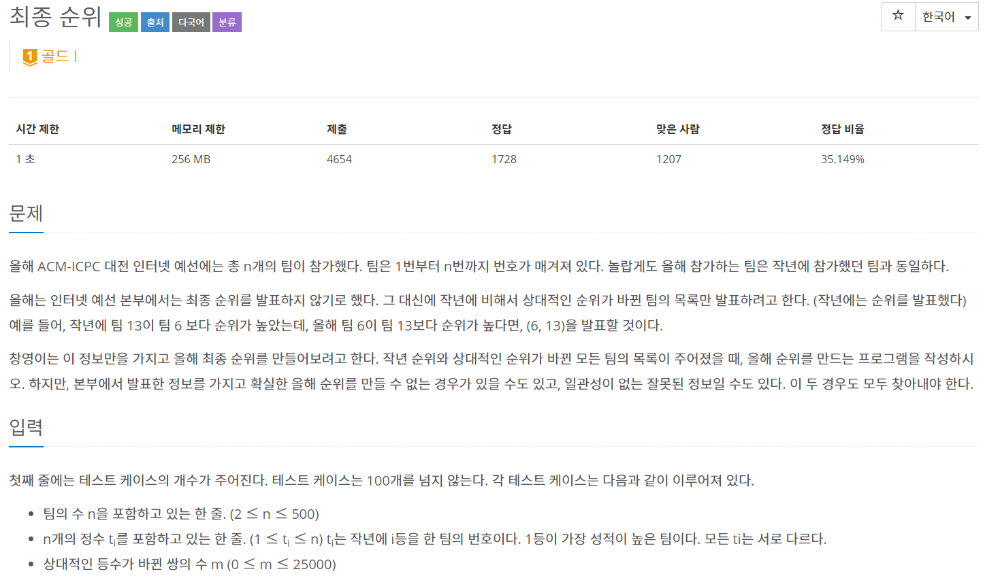  
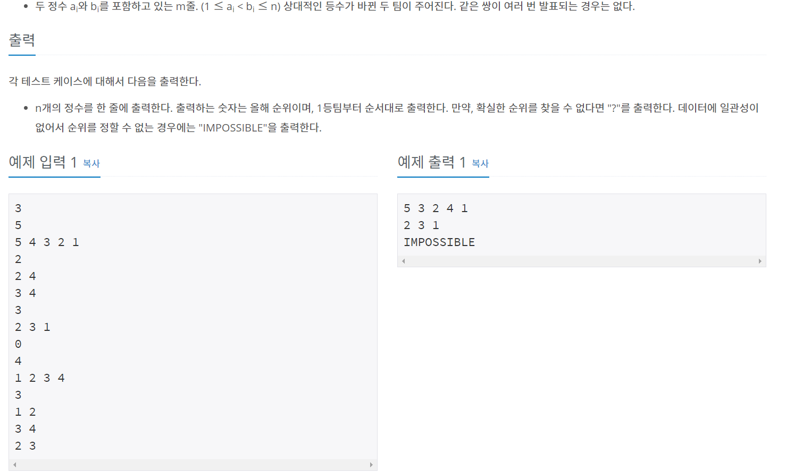  

---

### 풀이
---

일단 문제가 이해가 안되서

[stack07142님 블로그](https://stack07142.tistory.com/223)를 참고했다.

1. 그래프를 인접 행렬로 구현한다.  
2. 바뀐 순위에 따라 간선과 indegree를 갱신한다.  
3. 위상 정렬을 한다.  
   3-1. **정상일 경우**에 1등 팀 부터 순서대로 출력  
   3-2. **확실한 순위를 찾을 수 없다면** "?"출력  
   3-2. **사이클이 생겨** 순위를 정할 수 없는 경우   "IMPOSSIBLE"출력  

어렵당...

---

```java
package package34;

import java.io.*;
import java.util.*;

public class num3665 {
    static final int NONE = 0;
    static final int IMPOSSIBLE = 1;
    static final int NOT_DETERMINED = 2;

    static int T, N, M;
    static int[] indegree, result, prev;
    static Queue<Integer> q = new LinkedList<Integer>();
    static int[][] graph;
    
    public static void main(String[] args) throws IOException {

        BufferedReader br = new BufferedReader(new InputStreamReader(System.in));
        StringBuilder sb = new StringBuilder();

        T = stoi(br.readLine());

        for(int i=0; i<T; i++){
            N = stoi(br.readLine());

            indegree = new int[N + 1];
            result = new int[N+1];
            prev = new int[N+1];
            graph = new int[N+1][N+1];

            StringTokenizer st = new StringTokenizer(br.readLine());
            for (int j=0; j < N; j++) 
                prev[j] = stoi(st.nextToken());
            

            for (int j = 0; j < N; j++) {
                for (int k = j + 1; k < N; k++) {
                    graph[prev[j]][prev[k]] = 1;
                    indegree[prev[k]]++;
                }
            }

            M = stoi(br.readLine());

            for (int j=0; j<M; j++) {

                st = new StringTokenizer(br.readLine());

                int a = stoi(st.nextToken());
                int b = stoi(st.nextToken());

                if (graph[a][b] == 1) {
                    graph[a][b] = 0;
                    graph[b][a] = 1;

                    indegree[a]++;
                    indegree[b]--;
                } else {
                	graph[a][b] = 1;
                    graph[b][a] = 0;
                    
                    indegree[b]++;
                    indegree[a]--;
                }
            }
            
            for (int j=1; j<=N; j++) {
                if (indegree[j] == 0) {
                    q.add(j);
                }
            }

            int ans = NONE;
            for (int j=1; j<=N; j++) {
                if (q.isEmpty()) {
                    ans = IMPOSSIBLE;
                    break;
                }
                if (q.size() > 1) {
                    ans = NOT_DETERMINED;
                    break;
                }

                int u = q.poll();
                result[j] = u;

                for (int k=1; k<=N; k++) {
                    if (graph[u][k] == 1) {
                        indegree[k]--;
                        if (indegree[k] == 0) q.add(k);
                    }
                }
            }
            
            if (ans == NONE) {
                for (int j=1; j<=N; j++)sb.append(result[j] + " ");
                sb.append("\n");
            } else if (ans == IMPOSSIBLE) sb.append("IMPOSSIBLE\n");
            else if (ans == NOT_DETERMINED) sb.append("?\n");
        }
        System.out.println(sb);
    }
    
    public static int stoi(String string) {
    	return Integer.parseInt(string);
    }
}
```

## 백준 1005 - ACM Craft

---

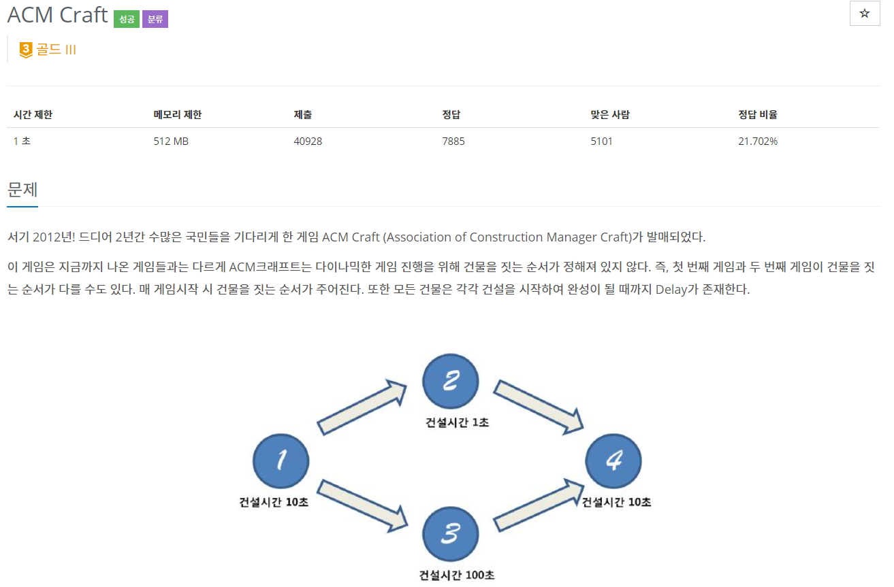  
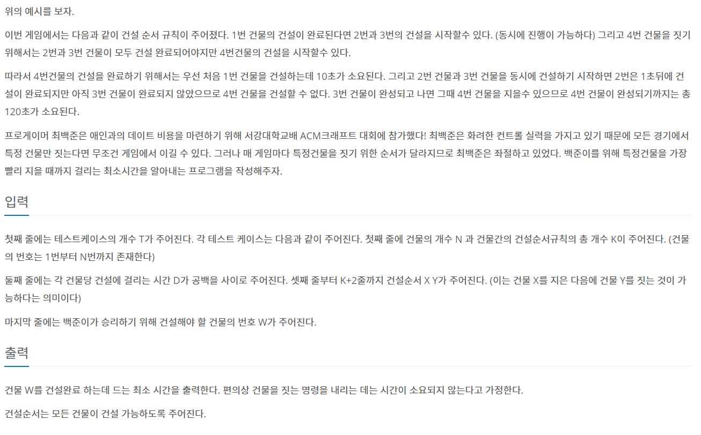  
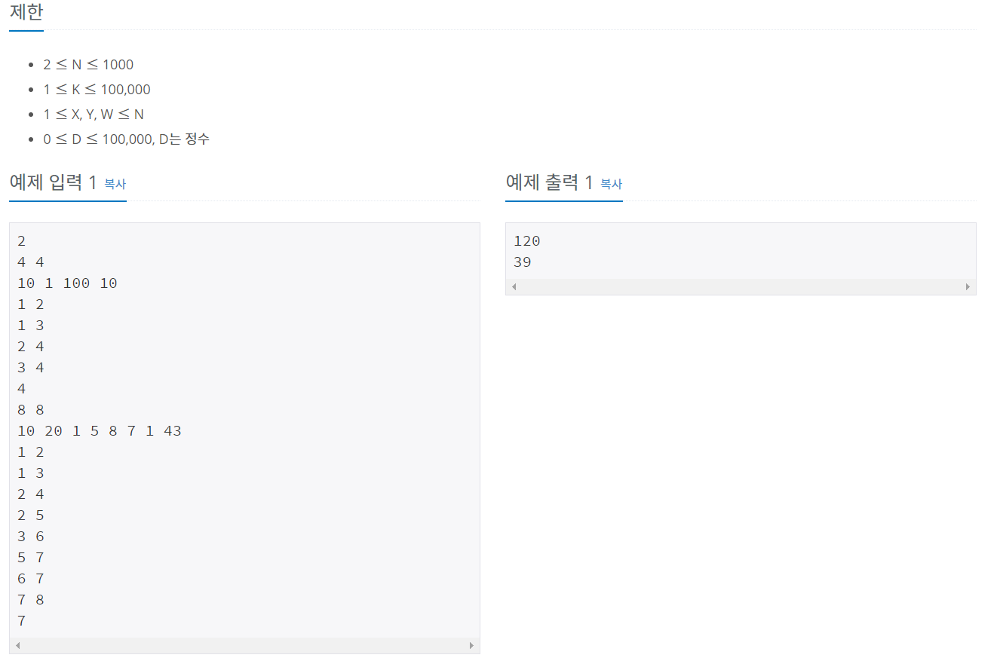  
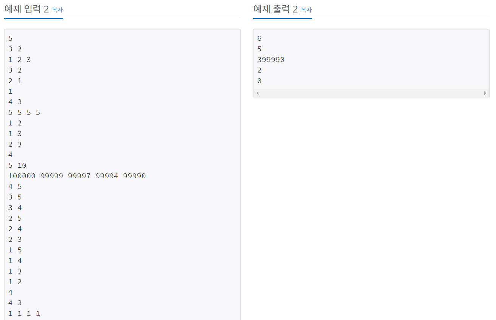  
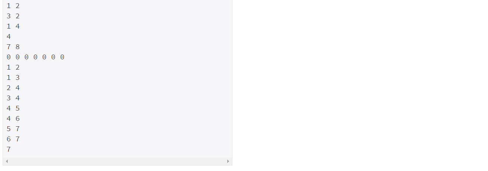  

---

### 풀이
---

1516문제와 비슷하다.

---

```java
package package34;

import java.io.*;
import java.util.*;

public class num1005 {
	static int T, N, K;
    static int[] result, indegree, weight;
	static ArrayList<Edge>[] edge;
	static Queue<Integer> q = new LinkedList<Integer>();
	
	public static void main(String[] args) throws IOException {
		BufferedReader br = new BufferedReader(new InputStreamReader(System.in));
		StringBuilder sb = new StringBuilder();
		StringTokenizer st;
		
		T = stoi(br.readLine());
		
		while(T-- >0) {
			st = new StringTokenizer(br.readLine());
			N = stoi(st.nextToken());
			K = stoi(st.nextToken());
			
			result = new int[N+1];
			indegree = new int[N+1];
			weight = new int[N+1];
			edge = new ArrayList[N+1];
			
			for(int i=1; i<=N; i++) {
				edge[i] = new ArrayList<Edge>();
			}
			
			st = new StringTokenizer(br.readLine());
			for(int i=1; i<=N; i++) {
				weight[i] = stoi(st.nextToken());
			}
			
			for(int i=1; i<=K; i++) {
				st = new StringTokenizer(br.readLine());
				int s = stoi(st.nextToken());
				int e = stoi(st.nextToken());
				
				edge[s].add(new Edge(s,e));
				indegree[e]++;
			}
	        for(int i=1; i<=N; i++) {
	            result[i] = weight[i];
	 
	            if(indegree[i] == 0)
	                q.offer(i);
	        }
	        
			for(int i=1; i<=N; i++) {
				if(q.isEmpty()) {
					break;
				}
				int now = q.poll();
				for(Edge next : edge[now]) {
					// 요기 중요함 둘 중 큰거 들어감
					result[next.e] = Math.max(result[next.e], result[now]+weight[next.e]);
					indegree[next.e]--;
					if(indegree[next.e]==0)
						q.add(next.e);
				}
			}
			int num = stoi(br.readLine());
			sb.append(result[num]+"\n");
		}
		System.out.println(sb);
		
	}
	
	static class Edge{
		int s, e;
		Edge(int s, int e){
			this.s = s;
			this.e = e;
		}
	}
	
	public static int stoi(String string) {
		return Integer.parseInt(string);
	}
	
}
```

## 백준 1766 - 문제집

---

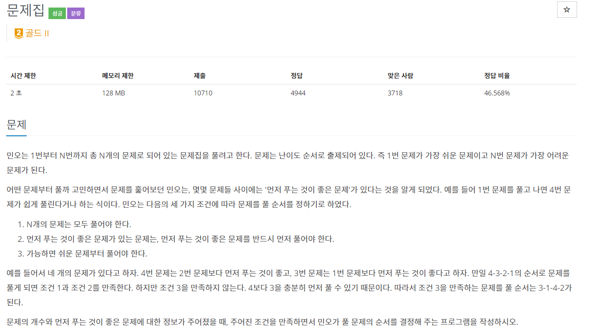  
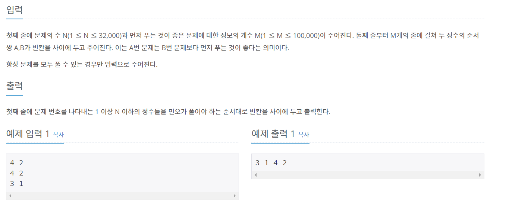  

---

### 풀이
---

문제를 보면 **가능한 쉬운 문제부터 풀어야 한다.** 라는 조건이 있다.  
 -> 이 조건은 Queue대신 PriorityQueue를 사용해 minheap에 저장하면 쉽게 구현 가능하다.

---

```java
package package34;

import java.io.BufferedReader;
import java.io.IOException;
import java.io.InputStreamReader;
import java.util.ArrayList;
import java.util.LinkedList;
import java.util.PriorityQueue;
import java.util.Queue;

public class num1766 {
	static int N, M;
	static int[] indegree,result;
	static ArrayList<Edge>[] edge;
	static PriorityQueue<Integer> q = new PriorityQueue<Integer>();
	
	public static void main(String[] args) throws IOException {
		BufferedReader br = new BufferedReader(new InputStreamReader(System.in));
		
		String[] NM = br.readLine().split(" ");
		
		N = stoi(NM[0]);
		M = stoi(NM[1]);
		indegree = new int[N+1];
		result = new int[N+1];
		edge = new ArrayList[N+1];
		
		for(int i=1; i<=N; i++) {
			edge[i] = new ArrayList<Edge>();
		}
		
		for(int i=1; i<=M; i++) {
			String[] edgeData = br.readLine().split(" ");
			int s = stoi(edgeData[0]);
			int e = stoi(edgeData[1]);
			
			edge[s].add(new Edge(s, e));
			indegree[e]++;
		}
		
		for(int i=1; i<=N; i++) {
			if(indegree[i] == 0) q.add(i);
		}
		
		for(int i=1; i<=N; i++) {
			if(q.isEmpty()) {
				return;
			}
			int temp = q.poll();
			result[i] = temp;
			for(Edge e : edge[temp]) {
				indegree[e.e]--;
				if(indegree[e.e] == 0)
					q.add(e.e);
			}
		}
		
		for(int i=1; i<=N; i++) {
			System.out.print(result[i] + " ");
		}
		
	}
	
	static class Edge{
		int s, e;
		Edge(int s, int e){
			this.s = s;
			this.e = e;
		}
	}
	
	public static int stoi(String string) {
		return Integer.parseInt(string);
	}
}
```

---

끗


# Reference

[[그래프]위상 정렬 - JuticeHui님 블로그](https://justicehui.github.io/easy-algorithm/2018/03/24/TopologicalSort/)   
[갓킹독님 블로그](https://blog.encrypted.gg/910?category=773649)   
[라이님 블로그](https://m.blog.naver.com/kks227/220800013823)  
