1. 수정된지 100일이 지난 파일 목록을 출력하시오. (명령어 : find)

```bash
$ find -mtime +100
```

2. (a)에서 (b)의 결과를 얻으시오 (명령어: ll)
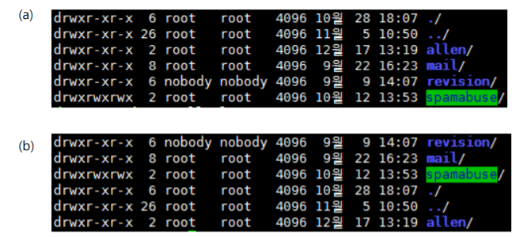

```bash
$ ll -rt
```

3. 명령어가 저장되는 history 파일의 경로는 어디인가

```bash
$ ~/.bash_history
```

4. 저장된 히스토리를 파일명 ‘myhistory.log’ 으로 저장하시오

```bash
$ history > myhistory.log
```

5. 아래 디렉토리의 소유자/그룹을 하위 디렉토리, 파일까지 전부 nobody 로 변경하시오. (명령어:chown)
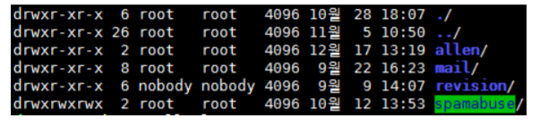

```bash
$ chown -R nobody:nobody ./*
```

6. temp 디렉토리의 파일 중, 하루가 지난 파일을 삭제하시오 (명령어: find)

```bash
$ find /temp -ctime +0 -type f -exec rm -f {} \;
```

7. screen 명령어를 사용하여, 서버와의 연결이 비정상종료되더라도, session은 유지한 채 작업을 할 수 있다. 이
때 단축키를 사용하여 screen에서 빠져 나오시오.

```bash
CTRL + a + d
```

8. 자신이 사용하고 있는 tty를 출력하시오.

```bash
tty
```

9. 아래 그림과 같이 단계적인 디렉토리를 한번에 생성하시오.
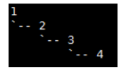

```bash
mkdir -p 1/2/3/4
```

10. grep 명령어의 위치를 출력하시오.

```bash
$ which grep

$ whereis grep
```

11. 상위디렉토리로 이동하는 ‘cd..’ 를 ‘pd’로 정의하시오. (alias)

```bash
alias pd='cd..'
``` 

12. 이전에 친 ‘vi mytest’ 명령어를 다시 출력하는 방법은 무엇인가.

```bash
$ !!

$ !{history에 명령어 번호}
```

13. 아래 출력결과를 현재 경로 내에 result.txt 파일로 저장하시오.
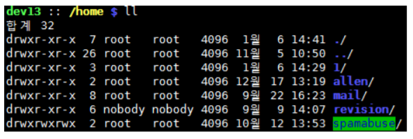

```bash
$ ll > result.txt
```

14. 5개의 백그라운드(background) 작업 중, 3번 작업을 포그라운드(foreground)로 가져오시오.

```bash
$ fg %3
```

15. 이름 ‘vi’ 프로세스를 찾아 종료시키시오. (‘vi’ 프로세스 id는 9140으로 가정한다.)

```bash
$ ps -ef | grep vi

$ kill 9140
```

16. (a)에서 (b)의 결과를 얻으시오 (명령어: ll)
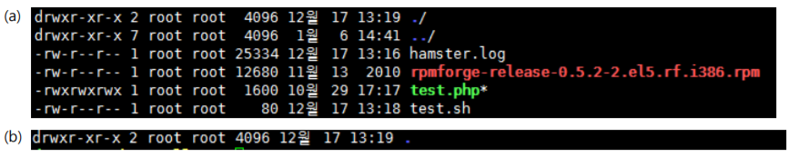

```bash
$ ll -d
```

17. ‘test.txt’ 파일에서 상단 10줄을 읽어 오류만 ‘error.txt’ 에 저장하시오.

```bash
$ head test.txt 2> error.txt
```

18. ‘test.txt’ 파일에 ‘link_test’ 이름으로 심볼릭 링크를 생성하시오.

```bash
$ ln -s test.txt link_test
```

19. (a)에서 (b)의 결과를 얻으시오 (명령어: du)
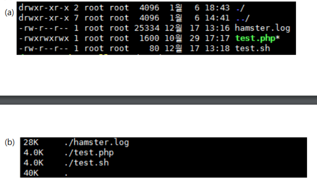

```bash
$ du -ah
``` 

20.  현재 디렉토리의 모든 파일에서 ‘mail’ 이라는 패턴이 들어간 파일의 이름을 출력하라. (명령어 : grep)

```bash
$ grep -l 'mail' *
```

1.  ‘m’으로 시작하는 모든 파일에서 ‘hamster’ 를 포함하는 모든 행을 찾으시오.(명령어 : grep)

```bash
$ grep -n hamster m*
```

22. 현재 디렉토리 내의 ‘test.txt’ 파일에서 ‘:’ 구분자를 이용하여 3번째 필드를 출력하라 (명령어 : awk)

```bash
$ awk -F: '{ print $3 }' test.txt
```

23. 현재 디렉토리 내의 ‘test.txt’ 파일에서 1행에서 3행까지 출력하라. (명령어 : sed)

```bash
$ sed -n '1,3p' test.txt
```

24. vi 에디터의 탭간격을 4로 설정하시오. (vi 에디터를 실행시켰다고 가정)
 
```bash
:set sts=4
```

25. 다음 vi 화면에서 ‘if’를 ‘testif’ 로 한번에 변경하시오.
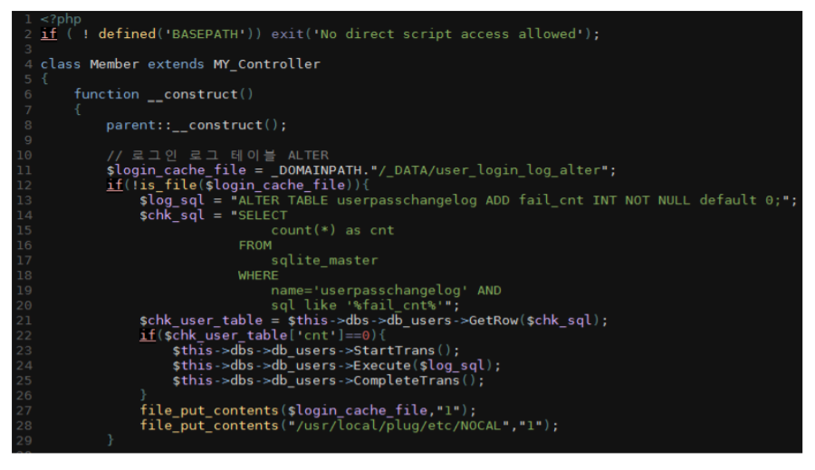

```bash
:%s/if/testif/g
``` 

1.  실행중인 터미널의 사이즈를 구하시오.

```bash
$ stty size
```

27. 로그인 하고 있는 모든 사용자를 출력하시오.

```bash
$ who
```

28. 현재 서버의 메모리와 캐시사용량을 mb 단위로 출력하시오.

```bash
$ free -m
```

29. 현재 디렉토리에 linuxwr.txt라는 파일을 만드는 alias를 작성하시오. (alias명 : linuxtest)
 
```bash
$ alias linux="touch linuxwr.txt"
```

30. 포그라운드(foreground)로 실행중인 프로세스를 일시 중지하는 단축키는 무엇인가.
 
```bash
CTRL + Z
```

31.  아래 리스트에서 ‘6자리 단어이자, 대소문자 구분없이 ‘y’ 가 포함되는’ 단어의 개수를 출력하라.
(명령어:more)
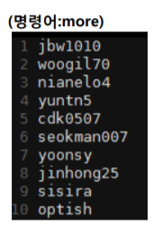

```bash
more list | grep -w '......' | -ic 'y'
```

32. ‘diff -u b a’ 명령어를 이용하여 아래와 같은 결과를 도출하였다. 결과값을 가지고 a파일을 만드시오.
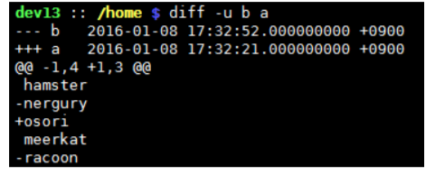

```bash
diff -u b a > a
```

33. 당일 오후 1시로 알람을 지정한 뒤, 프로세스를 죽이시오 (PID는 9140으로 가정한다.)
 
```bash
kill -14 9999 | at 13:00
```

34.  10G의 더미파일(빈파일)을 만들고자 한다. 흰색을 채우시오. (파일명은 ‘mailplug’로 지정한다.)
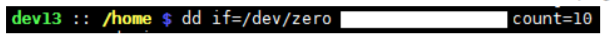

```bash
$ dd if=/dev/zero of=파일명 bs=1GB count=10
```

35. 시그널 이름 중 ‘SIGQUIT’ 는 몇 번에 해당하는가?  

```
a. 19 b.17 c.15 d.3 e.1
```

```bash
3
``` 

36.  csh 에서 로그아웃할 때 백그라운드 프로세스들을 자동으로 죽일 때, 어느 파일을 참조하는가?
```
a. .logout b. .bash_history c. .bashrc d. .bash_logout e. hamster
```

정답 : a

```bash
$ ~/logout
```

37.  grep 을 사용하여 마침표로 시작되는 줄을 찾으시오.

```bash
$ grep ^\. {찾을 파일/디렉토리 명}
```

38. 디렉토리 내에서 가장 새로운 파일의 이름을 출력하는 방법은 무엇인가 (명령어: ls)

```bash
$ ls -t1 | head -1
```

39. 연결되지 않은 심볼릭 링크 찾아내는 방법은 무엇인가 (명령어: find)

```bash
$ find -L . -type l
```

40. ‘rm’ 명령어 사용시, 바로 삭제시키지 않고 한번 더 물어본 후 삭제시키고자 할 때 사용하는 옵션은?

```bash
$ rm -l file
```

41. ‘cat’ 명령어 옵션 중, ‘tab과 행바꿈 문자를 제외한 제어 문자를 ^ 형태로 출력해 주는’ 옵션은?

```bash
$ cat -v file
```

42. 0.0.0.0 에서 999.999.999.999 까지 표현할 수 있는 정규표현식을 작성하시오.

```bash
$ [0-9]{1,3}\.[0-9]{1,3}\.[0-9]{1,3}
```

43. ‘egrep’ 명령어를 이용하여 ‘testfile’ 내 ‘숫자 3이 한 번 이상 등장하는 행을 출력하시오’.

```bash
$ egrep '3+' testfile
```

44. 디렉토리 구조는 아래와 같다. a.py 를 vi 편집기로 연 후, 빠져 나오지 않은 채, b.py 로 전환하시오.
 (cf. a.py 파일을 연 후, :q 명령은 내리지 않는다.)  

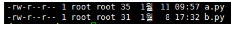

```bash
:e b.py
```

45. 파일의 제일 앞부분에 있는 100개의 문자를 삭제하시오 (명령어 : dd)

```bash
dd if={input file이름} of={output file이름} ibs=1 slip100 conv=cotrunc
```

46. ‘test.log’ 파일을 정렬하여, 동일 디렉토리 내 ‘result.log’ 에 작성하시오. (명령어 : sort)

```bash
$ sort -o result.log test.log
```

47. 백그라운드로 실행중인 프로세스나 현재 중지된 프로세스 목록을 PID와 같이 출력하라.

```bash
$ jobs -l
```

48. 현재 등록된 crontab에 등록된 작업을 출력하시오

```bash
$ crontab -l
```

49. 아래 crontab 에 대해 맞는 설명은?
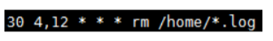

```
 a. 새벽 4시부터 낮12까지 30분 간격으로 로그파일 삭제.
 b. 매주 일요일, 새벽4시 30분과 낮12시 30분에, 로그파일 삭제.
 c. 매월 4일, 12일에 매시간 30분에 로그파일 삭제
 d. 새벽4시와 낮 12시, 30분에 로그파일 삭제
 e. 매월 30일 새벽4시와 낮12시에 로그파일 삭제
```

정답 : d
```bash
매일 4시 30분 12시 30분에 홈디렉토리의 모든 로그파일 삭제
```

1.   vi 편집기내에서 문서 최상단으로 커서를 위치시키는 명령어는?

```bash
gg

1G
```
