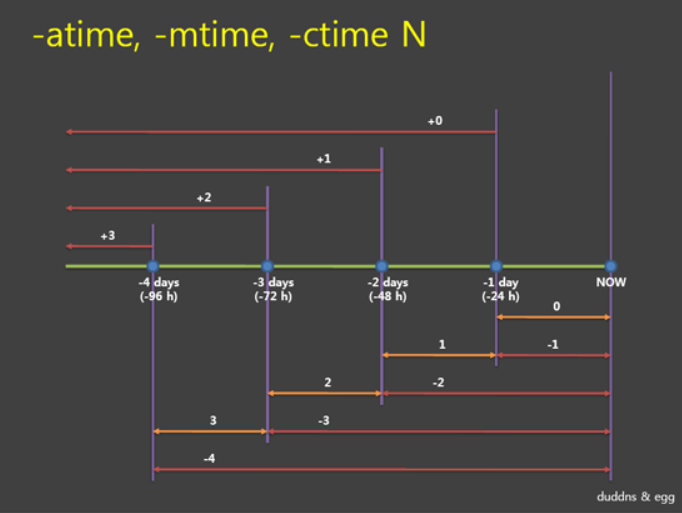
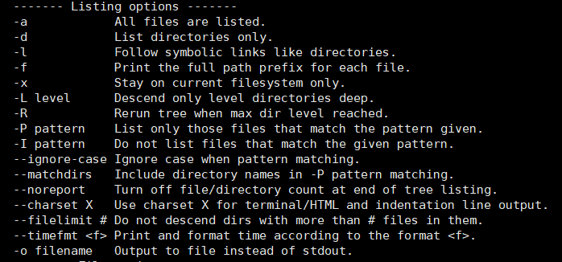
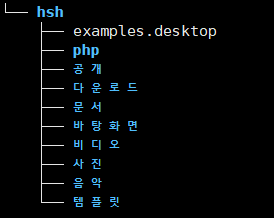

리눅스 자주쓰는 명령어와 중요 개념 정리한다.

# 1. find
> find [path] [Option] [expression] : 파일이나 디렉터리를 찾고 싶을 때 사용하는 명령어

**Tip!!**
- 옵션을 통해 다양한 경우의 상황으로 찾기 가능
- 시간 옵션 뒤에 부여해야 하는 숫자 tip!!


## 옵션
```
 -name : 파일이나 디렉토리 이름
 -iname : 대소문자 구분 없이 이름으로 검색
 -user : 사용자 이름
 -group : 그룹 이름
 -uid : uid로 검색
 -gid : gid로 검색
 -perm : 권한으로 검색
 -type : 파일 유형으로 검색
    (d : 디렉토리, f : 파일, l : 링크, s : 소켓)
 -atime n : 파일에 접근한 시간(파일을 Open할 때 마다 갱신된다)
 -ctime n : inode의 값(파일 속성, 권한, 크기 등)으로 검색
 -mtime n : 파일이 수정되었을 때 기준으로 검색
   * time부분을 min으로 사용하면 분으로 검색
   * 추가로 Suffix를 붙여 정확한 시간 지정 가능
 -empty : 빈 파일 찾기
 -exec : 명령 내릴 수 있는 옵션 / 결과 값 {}, \;로 끝내야 한다.
 -size n : n블록 길이의 파일
 -inum n : inode
 -maxdepth n : 파일 계층 depth의 최대값 설정
 -mindepth n : 파일 계층 depth의 최소값 설정
 -prune : 값을 찾으면 하위 디렉토리에 들어가서 찾지 않음
 -newer : 뒤에 적힌 파일보다 최근에 변경된 파일 찾음
```

**Tip!!**
 - 2>/dev/null : 권한 없는건 화면에 출력되지 않는다.  

# 2. grep
> grep [option] [pattern] [file_name] : 특정 문자열을 파일에서 찾아주는 명령어

- pattren에는 정규 표현식 메타 문자가 들어간다.

**Tip!!**
- egrep
- egrep은 grep의 확장판
- grep이 하나의 문자열을 찾는 것 과는 달리, 여러 개의 문자열을 동시에 찾기 가능  
- grep에서 활용할 수 있는 메타문자 이외에 추가 정규 표현식 메타문자 사용 가능

+: +앞의 정규표현식이 1회 이상 나타남
?: ?앞의 정규표현식이 0회 또는 1회 나타남
|: 문자열간의 OR연산자
(): 정규표현식을 둘러쌈

## 옵션
```
 -b : 검색 결과의 각 행 앞에 블록번호 표시
 -c : 찾아낸 행의 총 개수 출력
 -i : 대소문자 구분 x
 -l : 대소문자 구분 o
 -n : 파일 내에서 행 번호를 함께 출력
 -s : 에러 메세지 외에 표시 x
 -G : 기본 정규식으로 검색
```


# 3. awk
> awk [옵션] 
문서에서 패턴을 검사해 원하는 값 얻는다.

```
$ awk {-f 파일명} {-F 필드 구분자} {"패턴"} {처리할 파일명}
```

## 옵션


# 4. Redirection
> 명령의 결과를 모니터로 출력하지 않고, 파일로 저장할 수 있다. (리다이렉션을 사용해 출력, 입력 방향 지정 가능)

표준 입출력(Standard I/O)
|구분|파일 디스크럽터|
|----|----|
| 표준 입력 | 0 |
| 표준 출력 | 1 |
| 표준 에러 | 2 |


|기호|기능|
|----|----|
|>/>>| 출력 방향 재지정 |
|</<<| 입력 방향 재지정 |
|>| 덮어 쓴다.|
|>> | 추가된다. |

# 5. vi

- 텍스트 편집기
- 3가지 모드가 있다.
  - 입력(내용입력), 명령(편집기능), 콜론(열기, 저장, 추가기능 수행)


## 문자열 치환
>: [범위] / [매칭 문자열] / [치환문자열] / [행범위] 

**Tip!!**
- gg : 최상단으로 커서 옮김
- 0 : 현재 줄 맨 앞
- $ : 현재 줄 맨 뒤
- dd : 라인 삭제
- u : 복구
- p : 붙여 넣기
- yy : 라인 복사
- :wq : 저장 후 종료
- .vimrc 파일에 환경설정 가능!


# 6. sed 


## 옵션

 


# 7. ls

## 옵션


# 8.  사용자 권한 (chmod, chown)

리눅스는 사용자 및 그룹에 기반하여 액세스를 허가하거나 금지한다.

## chown
> 파일의 소유권 바꾸기 위해 사용

```bash
chown [OPTION]... [OWNER][:[GROUP]] FILE...
```


## chmod
> 파일이나 디렉토리의 모드를 변경

```bash
$ chmod {옵션} {권한} {파일}
```

# 9.  tty

- 로그인 한 모든 세션은 각각 고유의 tty를 가지고 있다.
- 입력과 출력을 처리한다.
  

```bash
$ tty

/dev/pts/0
```

# 10.  mkdir / rmdir

<!-- > 표현식 -->

**Tip!!**

## 옵션

 

# 11.  which / whereis

<!-- > 표현식 -->

**Tip!!**

## 옵션

 


# 12.  alias  
> 사용자가 원하는 명령어를 추가하기 위한 명령어

사용 예제
```
$ alias la='ls -a'
$ alias lf='ls -F'
$ alias lr='ls -R'
$ alias ri='rm -i'
$ alias mi='mv -i'
```

- alias를 입력하면 입력 된 alias를 확인할 수 있다.
- ~/.bashrc에 정의하면 쉘이 시작할 때 자동으로 정의된다.


# 13. history
> 커맨드 이력 관리 명령어

- ~/.bash_history 에 저장

히스토리 관련 환경변수
```
HISTFILE : command 저장 파일
HISTFILESIZE : 히스토리 파일 최대 크기
HISTSIZE : 히스토리에 저장 가능한 최대 명령어 개수
```

**Tip!!**

- history -w {파일 이름}: 별도의 파일로 저장
- !! : 바로 직전 커맨드 실행
- !n : history n 번째에 저장된 명령어 실행
- !{string} : string으로 시작하는 가장 최근 실행한 커맨드 찾아 실행
- :p : :p를 붙여서 실행 시 커맨드만 출력


# 14. jobs / 포그라운드 백그라운드

- jobs : 현재 쉘에서 작업 중지된 상태나 백그라운드로 진행되는 작업 표시
- bg : 백그라운드 프로세스 확인
- & : 프로세스를 백그라운드로 실행


# 15. ps

<!-- > 표현식 -->

**Tip!!**

## 옵션

 


# 16. head, tail, more

<!-- > 표현식 -->

**Tip!!**

## 옵션

 


# 17. 심볼릭 링크, 하드 링크

<!-- > 표현식 -->

**Tip!!**

## 옵션

 


# 18. du / df

## du
> 디렉토리 사용량 확인

### 옵션
```
-a : 모든 파일들의 기본정보를 보여준다.
-b : 표시단위를 기본 KB 대신 Byte로 한다.
-k : 표시단위를 KB 단위로 한다.
-h : 파일들의 용량단위가 보기좋게 정리되어 보여준다.
-c : 모든 파일들의 디스크 사용정보를 보여주고 나서 합계를 보여준다.
-s : 총 사용량만 표시
-x : 체크하는 경로안에 다른 시스템이 있으면 생략
```

## df
> 디스크의 사용가능한 용량 확인

# 19. who / whois

<!-- > 표현식 -->

**Tip!!**

## 옵션

 


# 20. free

<!-- > 표현식 -->

**Tip!!**

## 옵션

 


# 21.  diff

<!-- > 표현식 -->

**Tip!!**

## 옵션

 


# 22. kill

<!-- > 표현식 -->

**Tip!!**

## 옵션

 


# 22. dd
> 파일을 변환하고 복사하는 명령어


```
$ dd if={입력} of={출력} bs={바이트} count={반복}

ibs = bytes     #한번에 bytes 바이트씩 읽는다.
obs = bytes     #한번에 bytes 바이트씩 쓴다.
skip = n        #n*ibs 바이트만큼 무시하고 읽는다.
seek = n        #n*obs 바이트만큼 무시하고 쓴다.
```


# 23 시그널

<!-- > 표현식 -->

**Tip!!**

## 옵션

 


27. csh에서 로그아웃 할 때 백그라운드 프로세스를 자동으로 죽이려면 어떤 파일을 참조하면 되는가? - C쉘은로그아웃할 때 홈디렉토리의 ‘.logout’파일을 읽는다.

<!-- > 표현식 -->

**Tip!!**

## 옵션

 


# 24. rm

<!-- > 표현식 -->

**Tip!!**

## 옵션

 


# 25. cat
> cat {옵션} 파일명

파일 내용 출력


# 26. sort

<!-- > 표현식 -->

**Tip!!**

## 옵션

 


# 27. cron
> unix 운영체제에서 어떤 작업을 특정 시간에 실행시키기 위한 데몬

cron 작업을 설정하는 파일을 crontab이라고 부른다.

형식
```
* * * * * {명령어}

분/시/일/월/요일 
``` 

추가 기호
```
 , : 복수개의 시간 지정
 * : 모든 시간 지정
 - : 시간의 범위 지정
 / : 시간 간격을 지정
```

크론 조회
```bash
$ crontab -l
```

크론 접근 권한 설정은 관련된 파일로 명시해준다.
- /etc/cron.allow
- /etc/cron.deny
- /etc/con.d/cron.deny


# 28. cut
> cut {option} {file}

파일에서 필드 추출, 필드는 구분자로 구분 가능

옵션
```
 -c : 잘라낼 곳의 위치 지정. (콤마나 하이픈으로 범위 설정 가능)
 -f : 잘라낼 필드 설정
 -d : 필드 구분 문자 지정
```

# 29. tar / gzip

tar : gzip 명령이 포함된 압축 툴
gzip : 파일 압축 명령어


# 30. split

<!-- > 표현식 -->

**Tip!!**

## 옵션

 


# 31. mount

<!-- > 표현식 -->

**Tip!!**

## 옵션

 


# 32. nohup

<!-- > 표현식 -->

**Tip!!**

## 옵션

 


# 33. apt-get / yum

<!-- > 표현식 -->

**Tip!!**

## 옵션

 


# 34. basename

<!-- > 표현식 -->

**Tip!!**

## 옵션

 


# 35. net tools

<!-- > 표현식 -->

**Tip!!**

## 옵션

 


# 36. ulimit

<!-- > 표현식 -->

**Tip!!**

## 옵션

 


# 37. wc
> wc {옵션} {파일}
각각의 파일에 대한 줄(line), 단어(word), 문자(char), 바이트(byte) 수를 알려준다.

## 옵션
```
-c : byte 수를 알려준다.
-m : 문자 수를 알려준다.
-l : 줄 수를 알려준다.
-L : 가장 긴 줄의 길이를 알려준다.
```


# 38. /dev/zero

<!-- > 표현식 -->

**Tip!!**

## 옵션

 


# 39. DNS 서버 변경 -> /etc/resolve.conf

<!-- > 표현식 -->

**Tip!!**

## 옵션

 


# 40. cd

<!-- > 표현식 -->

**Tip!!**

## 옵션

 


# 41. IPv6

<!-- > 표현식 -->

**Tip!!**

## 옵션

 


# 42.  lsmod

<!-- > 표현식 -->

**Tip!!**

## 옵션


# 43. ulimit

<!-- > 표현식 -->

**Tip!!**

## 옵션


# 44. 메일 프로토콜 (SMTP, POP3)

**Tip!!**

## 옵션
 

# 45. Tree

tree 명령어는 기본적으로 존재하는 명령어가 아니므로 apt이나 yum을 이용해 설치한다.

```bash
$ tree --help
```
명령어로 트리의 옵션을 볼 수 있다.


tree 명령어의 실행 화면이다.



# 46. Rsync 명령어


https://jhnyang.tistory.com/287

# 47. Linux 파이프 라인


일단 오늘 해결
[요거 보고 해결함 ㅋ](https://velog.io/@issac/SSH-%EC%A0%91%EC%86%8D%EC%8B%9C-RSA-%EA%B3%B5%EC%9C%A0%ED%82%A4-%EC%B6%A9%EB%8F%8C-%EB%AC%B8%EC%A0%9C-%ED%95%B4%EA%B2%B0)

rm 보면 `` , '' , "" 차이 있거든? https://askubuntu.com/questions/20034/differences-between-doublequotes-singlequotes-and-backticks-on-comm 요거 보고 해결함