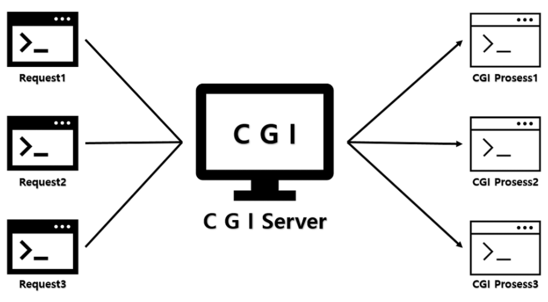
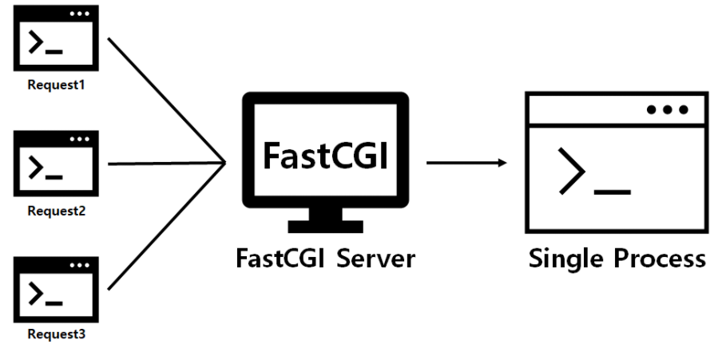
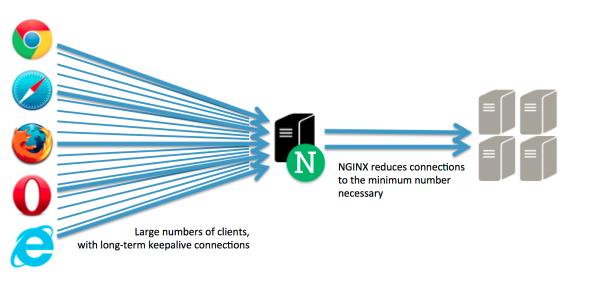
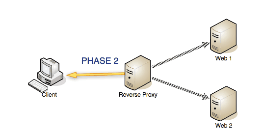
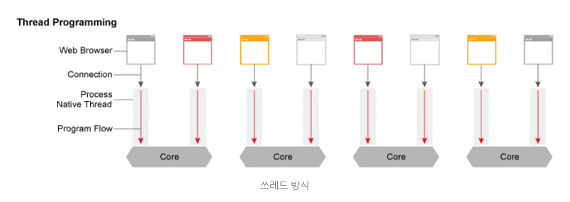
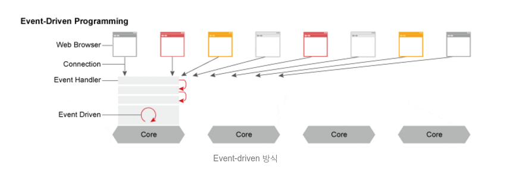
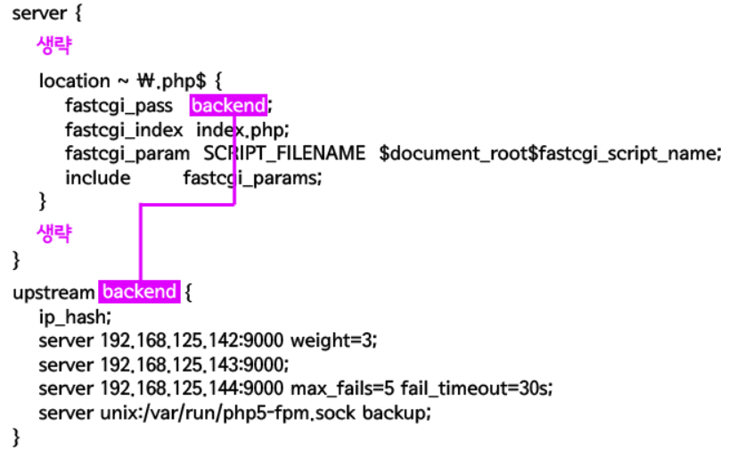

# Nginx

## CGI(Common Gateway Interface) 란?
> 웹서버와 외부 프로그램(C, PHP, Python 등) 사이에서 정보를 주고받는 방법과 규약

**이 표준에 맞춰 만들어진 것이 CGI 스크립트이다.**



### 관련 용어
 - Web Server : 웹 클라이언트에게 콘텐츠를 제공하는 서버
 - WAS : 서버 단에서 Application을 동작할 수 있도록 지원

### 장점
 - 언어, 플랫폼에 독립적
 - 매우 단순하고 다른 서버 사이드 프로그래밍 언어에 비해 쉽게 수행
 - 라이브러리가 풍부하다
 - 가볍다

### 단점
 - 느리다(요청이 올 때 마다 DB connection을 새로 열어야 한다)
<!-- TODO : 확인해보자 -->
 - HTTP 요청마다 **새로운 프로세스를 만들어** 서버 메모리를 사용한다 (Fork로 구현되어 있음)
 - 데이터가 메모리에 캐시될 수 없다.

### 추가
[RPC 3875-1.4 항목](https://tools.ietf.org/html/rfc3875#section-1.4)
```
1. CGI 프로그램을 호출하는 WEB 서버 역할
  1) 전송 단계에서의 인증 및 보안
  2) CGI 프로그램의 선택
  3) CGI Request 로 변환
  4) CGI Response에서의 변환
2. 호출 프로그램의 지정 방법 (URI)
3. WEB 서버에서 CGI Request의 해석 방법 (경로 및 프로토콜)
4. WEB 서버에서 CGI Response에 대한 반환 방법 (경로 및 프로토콜)
```

## FastCGI란?
> 하나의 큰 프로세스로 동작한다. 이 프로세스가 계속해서 새로운 요청(Request) 처리(CGI 단점 해결)



대부분의 웹서버 **(Nginx, IIS, Apache)** 가 FastCGI를 제공한다.

## PHP-FPM(Fast Process Manager)
> PHP를 FastCGI 모드로 동작하게 해준다.


## 1. 역할
1. 정적 파일을 처리하는 **HTTP 서버**로서의 역할



2. 응용 프로그램 서버에 요청을 보내는 **리버스 프록시** 역할



프록시는, **클라이언트와 서버 통신 사이에서 통신을 대신!! 해주는 서버를 의미한다.**

### 리버스 프록시란?
 > 클라이언트가 서버에 요청하면, 프록시 서버가 배후 서버(응용프로그램 서버)로부터 데이터를 가져옴

추가로 포워드 프록시는 클라이언트 앞단에서
**보안을 위해 사용을 제한할 목적**

리버스 프록시는 서버의 앞단에서 요청을 처리  
**좀 더 안전하게 Request, Response를 관리**

### 리버스 프록시를 쓰는 이유
 > **프록시 서버를 둠으로써 요청을 배분하는 역할**
 > cli가 직접 App 서버에 요청하면 프로세스 1개가 응답대기 상태가 되어서 요청에 대한 버퍼링이 생김
 > 추가로 **보안** 때문이다. -> WAS는 대부분 DB서버와 연결되어 있으므로 WS - WAS가 통신을 통해 클라이언트에게 제공하는 방식

추가로 스위치(로드밸런서)로써 역할도 가능하다.
> 프로세스 응답 대기를 막고, 요청을 배분하는 역할 
### Event-driven 방식

Thread 기반은 하나의 커넥션당 하나의 쓰레드를 사용

Event-driven 방식은 Event Handler를 통해 비동기 방식으로 처리해 먼저 처리되는 것부터 로직이 진행된다.





## 2. 파일 구조

5개 폴더 및 파일을 알아보고 넘어가겠다.

```
conf.d : nginx.conf에서 불러들일 수 있는 파일을 저장
fastcgi.conf : FastCGI 환경설정 파일
nginx.conf : 접속자 수, 동작 프로세스 수 등 퍼포먼스에 관한 설정들
sites-available : 비활성화된 사이트들의 설정 파일들이 위치한다.
sites-enabled : 활성화된 사이트들의 설정 파일들이 위치한다. 
```

사실 기본 설정이 이렇다는 거고, 폴더명 같은 경우는 상황에 따라 변경이 가능하다. 

## 3. 변수

#### $arg_{PARAMETER}
> URI의 파라미터 변수의 이름 의미
#### $host
> 현재 요청의 호스트 명

#### $uri
> 현재 요청의 URI (호스트명과 파라미터는 제외된다.)

#### $args
> URL의 질의 문자열

#### $binary_remote_addr
> 바이너리 형식의 클라이언트 주소

#### $body_bytes_sent
> 전송된 바디의 바이트 수

#### $content_length
> HTTP 요청헤더의 Content-length

#### $content_type
> HTTP 요청헤더의 Content-type

#### $document_root
> 현재 요청의 document root 값

#### $http_HEADER
> HTTP 헤더의 값을 소문자로 한 값(-는 _로 변환된다.)

#### \$server\_name / \$server\_port / \$server\_protocol
> 각각 name, port, protocol을 의미한다.

#### cookie_{쿠키이름}
> 해당 쿠키의 값을 얻을 수 있다.
## 4. 설정

**설정 수정 시 원본을 복사해 보관해 두는 습관 가지자!**

### 설정 파일

설정파일은 크게 4가지로 나뉜다.
1. nginx.conf : 메인 설정 파일
2. fcgi.conf : FastCGI 환경 설정파일
3. sites-enabled : 활성화된 사이트들의 설정 파일 위치
4. sites-available : 비활성화된 사이트들의 설정 파일 위치


두개의 파일을 보며 Nginx 설정에 대해 확인해보자
> /etc/nginx/nginx.conf  
> /etc/nginx/sites-available/default

#### /etc/nginx/nginx.conf
```
user www-data;
worker_processes auto;
pid /run/nginx.pid;

events {
        worker_connections 768;
        # multi_accept on; #기본값:off
}

http {
        sendfile on;
        tcp_nopush on;
        tcp_nodelay on;
        keepalive_timeout 10; #기본값:75
        types_hash_max_size 2048;
        server_tokens off;

        server_names_hash_bucket_size 64; #기본값:32
        server_names_hash_max_size 2048; #기본값:512
        # server_name_in_redirect off;

        include /etc/nginx/mime.types;
        default_type application/octet-stream;

        access_log off; log_not_found off;
        error_log /var/log/nginx/error.log warn;

        include /etc/nginx/conf.d/*.conf;
        include /etc/nginx/sites-enabled/*;
}

```
nginx.conf 파일은 접속자 수, 동작 프로세스 수 등 퍼포먼스에 대한 기본적인 설정 항목을 포함한다.

크게 3가지 항목으로 나뉜다.

#### 1. 최상단 (Core 모듈)

user : Nginx 프로세스(워커 프로세스)가 실행되는 권한
 - nginx는 master process, worker process로 동작한다.
 - 실질적으로 **worker process가 실직적인 웹서버 역할** 수행
 - root로 설정되어 있을 경우, 워커 프로세스를 root 권한으로 동작  
   -> 악의적인 사용자가 제어하게 된다면 보안상 위험  
   -> 보통 **www-data, www, nginx**와 같이 계정이 하는 일에 대한 대표성 있는 이름 사용  
    - (default 값 - ubuntu : www-data, 기타 nobody )  
   -> 이 계정들은 일반 유저의 권한으로 쉘에 접속 할 수 없어야 안전하다.  
    - ubuntu 에서 계정 생성방법  
```bash
$ useradd --shell /usr/sbin/nologin www-data
```

worker_processes : Nginx 프로세스 실행 가능 수
 - auto일 경우도 있지만, 명시적으로 서버의 코어 수 만큼 할당하는 것이 보통 (더 높게도 가능)

pid : Nginx 마스터 프로세스 정보


#### 2. events
주로 네트워크의 동작 방법과 관련된 설정값을 가진다. 

worker_connections : 몇개의 접속을 동시에 처리할 것인가
 - worker_processes * worker_connections = **처리 할 수 있는 커넥션의 양**
 - Tip!!
   - 여러 자료와 퍼포먼스 테스트를 하며 값을 조정해야 한다.

#### 3. http
> server, location의 루트 블록이라 할 수 있고, 여기서 설정된 값들은 하위 블록들이 상속한다.  
> http 블록은 여러개를 사용할 수 있지만 관리상의 이유로 한번 사용하는 것이 좋다.

 - keepalive_timeout : 클라이언트에서 커넥션을 유지하는 시간을 의미
 - servers token : Nginx 버전 숨길 수 있는 기능 (주석을 제거해 보안 이슈를 방지하는 것이 좋다.)
 - server_names_hash_max_size, server_names_hash_bucket_size : 호스트의 도메인 이름에 대한 공간(너무 낮으면 에러 발생 가능)
 - **log관련 설정**은 각 **호스트 마다 배분**하는 것이 관리하기 편하므로 http block에선 off로 처리한다.


#### etc
 - **include 옵션** : 별도의 파일에 설정을 기록해서 설정의 그룹핑, 재활용성을 높이는 방법
 - ex) 리버스 프록시를 각 도메인에 설정한다고 했을 때 헤더 처리 옵션등을 conf.d에 넣어두고 불러온다. (nginx.conf 설정 파일이 깔끔해짐)
   - 리버스 프록시란? : 

#### 4. server / location
/etc/nginx/sites-available/default에 server, location 블록이 작성되어 있다.

server 블록 : 하나의 웹사이트를 선언하는데 사용 (가상 호스팅 개념)
location 블록 : server 블록 안에 등장하며 특정 URL을 처리한다.

```
server {
    listen       80;
    server_name  localhost;
 
    root   /usr/share/nginx/html;
    location / {
        index  index.html index.htm index.php;
    }
 
    location = /50x.html {
        root   /usr/share/nginx/html;
    }

    location ~ \.php$ {
        fastcgi_pass   unix:/var/run/php5-fpm.sock;
        fastcgi_index  index.php;
        fastcgi_param  SCRIPT_FILENAME  $document_root$fastcgi_script_name;
        include        fastcgi_params;
    }
}
```
location 블록을 상세히 살펴보면

1. fastcgi_pass : 
2. fastcgi_param : 

**설정 파일을 변경하면 nginx에 반영해야 하는데, reload 명령을 이용한다**

## 추가!!

- 보통 가상 호스트 설정 파일의 경우 sites-available 디렉토리 아래 위치  
- sites-enabled 디렉토리에 심볼릭 링크를 걸어주면서 nginx에서 사용하게 설정
- 에러 같은 경우 중요한 오류 이외에는 로그로 남기지 않게 설정해서 로그로 인해 디스크 엑세스를 하지 않게 설정한다!

**conf파일 구성은 상황마다 다르다.**

### 로그 파일 위치
> /var/log/nginx

## Upstream Module
> NGINX를 일종의 LoadBalancer(부하분산, 속도개선)로 이용할 수 있게 해주는 모듈

- conf파일의 upstream블록을 통해 사용한다. 
- was를 의미하고, nginx는 downstream에 해당한다고 할 수 있다.

**형식**
```
upstream 이름 {
    [ip_hash;]
    server host 주소:포트 [옵션];
    .....
}
```

**예제**
```
upstream backend {
    ip_hash;
    server 192.168.125.142:9000 weight=3;
    server 192.168.125.143:9000;
    server 192.168.125.144:9000 max_fails=5 fail_timeout=30s;
    server unix:/var/run/php5-fpm.sock backup;
}
```

**옵션**
```
ip_hash : 같은 방문자로부터 도착한 요청은 항상 같은 업스트림 서버가 처리하게 설정
weight=n : 업스트림 서버의 비중(2 -> 2배 더 자주 사용)
max_fails=n : n으로 지정한 횟수만큼 실패가 일어나면 서버가 죽은 것으로 간주한다.
fail_timeout=n : max_fails가 지정된 상태에서 이 값이 설정만큼 서버가 응답하지 않으면 죽은 것으로 간주한다.
down : 해당 서버를 사용하지 않게 지정한다. ip_hash; 지시어가 설정된 상태에서만 유효하다.
backup : 모든 서버가 동작하지 않을 때 backup으로 표시된 서버가 사용되고 그 전까지는 사용되지 않는다.
```

다음 사진과 같이 사용한다.


## 재작성(rewrite)
> rewrite 모듈을 통해 URL 재작성

예제
```
location ~ /tutorials/javascript.html {
    rewrite ^ http://opentutorials.org/course/48;
}
```

리다이렉션을 디버깅 하기 위해선 **error_log 지시자를 server나 location블록 아래에 위치!!**

```
server {
    server_name opentutorials.org
    error_log /var/log/opentutorials.org.error debug;
    location ~ /.php$ {
        error_log /var/log/opentutorials.org.php.error debug;
    }
}
```

위와 같이 사용하면 error log는 debug수준에서 출력 -> 에러 출력 debug레벨 사용

www를 제거하는 예제
```
if ($host ~* ^www\.(.*)){
    set $host_without_www $1;
    rewrite ^/(.*)$ $scheme://$host_without_www/$1 permanent;
}
```