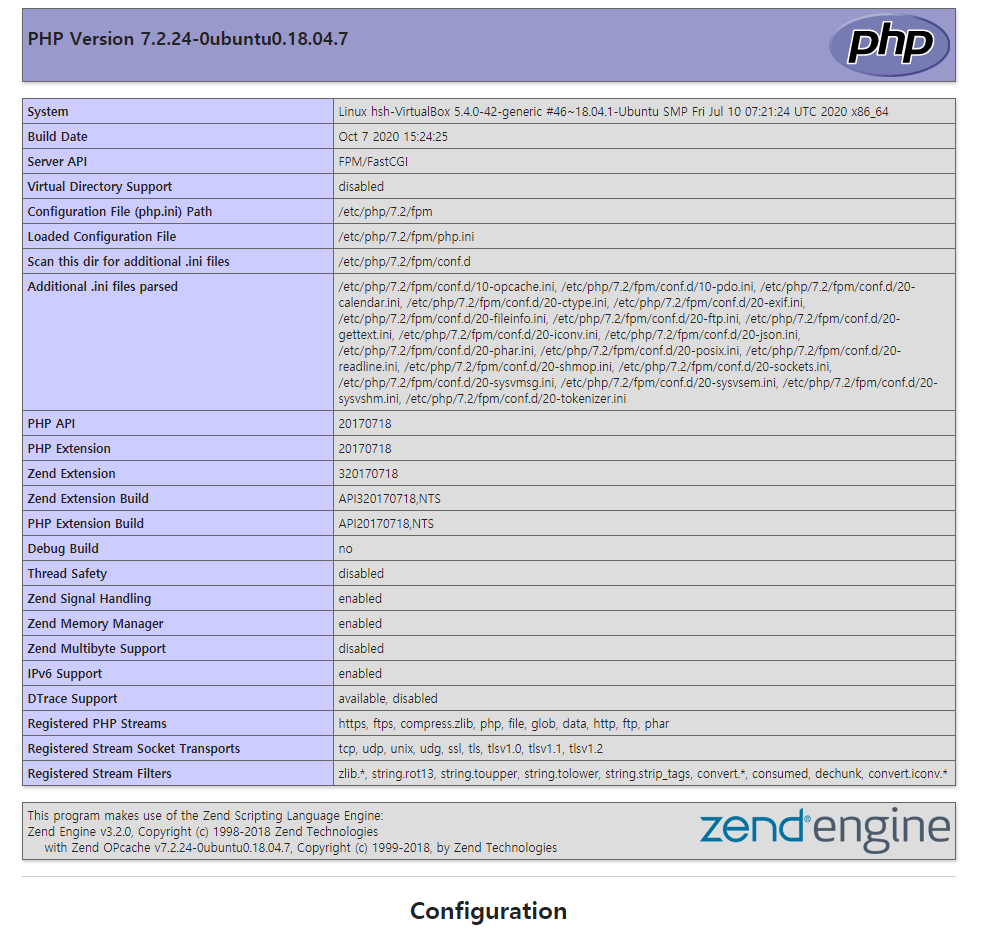

<!-- 
   학습 강의
   1. nginx 
   2. php 기본 문법
   3. php 객체지향
   4. php + mysql
 -->

본 포스트는 시리즈로 작성될 예정입니다.

1. PHP + Nginx 개발 환경 설정
2. Nginx 이해
3. PHP 언어 사용방법 학습
4. Codeigniter를 사용한 MVC 구현 방법 학습
5. Codeigniter + SQLite + React 게시판 구현

# 1. Window / Linux 환경 설정

**아파치와 php7는 라이브러리 충돌 및 오류 때문에 잘 쓰이지 않음**

## Window PHP 환경 설정

1. WNMP 설치
2. {설치경로}/conf/nginx/nginx.conf - root directory 변경 

## Linux 환경 설정

환경 설정 방법

1. PHP-fpm 실행
2. nginx 실행

```bash
$ apt-get install nginx
Nginx 실행 : service nginx start 
Nginx 중단 : service nginx stop 
Nginx 재시작 : service nginx restart  / nginx 서버 중단 후 재가동
Nginx 리로드 : service nginx reload  / 설정만 다시 적용
Nginx 자동 시작 : service nginx enable 
Nginx 상태 : service nginx status
```

3. php 설치

```bash
$ apt-get install php-fpm
```

4. /etc/nginx/sites-available/default 파일 수정

```
1. index.php 자동 인식하게 설정
index index.html index.htm index.nginx-debian.html;

2. 설치한 php fpm에 맞게 수정
location ~ \.php$ {
  include snippets/fastcgi-php.conf;
  fastcgi_pass unix:/var/run/php/php7.2-fpm.sock
}

3. 원하는 root경로 설정
root /{원하는 경로}
```

간단하게 index.php 파일을 만들어 들어가봤다.

```php
<?php
  phpinfo();
>
```



## **Tip!!**  
설정파일 이상 여부 검사 
```bash
nginx -t
```
error log확인 
```bash
tail -f /var/log/nginx/error.log  
```  
텍스트 모드 부팅 설정 (더 빨라짐)
```bash
sudo systemctl set-default multi-user.target
```
putty로 vitual box 연결  
[putty로 virtualbox 연결하기 - 숭숭이님 블로그](https://m.blog.naver.com/skddms/220575084716)  
vim 설정  
[[Vim]vim 설정하기 - heyhyo님 블로그](https://hyoje420.tistory.com/51)  