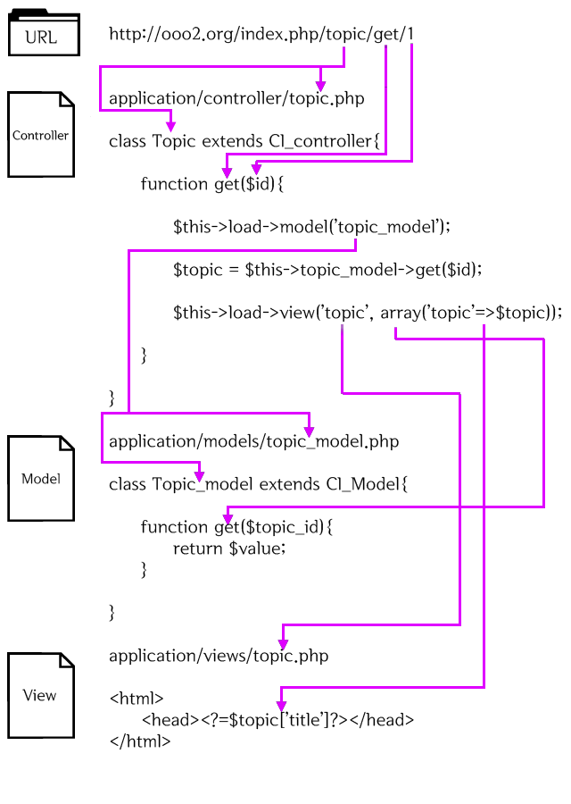

codeigniter3를 공부해보자

# codeigniter3

## CI 동작


1. index.php CI가 동작하기 위한 기반 리소스 초기화
2. Router 모듈 동작 결정
   2.1) 캐시 파일 존재 -> 캐시 파일 전송
3. Security 모듈이 Controller로 이동하기 전에 필터링
4. Controller 사용자 요청 처리
5. View 모듈 렌더링 -> 전송 (캐시 추가)

## CI URL

새그먼트 기반 URL 사용

```
example.com/news/article/my_article
{호스트 주소}/{호출될 Controller}/{클래스 안의 호출될 Function}/{변수}
```

<!-- TODO : nginx index.php 제거 방법 -->

## MVC

1. Model : 데이터구조 표현, 모델 클래스는 데이터 함수 포함
2. View : 사용자에게 보여질 화면
3. Controller : Model과 View사이 동작



<!-- TODO : 파일 구조 설명 -->

## Controller
> URL과 상호작용하는 클래스 파일

#### 특징
 - 클래스 명은 항상 **대문자로 시작**

### 추가로 알아야 될 사항
#### 1. $this, self, -> 차이
<!-- TODO : 정리해야 한다. -->

[참고 블로그](https://m.blog.naver.com/PostView.nhn?blogId=vefe&logNo=221454883593&proxyReferer=https:%2F%2Fwww.google.com%2F)

#### 2. _remap() 함수
> 함수요청 재매핑


```php
public function _remap($method, $params = array()) {
   $method = 'process_'.$method;
   if (method_exists($this, $method)) {
      return call_user_func_array(array($this, $method), $params);
   }
   show_404();
}
```


**컨트롤러가 _remap()함수 가지고 있으면 무조건 호출된다**

#### 3. _output() 함수
> 

<!-- TODO : VIEW, Output 클래스 내용 정리하고 다시보자 -->

**추가로 알아야 될 사항은 내용이 조금 어려워서 실제로 쓰이는 코드를 보게되면 코드를 통해 더 알아볼 예정이다**

## Route
> application/config/routes.php에 작성
<!-- TODO : 생활코딩 강의 -> ref문서 정리 -->

## View
> 화면에 출력되는 부분

## Model
> Model은 데이터를 가져오는 로직을 메소드로 정의, Controller를 통해 사용된다.

### 데이터 베이스 설정

> Application/config/database.php 파일을 수정

파일 속성
```
hostname : 데이터베이스 서버의 주소 (localhost는 PHP와 같은 머신을 의미)
username : 데이터베이스 사용자의 이름
password : 데이터베이스 비밀번호
database : 데이터베이스 명
dbdriver : 데이터베이스의 종류로 지원되는 드라이브의 목록은 system/database/drivers 디렉토리명을 참고한다.
```

### 데이터 베이스 라이브러리 로드

PHP에서 MySQL을 사용하기 위해 mysqli를 설치한다

```bash
$ sudo apt-get install php-mysqli
```

데이터 베이스 라이브러리 로드 방법은 2가지가 있다.

```
1. application/config/autoload.php 파일의 $autoload['libraries'] 배열에 'database'를 추가한다. 
2. controller 내에서 $this->load->database()를 호출한다.
```

### Model 파일 생성 규칙
 - **application/models/{모델 명_model}.php** 형식으로 생성
 - 파일은 **CI_Model 클래스 상속**
 - 클래스 명은 **대문자로 시작**

### Model load

1. Model load
 - 형식
```
$this->load->model('소문자로된 모델 클래스 명');
```
 - 예제
```
$this->load->model('topic_model');
```

2. Model call
 - 형식
```
모델 클래스 명 -> 메소드 명
```
 - 예제
```
$topics = $this -> topic_model -> gets();
```

### Model 내 쿼리 사용
> $this->db 이용!

- 사용 예제 
  
```php
$query - $this->db->query('SELECT name, title, email FROM my_table')

foreach($query->result() as $row) {
   echo $row->title;
   echo $row->name;
   echo $row->email;
}

echo 'Total Results: ' . $query->num_rows();
```

#### 결과 불러오기
> **객체 배열 리턴**한다.

1. 다중 결과(객체)
   - result()
2. 다중 결과(배열)
   - result_array()
3. 단일 결과(객체)
   - row()
4. 단일 결과(배열)
   - row_array()

<!-- TODO : 표준 입력 예제, 쿼리 빌더 -->
<!-- http://www.ciboard.co.kr/user_guide/kr/database/examples.html#standard-insert -->

<!-- TODO : Active Record vs JPA 비교 -->

## Error 해결
강의 예제 실행 중 오류
> localhost/index.php/topic 404에러

{nginx설치 경로}/conf/nginx.conf sever설정에 아래 코드 추가 

```bash
if (!-e $request_filename ) {
	rewrite ^(.*)$ /index.php last;
}
```
file이 존재하지 않으면, index.php로 이동


## Helper
> 자주 사용하는 로직을 재활용 할 수 있게 만드는 Library

1. 기본적인 로드 방법
```php
$this->load->helper('헬퍼 이름')
```

2. 복수의 헬퍼를 로드하기 위한 방법
```php
$this->load->helper(array('헬퍼1의 이름', '헬퍼2의 이름'));
```


# Reference
[Common Gateway Interface(CGI)란 무엇인가 - bruteforce님 블로그](https://live-everyday.tistory.com/197)  
[](https://server-talk.tistory.com/308)  
[]()  
[]()  
[]()  
[]()  
[]()  
[]()  
[]()  
[]()  
[]()  
[]()  
[]()  