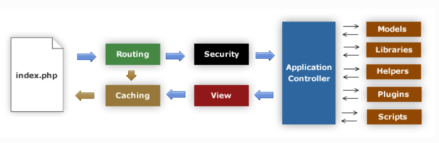

codeigniter3를 공부해보자

# codeigniter3

# 1. CI 동작



1. index.php CI가 동작하기 위한 기반 리소스 초기화
2. Router 모듈 동작 결정
   2.1) 캐시 파일 존재 -> 캐시 파일 전송
3. Security 모듈이 Controller로 이동하기 전에 필터링
4. Controller 사용자 요청 처리
5. View 모듈 렌더링 -> 전송 (캐시 추가)

## CI URL

새그먼트 기반 URL 사용

```
example.com/news/article/my_article
{호스트 주소}/{호출될 Controller}/{클래스 안의 호출될 Function}/{변수}
```

<!-- TODO : nginx index.php 제거 방법 -->

# 2. MVC

1. Model : 데이터구조 표현, 모델 클래스는 데이터 함수 포함
2. View : 사용자에게 보여질 화면
3. Controller : Model과 View사이 동작


<!-- TODO : 파일 구조 설명 -->

## Controller
> URL과 상호작용하는 클래스 파일

#### 특징
 - 클래스 명은 항상 **대문자로 시작**

### 추가로 알아야 될 사항

#### 1. Controller에 나오는 _의 의미
> Controller에서 _를 함수 이름 앞에 작성하면 **Routing**되지 않는다. (private한 메소드가 된다.)


#### 2. $this, self, -> 차이
<!-- TODO : 정리해야 한다. -->

[참고 블로그](https://m.blog.naver.com/PostView.nhn?blogId=vefe&logNo=221454883593&proxyReferer=https:%2F%2Fwww.google.com%2F)

#### 3. _remap() 함수
> 함수요청 재매핑


```php
public function _remap($method, $params = array()) {
   $method = 'process_'.$method;
   if (method_exists($this, $method)) {
      return call_user_func_array(array($this, $method), $params);
   }
   show_404();
}
```


**컨트롤러가 _remap()함수 가지고 있으면 무조건 호출된다**

#### 4. _output() 함수
> 

<!-- TODO : VIEW, Output 클래스 내용 정리하고 다시보자 -->

**추가로 알아야 될 사항은 내용은 내용을 조금 더 추가 할 예정이다.**

## Route
> application/config/routes.php에 작성
<!-- TODO : 생활코딩 강의 -> ref문서 정리 -->

## View
> 화면에 출력되는 부분

## Model
> Model은 데이터를 가져오는 로직을 메소드로 정의, Controller를 통해 사용된다.

### 데이터 베이스 설정

> Application/config/database.php 파일을 수정

파일 속성
```
hostname : 데이터베이스 서버의 주소 (localhost는 PHP와 같은 머신을 의미)
username : 데이터베이스 사용자의 이름
password : 데이터베이스 비밀번호
database : 데이터베이스 명
dbdriver : 데이터베이스의 종류로 지원되는 드라이브의 목록은 system/database/drivers 디렉토리명을 참고한다.
```

### 데이터 베이스 라이브러리 로드

PHP에서 MySQL을 사용하기 위해 mysqli를 설치한다

```bash
$ sudo apt-get install php-mysqli
```

데이터 베이스 라이브러리 로드 방법은 2가지가 있다.

```
1. application/config/autoload.php 파일의 $autoload['libraries'] 배열에 'database'를 추가한다. 
2. controller 내에서 $this->load->database()를 호출한다.
```

### Model 파일 생성 규칙
 - **application/models/{모델 명_model}.php** 형식으로 생성
 - 파일은 **CI_Model 클래스 상속**
 - 클래스 명은 **대문자로 시작**

### Model load

1. Model load
> $this->load->model('소문자로된 모델 클래스 명');  

ex)
```
$this->load->model('topic_model');
```

1. Model call
> 모델 클래스 명 -> 메소드 명

ex)
```
$topics = $this -> topic_model -> gets();
```

### Model 내 쿼리 사용
> $this->db 이용!

- 사용 예제 
  
```php
$query - $this->db->query('SELECT name, title, email FROM my_table')

foreach($query->result() as $row) {
   echo $row->title;
   echo $row->name;
   echo $row->email;
}

echo 'Total Results: ' . $query->num_rows();
```

#### 결과 불러오기
> **객체 배열 리턴**한다.

1. 다중 결과(객체)
   - result()
2. 다중 결과(배열)
   - result_array()
3. 단일 결과(객체)
   - row()
4. 단일 결과(배열)
   - row_array()

<!-- TODO : 표준 입력 예제, 쿼리 빌더 -->
<!-- http://www.ciboard.co.kr/user_guide/kr/database/examples.html#standard-insert -->

<!-- TODO : Active Record vs JPA 비교 -->

## Tip!!

```bash
if (!-e $request_filename ) {
	rewrite ^(.*)$ /index.php last;
}
```
file이 존재하지 않으면, index.php로 이동

### ?> 닫는 태그를 생략하는 경우

PHP 구문은 기본적으로 
```php
<?php
  ...
?>
```
위와 같이 구성된다. 문장의 종료는 반드시 **세미 콜론**이 찍혀야 한다.

하지만 php코드를 보면 닫는 코드인 ?> 을 생략한 구문이 있다. 이상하게 코드는 잘 동작한다.

그 이유를 알아보면 순수 PHP코드로만 이루어진 코드는 닫는 태그를 생략하는 것이 더 유리하다고 한다.

왜냐하면 닫는 태그인 ?> 앞 뒤에 공백이나 Enter가 실수로 들어가는 경우가 많기 때문이다.

이런 상황에는 의도하지 않은 에러가 날 수 있고, 디버깅 하기 힘듬

하지만 **HTML 코드와 같이 사용할 경우에는 반드시 사용해야 한다.**


# 3. Library, Helper

## Helper
> 자주 사용하는 로직을 재활용 할 수 있게 만드는 Library

**Library vs Helper 
> Helper : 일반적인 함수로 만들어진 것 / Library : 객체로 만들어진 것

1. 기본적인 로드 방법
```php
$this->load->helper('헬퍼 이름')
```

2. 복수의 헬퍼를 로드하기 위한 방법
```php
$this->load->helper(array('헬퍼1의 이름', '헬퍼2의 이름'));
```

## Tip!!
헬퍼는 보통 직접적으로 스크립트를 실행하는 경우가 많이 없으므로

```php
<?php if (! defined('BASEPATH')) exit('No Direct script access allowed');
```
구문을 상단에 최상단에 추가하여 스크립트의 실행을 막는다.

## Library
> 웹개발에서 자주 사용되는 로직을 내장(Core) 라이브러리로 제공하고 있다.

# 4. CI Config
> 필요에 따라 Application 동작 방법을 변경한다.
> Application/config/ 디렉토리 아래에 위치

**Tip!!**
개발환경과 실서비스 환경과 설정을 다르게 위해 index.php의
```php
define('ENVIRONMENT', 'development');
```
두 번째 인자값을 development, testing / production 으로 바꿀 수 있지만
**dev.php를 하나 더 만들어서 접속 경로를 다르게 하는 방법도 있음**

```
development : 개발 환경에서 사용한다. 모든 에러가 출력된다. 
testing, production : 테스팅이나 실서비스 환경에서 사용된다. 에러가 출력되지 않는다. 
```

## 1. config.php
> CI에 필요한 기본적인 설정파일 / CI가 동작하는 방식에 대한 다양한 설정 값이 저장되어 있음.

파일 보면 쿠키, 세션, 보안, 캐시파일/로그파일 저장 위치 같은 것을 확인할 수 있다.

## 2. database.php
> database에 필요한 설정파일

## 3. autoload.php
> Helper, Library같은 리소스들을 자동 로드 -> 편의성 증대 / 성능 감소 주의

## 4. hooks.php
> 사용자가 Core의 기본 실행 흐름을 설정 가능 (자신만의 로직 추가 가능 / config.php에서 설정 해야지 사용 가능)

## 설정 정보 사용
> config 라이브러리와 config.php 파일은 자동 로딩하기 때문에 별도 작업 필요 없음

```php
$this->config->item('base_url');
```

### 사용자 정의 설정
> $config 배열에 값 추가, 파일을 통한 설정 값 추가 가능(로딩 절차 필요)

```php
$this->load->config('hsh');
// file을 통한 설정 load 
$this->config->item('hsh');
// item 메소드는 설정이 없으면 false 리턴
```

## 5. CI debugging / log

application/config/config.php에 보면

```php
$config['log_threshold'] = 0;
```
구문 수정을 통해 log수준을 설정할 수 있다.

```
0 = 로깅을 비활성화
1 = 에러로그만 기록
2 = 디버그 로그도 기록 
3 = 정보 로그도 기록
4 = 모든 메시지를 기록
```

controller에서 아래와 같이 사용하면 원하는 log메세지를 추가 할 수 있다.

```php
// debug 메세지 추가
log_message('debug', 'topic 초기화');

// error 메세지 추가
log_message('error', 'topic의 값이 없습니다');       
```

## 6. 파일 처리
> Upload 클래스의 doupload가 핵심 메소드

필요하면 docum
[CI3 - FILE Uploading Class document](http://www.ciboard.co.kr/user_guide/kr/libraries/file_uploading.html)

추가로 CKEditor를 사용해서 HTML 코드 없이 편집기를

## 7. Core 확장
> CI는 코어 상속, Hook방법을 통해 Core기능 


<!-- ## 8. 세션 / 비밀번호 암호화

## 9. CRI 프로그램

## 10. Queue / Cron

## 11. Caching -->

<!-- 
[쿠키와 세션](https://opentutorials.org/course/62/240
[Session](https://opentutorials.org/course/697/398)
[회원가입 & 비밀번호 암호화](https://opentutorials.org/course/697/4278)
[리다이렉션과 로그인 개선](https://opentutorials.org/course/697/4129)
[이메일 전송 & 라이브러리 장]()
[CLI](https://opentutorials.org/course/697/4282)
[Queue & cron](https://opentutorials.org/course/697/4130)
[Caching](https://opentutorials.org/course/697/3839)
 -->

## 경로에 index.php 없애기

1. application/config/config.php

```php
$config['index_page'] = '';
```
index.php를 찾아서 빈 값으로 설정한다

2. index.php가 존재하는 폴더에 .htaccess파일을 추가한다.
(Permisson은 755로 설정한다.)

**.htaccess 파일**
```
<IfModule mod_rewrite.c>
    RewriteEngine On
    RewriteCond %{REQUEST_FILENAME} !-f
    RewriteCond %{REQUEST_FILENAME} !-d
    RewriteRule ^(.*)$ index.php/$1 [L]
</IfModule>
```