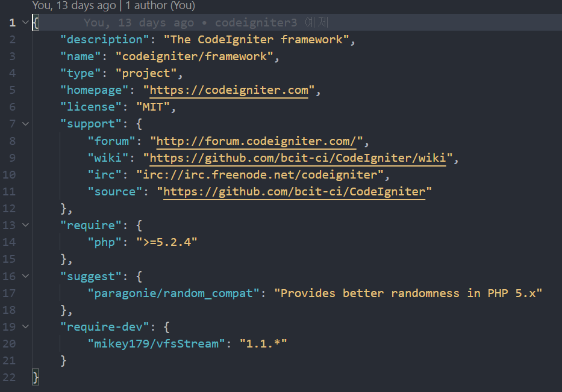
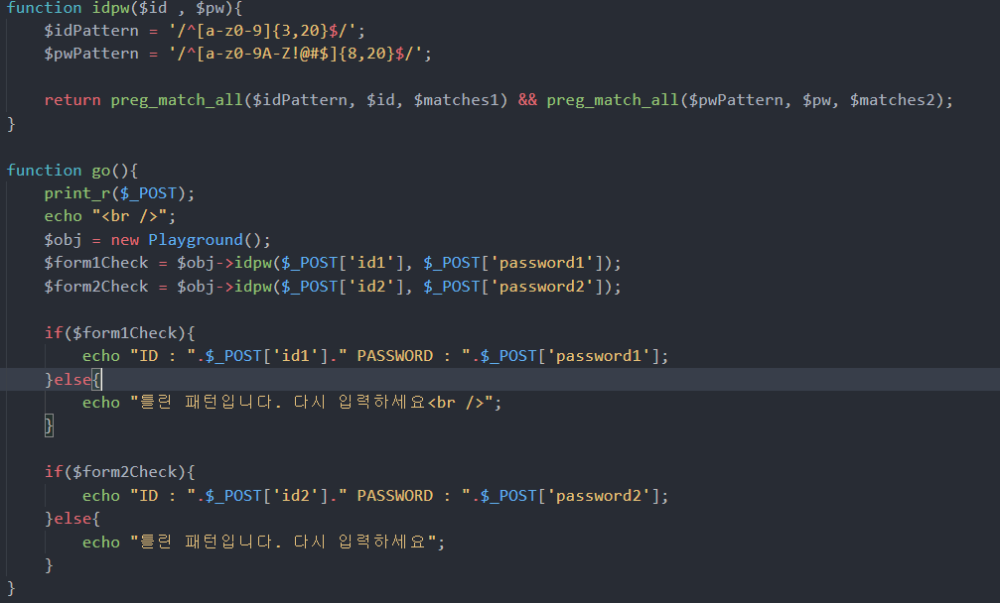
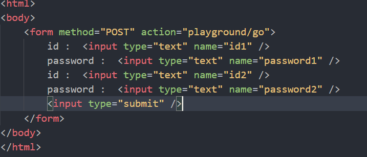
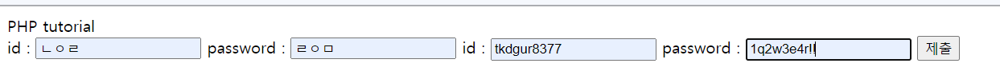
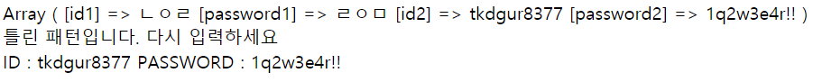

php 문법을 간략히 정리해보자

# 1. 변수

PHP는 아래와 같은 자료형을 사용할 수 있다
문자열 String  
정수형 Integer  
실수형 Float  
논리형 Boolean  
배열 Array  
객체형 Object  
널 NULL  
리소스 Resource  

아래의 방법으로 변수의 자료형을 알아내거나, 자료형을 변경할 수 있다.

```php
// 변수 자료형 알아내기 
var_dump({변수 이름});
echo gettype({변수 이름});

// 변수 자료형 변경
settype({변수이름},'{자료형}');
```

PHP의 특이한 점으로는 동적으로 변수명 설정이 가능하다.

```php
<?php
$title = 'subject';
$$title = 'PHP tutorial';
echo $subject;
?>
```

아래의 구문을 실행하면 실행값이
```
PHP tutorial
```
이 나온다.

\$\$가 두번 표시되어 있는데, $title 의 값으로 변수가 생성된 것을 의미한다.


# 2. 연관배열

조건문, 반복문은 일반적인 프로그래밍 언어와 거의 동일하게 사용하는데 배열이 특이한 점이 있다.

## 연관배열
> 배열의 키 값으로 숫자와 문자 모두 사용

예제를 보면 

값 할당 및 출력 구문
```php
<?php
$grades = array('egoing'=>10, 'k8805'=>6, 'sorialgi'=>80);
$grades = array('egoing'=>10, 'k8805'=>6, 'sorialgi'=>80);
foreach($grades as $key => $value){
    echo "key: {$key} value:{$value}<br />";
}
?>
```

결과값
```php
key : sorialgi  value : 80
key : k8805     value : 6
key : egoing    value : 10  
```

이렇게 해쉬맵처럼 사용한다.

# 3. File load

## require, import 

php에는 **1. require** , **2. import** 두가지 방법으로 file호출 가능  
뒤에 _once를 붙여 include_once 처럼 사용하면 파일을 로드할 때 단 한번만 로드하면 된다는 의미

기능상 차이는 없는데 error 표시가 다름  

require가 더 높은 에러 수준으로 error를 알리고, 코드의 실행을 중단시킨다.  


**1) 파일 복사**
> copy($file, $newfile)

**2) 파일 삭제**
> unlink('file.txt');

**3) 파일 읽기**
> file_get_contents($file);

**4) 파일 저장**
> file_put_contents($file, 'coding everybody');

**5) file etc**
> is_readable, is_writable, file_exists 같은 함수를 통해 파일 확인이 가능하다

**6) 디렉토리**
```php
// directory 읽기
$dir    = './';
$files1 = scandir($dir);

// directory 만들기
mkdir("1/2/3/4", 0700, true);
```

# 4. Class

클래스 선언 및 인스턴스 생성
```php
class MyObject{
  function __contruct($fname){
    $this->filename = $fname;
  }
}

$obj = new MyObject('file1');
```

Class내 함수 사용
```php
print_r($obj->func());
```

# 5. 접근 제어자
> private, public 키워드를 사용해서 접근을 제어할 수 있다.

# 6. 상속
> extends 키워드를 사용해 클래스를 상속할 수 있다.

**Tip!!**
클래스 안에 static 키워드를 추가한 변수를 만들어주면 모든 인스턴스가 공유하는 변수를 만들어줄 수 있다.

```php
class car{
  private static $count = 0;
  private $name;
  function __construct($name){
    $this->name = $name;
    self::$count = self::$count+1;
  }
}
```

### 클래스 접근

부모 클래스를 접근할 때는 parent(parent::) 연산자를 사용한다.
자신의 클래스를 접근할 때는 self(self::) 연산자를 사용한다.

**\::는 new 지시자로 class를 미리 객체화 시켜놓지 않고 사용하는 시점에서 객체가 생성되고 지정된 메소드가 실행되도록 하는 접근자이다.**


# 7. Namespace, use
> Namespace : 동일한 이름을 가진 class가 존재할 때 구분하여 사용하기 위한 이름
> use : 키워드를 통해 불러올 수 있다.

Java에서 package와 import 같은 개념이다. 

[PSR](https://www.php-fig.org/psr/psr-4/)에서는 아래와 같은 방식으로 사용하는 것을 권장한다
> \<NamespaceName>(\<SubNamespaceNames>)*\<ClassName>

사용법은
```php
<?php
// 파일명 : greeting_en_ns.php

namespace language\en;
class Hi{
  function welcome(){
      return 'Hello world';
  }
}
```
상단에 namespace 를 명시해준다.

사용할 땐
```php
<?php
require_once 'greeting_en_ns.php';
use \greeting\en\Hi as hien
new HiEn();
?>
```

불러와서 사용해주면 된다.

# 8. 인터페이스

```php
interface myInterface{
  public function promiseMethod(array $param):int;
}
```

# 9. abstract
> 하위 클래스가 반드시 오버라이드하게 강제한다.

강제하고 싶은 메소드 앞에 abstract 키워드를 붙여주면 된다.

# 10. 컴포저
> PHP의 Package Manager

composer.json파일로 관리

[packagist](https://packagist.org/)를 들어가보면 PHP Repository를 검색할 수 있다.

CI3의 composer.json



추가로 ci는 composer를 사용하려면 config/config.php 부분에 아래 구문을 수정 해야한다.

```php
$config['composer_autoload'] = '/vendor/autoload.php';
```

---

위 내용을 바탕으로 간단하게 CI3 + Nginx로 띄운 서버에 id, password 입력 폼을 만들고 정규식으로 값들을 체크하는 코드를 작성해보았다.

controller 소스다.


view 소스다.


/playground


/playground/go 로 이동한 결과


끗