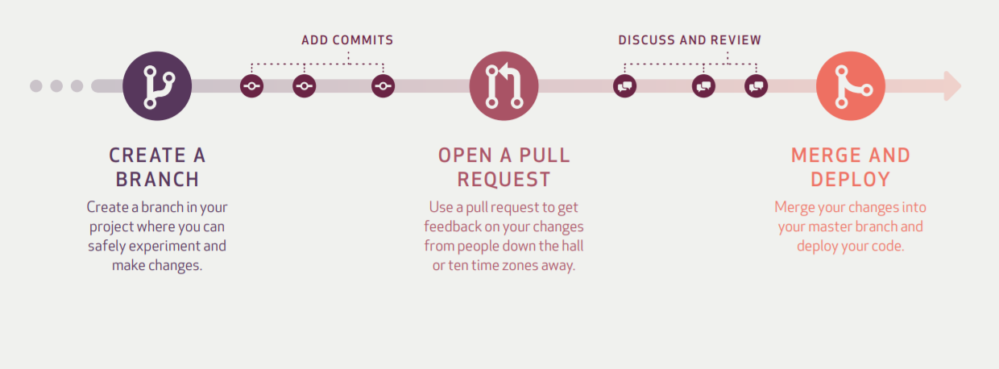
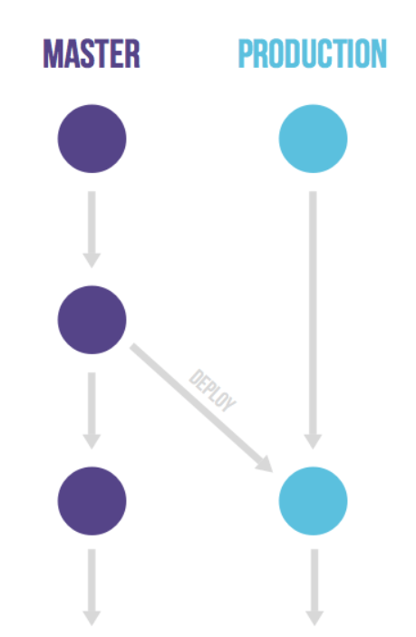

개발 프로젝트를 진행하면 코드를 관리하기 위해  
보통 **코드베이스**, **코드리뷰**, **배포방법**에 대해 고민한다.

오늘은 코드베이스, 코드리뷰에 대해 정리해보자

# 코드베이스란?
---
 > 특정 시스템, 어플리케이션, 컴포넌트 따위를 빌드할 때 사용되는 소스코드의 전체집합, 그것을 담은 저장소 

가장 대중적으로 많이 쓰이는 도구는 **git, svn**이 있다.

보통 git을 가장 많이 사용하고 추가로 개발을 하며

branch를 어떻게 관리할지 고민하는데

git-flow, github-flow, gitlab-flow 브랜치 전략이 가장 대중적인 방법이다.

3가지 브런지 전략에 대해 더 알아보면

## 1. Git-flow


git-flow를 설명할 때 가장 많이 보이는 그림이다.  

사진을 보면 5개의 브랜치가 있는데 브랜치를 요약해보면

```
master : 배포할 수 있는 브랜치
develop : 개발 브랜치
feature : 기능별 개발 브랜치
hotfixes : 버그를 수정하는 브랜치
release : 배포 전 테스트를 통해 버그를 찾아내는 브랜치
```

진행과정을 살펴보면
```
1. 기능 개발을 위해 feature 브랜치를 생성 후 작업
2. develop 브랜치에 merge
3. 배포 전 테스트를 위해 release 브랜치 생성
4. 테스트 완료 시, 배포를 위해 master 브랜치로 merge 후 태그를 달고 배포
+ master branch에서 버그 발생 시, hotfix 브랜치 생성 
  -> hotfix에서 작업한 내용은 master와 develop에 merge된다.
```

## 2. Github-flow
---
> 자동화 개념이 들어가 있는게 핵심!



가장 쉽고, 접하기 쉬운 브랜치 전략이라고 생각한다.   
(혼자 개발할 때는 pull request가 없지만 ㅋ)

github flow는 master 브랜치가 핵심이다. 

master 브랜치는 **항상 최신 상태, 안정적인 상태이다.**

github flow를 잘 사용하기 위한 몇가지 특징을 정리해보면

- 커밋 메세지를 명확히 작성한다.
- pull request, role은 엄격해야한다.
- CI가 필수!

## 3. Gitlab-flow
---



git-flow와 github flow의 중간버전 느낌이다.

production 브랜치가 있는데 이 브랜치는 배포를 위한 브랜치이다.

음... 더 알아 볼수록 짬뽕 시킨 것 같으므로 요런게 있다는 것만 알고 넘어가자 ㅋ

# 정리
---

3가지 브랜치 전략을 알아보았는데 

세가지 모두 효율적인 소스 관리, 좋은 배포를 위한 고민이다.

어쨋든 가장 중요한건 **개발팀 상황에 맞게 구성원과 전략을 세우는 것**으로 정리하고 글을 마친다. 

# 잡담

혼자 개발하고, 친구들이랑 공모전 준비할 땐 이런 문제를 딱히 고민하지 않았는데  
회사에서 직접 버그를 수정하고, 간단한 기능개발 하며   
협업 방법과 코드로 대화하는 것에 대해 계속 고민하게 된다.

# Reference
[git flow 참고 자료](https://nvie.com/posts/a-successful-git-branching-model/)  
[github flow 참고 자료(공식 홈페이지)](https://guides.github.com/introduction/flow/)  
[gitlab flow 참고 자료(공식 홈페이지)](https://about.gitlab.com/topics/version-control/what-is-gitlab-flow/)  