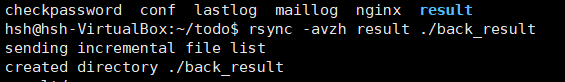
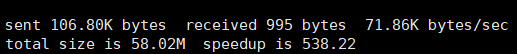

일을 하다보면 어디선가 rsync라는 단어가 많이 들린다.

추측을 좀 해보면 

백업 기능, jenkins + shell script(rsync)를 활용해 배포할 때 사용하는 것 같다.

rsync를 사용해 본 적도 없고, 잘 모른다. 정리해보자ㅋ  

나중에 도움이 되길... ㅎㅎ

# Rsync(Remote sync)
---
> 파일과 디렉토리를 로컬 및 원격으로 동기화(복사) 하는데 사용

## 특징
---

- 네트워크 대역폭을 최소화하는 델타 인코딩 알고리즘을 사용해 변경이 일어난 부분만 전송  
  -> **빠르고 효율적으로 동기화 가능!**  
- 설치
```bash
$ yum install rsync # CentOS
$ apt-get install rsync # Ubuntu
```

- [rsync 홈페이지](https://rsync.samba.org/documentation.html)

## 장점
---

- Cli툴로 쉘스크립트 프로그램 개발 가능 (cron으로 활용 가능)
- 데이터를 압축하여 송/수신하기 때문에 빠르고 효율적
- **link, 파일 소유자, 권한등 파일의 부가 정보를 함께 복사가능**
- remote 업데이트를 이용하여 차이가 있는 파일만 복사한다. 

## 동기화 알고리즘
---

### 1. 파일 전송결정
> 파일의 크기와 수정시간을 비교하는 것으로 파일을 전송할지 말지 결정한다.

파일의 크기와 수정시간을 비교하는 것을, 아주 작은 cpu자원을 소모하지만 실수가 발생할 수 있다
 -> **checksum** 옵션 사용

### 2. 전송할 파일 부분 결정

1) 파일을 고정크기를 가지는 청크(Chunk)로 나눈다음에 checksum을 계산한다.
2) 다를 경우 해당부분 chunk만 복사한다

chunk파일의 체크섬을 비교하는 방식은 파일의 앞부분이 수정되서 정보가 밀리면 모든 청크와 checksum이 밀릴 것이다.
 -> **Rolling hash** 사용!

#### 참고자료
[위키트리](https://en.wikipedia.org/wiki/Rolling_hash)  
[함께 읽으면 좋은 자료](rsync.md)


## 옵션
---

```
-v : 진행 상황을 상세하게 보여줌
-r : 지정한 디렉토리의 하위 디렉토리까지 재귀적으로 실행
-l : 소프트 링크 보존
-H : 하드 링크 보존
-h : -human-readable 읽을 수 있는 형식으로 출력 번호를 출력합니다.
-p : 버전 속성 보존
-o : 소유 속성 보존(루트)
-g : 그룹 속성 보존
-t : 타임스탬프 보존
-D : 디바이스 파일 보존(루트)
-z : 데이터 압축 전송
-b : 낡은 파일은 ~가 붙음
-u : 추가된 파일만 전송 새 파일은 갱신하지 않음
-a : 아카이브 모드. rlptgoD를 자동 지정
-c : 서버와 클라이언트의 파일 크기를 세밀히 체크
-e ssh(rsh) : 전송 암호화

--stats : 결과를 보고
--delete : 서버에 없는 파일은 클라이언트에서도 삭제
# 데이터 백업시 사용하지 않는 것이 좋다.
--progress : 전송시 진행상황을 보여줌
--existing : 추가된 파일은 전송하지 않고 갱신된 파일만 전송
--exclude=PATTERN : 패턴에 제외할 파일, 디렉토리 유형을 써주면 동기화하지 않는다.
```


## Rsync 사용 예시
---

### 기본 사용법
```bash
$ rsync [option] [source] [destination]
```

### 1. 로컬로 디렉토리 복사 또는 동기화
> rsync -zvh





### 2. 로컬로 파일 복사 또는 동기화
> rsync -zavh

### 3. 원격으로 파일 복사 또는 동기화
> 원격 Pull
```bash
$ rsync {options}  <User_Name>@<Remote-Host>:<Source-File-Dir>  <Destination>
```
> 원격 Push
```bash
$ rsync  <Options>  <Source-Files-Dir>   <User_Name>@<Remote-Host>:<Destination>
```

[17가지 예제 - linuxtechi.com](https://www.linuxtechi.com/rsync-command-examples-linux/)

# Reference
---

[rsync - 용훈님 블로그](https://m.blog.naver.com/PostView.nhn?blogId=asdf2017&logNo=221491533057&proxyReferer=https:%2F%2Fwww.google.com%2F)  
[Rsync 10가지 사용 예제들](https://www.joinc.co.kr/w/Site/Tip/Rsync)  
[TWpower's Tech Blog](https://twpower.github.io/153-copy-file-or-directory-using-rsync-command)  