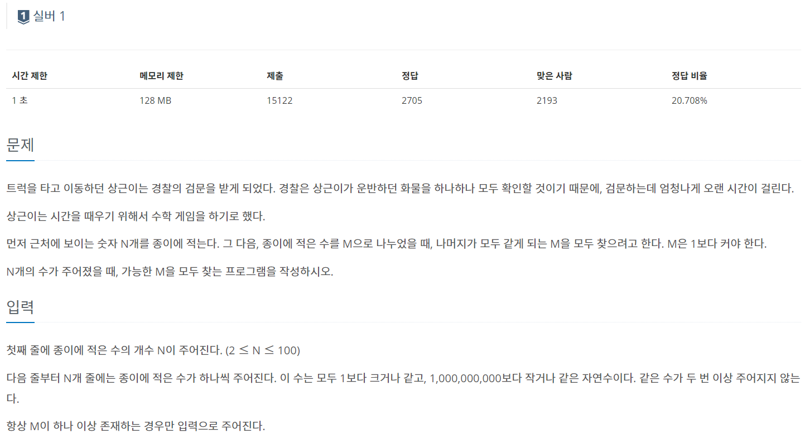
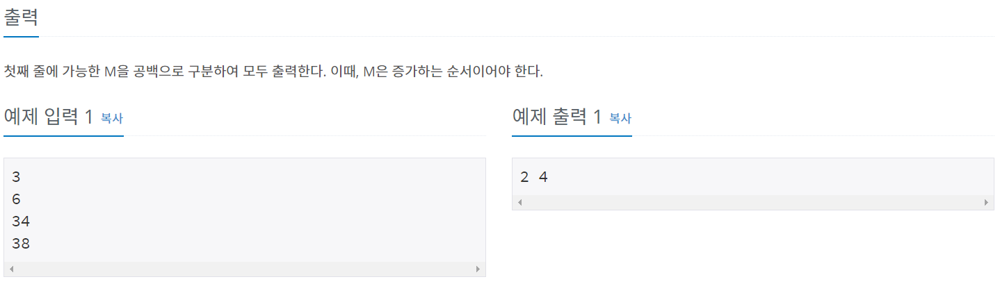

문제를 풀다가 이해하기 어려웠던 부분이 있어 포스팅한다.

일단 글을 시작하기 앞서 참고한 글이다.  
[백준 질문하기 - helios789789님 자료](https://upload.acmicpc.net/d5cda1c9-a7a9-4aa1-9a08-99af8e123ff1/)  
[블로그](https://m.blog.naver.com/tjdwns0920/221135677693)  

백준 질문하기를 보니 몇몇분들은 나랑 비슷한 방식으로 푼걸 보고 심심한 위로를 받았다.  
 (동질감 느낌)

생각보다 이해하기 어려운 문제이기도 하지만 ..... 문제 좀 제대로 이해하자 제발 ㅜㅜㅜㅜㅜㅜㅜ